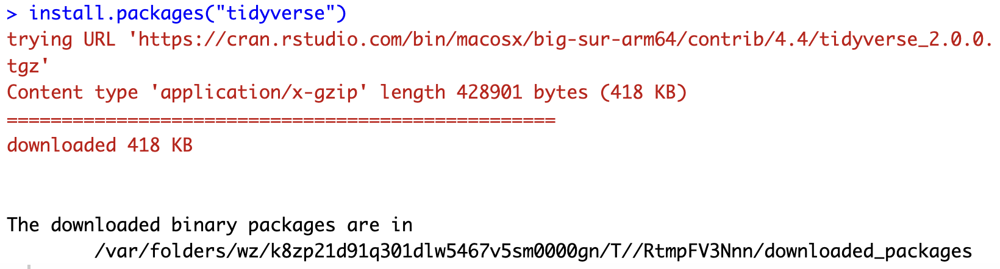

# Week2 Practice

刘沛雨 2100012289 信息科学技术学院

## Practice 1

### 正确安装并导入R包tidyverse（计0.5分）

```{r}
setwd(dir = '/Users/peiyuliu/Desktop/PKU-Undergraduate-Course-Public/生物信息学实验 (Bioinformatics Lab.)/Week2/codes')
```

```{r}
getwd()
```

```{r}
# install.packages("tidyverse")
# below is terminal output indicating successful installation
```



```{r}
library(tidyverse)
```

### 运行R语言样例

```{r}
5 + (2.3 - 1.125) * 3.2 / 1.1 + 1.23E3

```

```{r}
sqrt(6.25)
```

```{r}
exp(1)
```

```{r}
log10(10000)
```

```{r}
x1 <- 1:10
x1
```

```{r}
x1 + 200
```

```{r}
2 * x1
```

```{r}
curve(sin(x), 0, 2 * pi)
abline(h=0)
```

```{r}
barplot(c("male" = 10, "female" = 7),
        main = "number of students")
```

## Practice 2

### 预览iris表格并输出表格的前5行（计0.5分）

```{r}
dataset <- iris
head(dataset, 5)
```

### 构建vector、dataframe类型的对象

```{r}
gene_names <- c("TP53", "BRCA1", "EGFR")
expression_levels <- c(12.5, NA, 8.3)
gene_data <- data.frame(gene_names, expression_levels)
gene_data
```

```{r}
patient_data <- data.frame(
  patient_id = 1:5,
  age = c(25, NA, 45, 37, 52),
  status = factor(c("Healthy", "Disease", "Healthy", NA, "Disease"))
)
patient_data
```

```{r}
patient_data$patient_id
```

## Practice 3

### 鸢尾属植物Sepal.Length的中位数（计0.5分）

```{r}
median(dataset$Sepal.Length)
```

### 表格不同植物样本数(计0.5分）

### 汇总不同Species中 Sepal.Length, Sepal.Width, Petal.Length, Petal.Width的平均数（计1分）

```{r}
grouped_dataset <- group_by(dataset, Species)
statistics <- summarise(grouped_dataset, count=n(),
          'mean sepal length'=mean(Sepal.Length), 
          'mean sepal width'=mean(Sepal.Width), 
          'mean petal length'=mean(Petal.Length), 
          'mean petal width'=mean(Petal.Width), )
statistics
```

### 在表格中添加1列，注释不同Species的主要产地

```{r}
species_area <- data.frame(
  Species = factor(c("setosa", "versicolor", "virginica")), 
  Area = factor(c("Asia and North America", "North America", "the United States"))
)
species_area
```

```{r}
annotated_dataset <- full_join(dataset, species_area, by = join_by(Species))
head(annotated_dataset, 5)
```

## Practice 4

### 绘制箱型图比较不同Species的Sepal.Width（计1分）

```{r}
ggplot(data = dataset, mapping = aes(x = Species, y = Sepal.Width, fill = Species)) + geom_boxplot(color = "black") + labs(x = "Species", y = "Sepal Width")
# ggsave("./images/boxplot.pdf")
```

### 绘制频数直方图比较不同Species的Sepal.Width（计1分）

```{r}
ggplot(data = dataset, mapping = aes(x = Sepal.Width, fill = Species)) + geom_histogram(binwidth = 0.2, color = "black") + labs(x = "Sepal Width", y = "Frequency")
# ggsave("./images/histogram.pdf")
```

由图可知，不同物种的鸢尾花的花萼宽度存在差异。总体来看，花萼宽度服从正态分布；*versicolor* 的花萼宽度最小，*virginica* 略大，而 *setosa* 的花萼宽度明显高于其余两种鸢尾花；且三种鸢尾花各自的花萼宽度分布均不同。因此花萼宽度可能可以作为区分不同类型鸢尾花的形态学分类依据之一。
