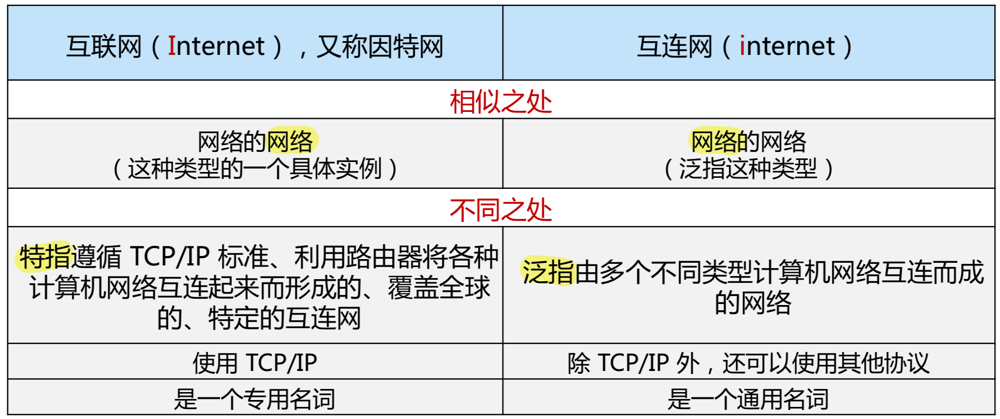
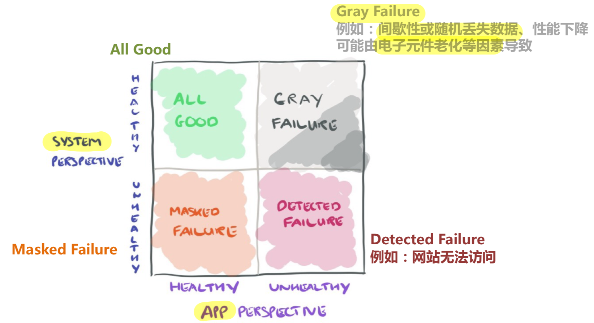
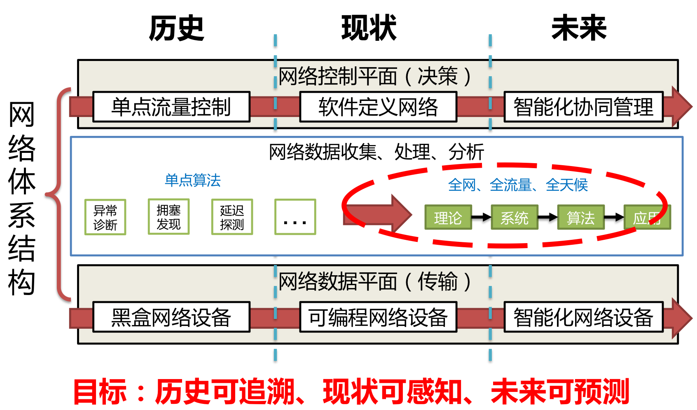

# 课程介绍
## 计算机网络的发展历史
### 早期互联网
-  60年代：早期网络技术，1969年ARPANET诞生
    -  分组交换
    -  分布式架构
-  70年代：网络互联技术，将各个小网络互相连接
-  80年代：TCP/IP成为标准（1983年）
### 当今互联网
-  90年代：万维网（WWW），开始爆炸式增长
-  21世纪：移动互联网、数据中心网络
### 因特网
-   由ARPANet发展而来
-   以IP为技术基础
-   由多个网络组成，“网络的网络”

## 当前计算机网络存在的问题
### 主要问题
-  安全漏洞与隐私泄露
-  性能瓶颈
-  管理困难
-  政策法规与伦理道德
### 安全漏洞与隐私泄露
#### 病毒
-  需要与用户交互（以文件为载体）
-  如含可执行代码的email附件（打开后会给通讯录所有再次用户发送）
#### 蠕虫
-  独立程序，无需与用户交互
-  通过不断扫描网络中存在漏洞的计算机，进行传播
#### 木马
- 独立程序，伪装自己
#### 网络攻击
-  拒绝服务攻击（DoS）：攻击者通过制造大量虚假流量占用资源，使合法流量无法使用资源（服务、带宽）
-  ...
### 性能瓶颈
- 尼尔森定律：网络连接速度每年增长50%（低于摩尔定律）
### 网络管理
-  设备数量庞大
-  设备功能复杂
-  难以复现与测试

## 当今计算机网络的发展
