# 网络基础知识
## 实体：网络的组成、命名和结构
### 网络的类型
个域网PAN；局域网LAN；城域网MAN；广域网WAN  
### 网络的构成
-  网络边缘
    -  端系统：位于互联网边缘；与互联网相连
    -  端系统由主机构成
-  接入网
    -  连接边缘端系统与网络核心
    -  本质是通信链路（光纤、铜缆、无线电、激光链路）
    -  ISP：提供网络接入和互连服务
-  网络核心
    -  由分组交换设备和通信链路组成
    -  互联端系统
    -  分组交换：路由器、交换机 
### 网络边缘：主机
-  Client-Server架构
-  内部结构
    -   网络设备硬件：网卡
    -   内核软件：驱动和协议栈
    -   用户软件：使用内核提供的socket接口
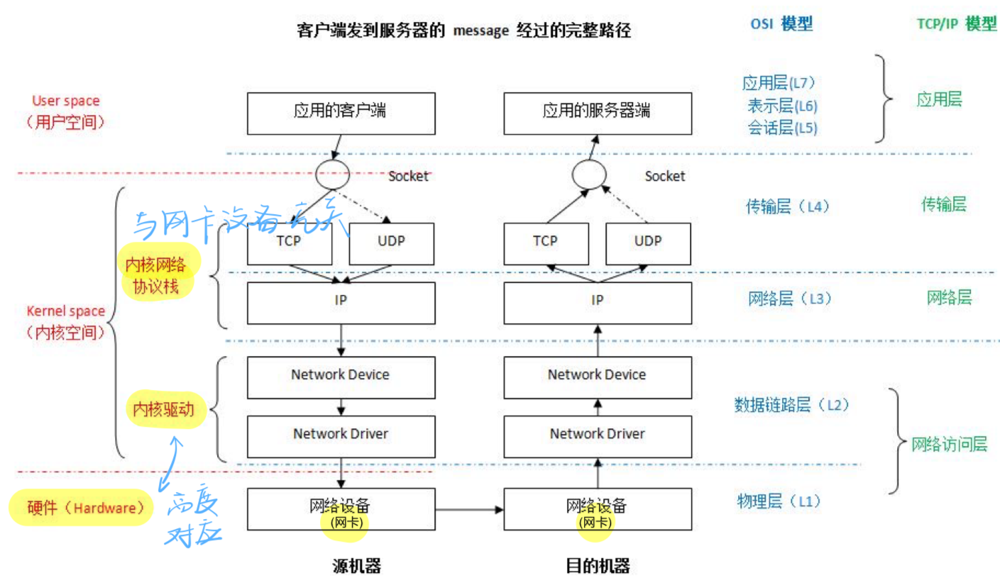
-  命名：如何在网络中区分主机
    -  硬件网卡：全球唯一的48位MAC地址
        -  烧写在ROM中，不可修改
        -  IEEE分配命名空间
    -  IP地址：32（v4）/128（v6）位  
        -  可以根据需要配置
    -  主机名：字符串
### 接入网
-  边缘路由器：端系统去往任何其他远程端系统的路径上的第一台路由器
-  接入技术：有线和无线
    -  拨号上网、同轴电缆、双绞线的DSL、光纤到户FTTH、以太网
    -  WiFi、4G/5G，卫星广域覆盖
-  物理介质（引导型/非引导型）
    -  双绞线：2根绝缘铜线缠绕为1对；电话线1对，网线4对
    -  同轴电缆：两根同心铜导线；支持双向传输和频分复用
    -  光纤：玻璃纤维传播光脉冲；高速运行+低误码率（免疫电磁噪声）
    -  无线电：不依赖介质；半双工；易受干扰
        -   Wi-Fi、蜂窝网、蓝牙、地面微波、卫星
-  数字用户线DSL（ADSL）：电话线复用；每户有独立线路；现在支持同时传输语音和数据，拨号上网时代不行；ADSL：下行快上行慢


-  有线电视信号线（同轴电缆）：电视线复用；多个家庭共享电缆头端；混合光纤同轴电缆HFC：同轴电缆先连到光纤节点
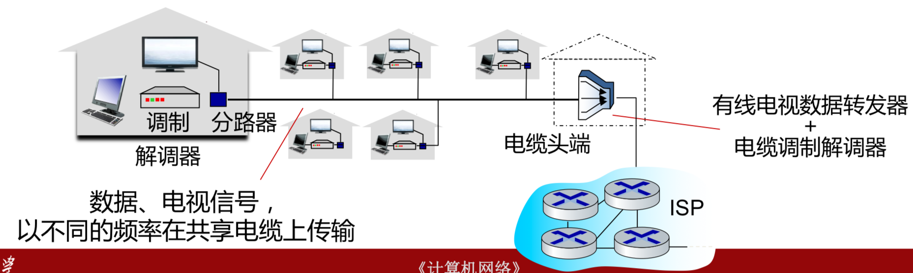
-  光纤到户（FTTH）：带宽大线路稳定；有源（独立线路）/ 无源（共享线路）
-  无线接入：通过基站
### 🌟网络核心
#### Internet架构
-  本地网络提供商（access ISP）与端系统相连
-  全局ISP；区域ISP：连接本地和全局ISP
-  去中心化的分布式架构
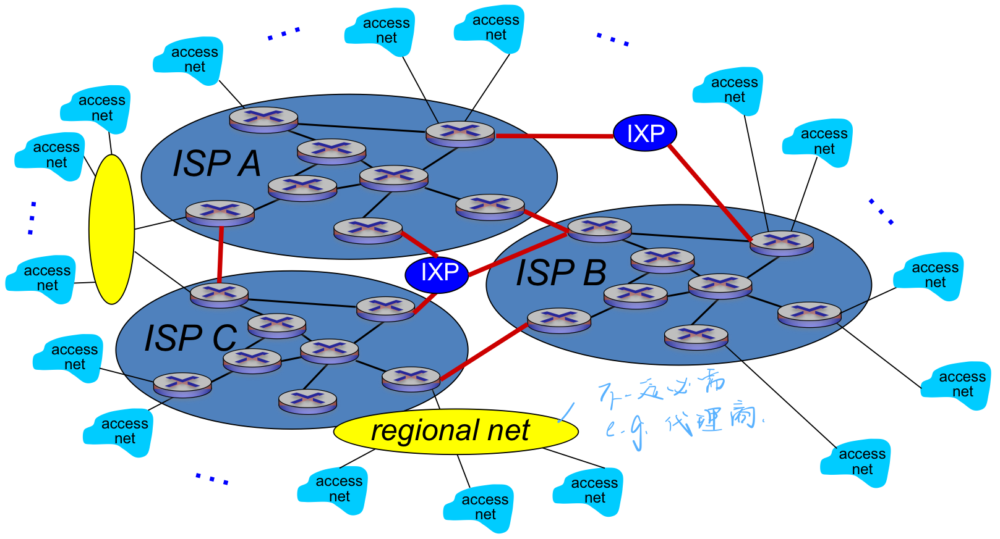
-  互联网公司搭建内容提供网络：提高性能，降低成本

#### 转发与路由
-  路由：全局操作；路由算法配置路由表，需要全局信息
-  转发：本地操作；查本地路由表

<div style="text-align: center;">
    
</div>


#### 分组交换
-   主机对数据分组，以分组为单位发送，逐跳传输
    -   分组首部含有控制信息（目的和源...）
    -   支持统计多路复用：不同主机的报文分组按需共享带宽
-   存储-转发：**路由器**收到完整的包之后才能发送
    -   带来额外的报文传输延迟（正常的传输延迟以外的）
       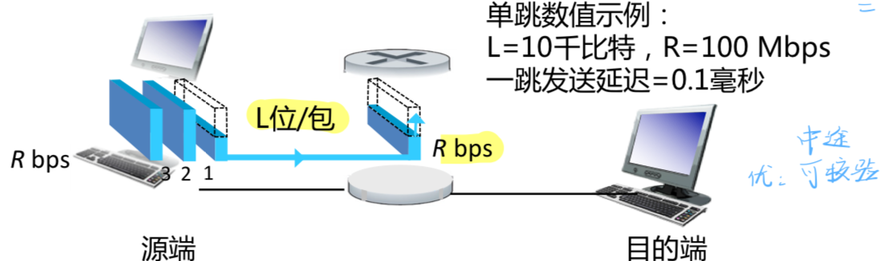 
    -   本来不需要多等L/R时间
-   分组独立传输
    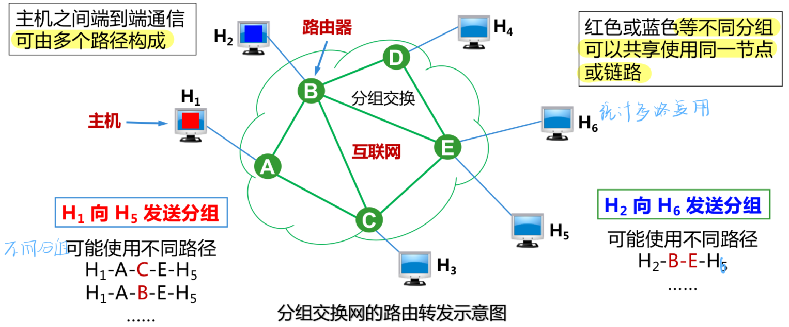
-  排队延迟与丢包
    -  分组到达速率 > 链路传输速率
    -  分组在缓冲区排队，缓冲区满则丢弃（丢包）
#### 电路交换
-   基于连接的传输方式
    -   呼叫建立连接，实现端到端的资源**预留**
        -   链路带宽资源
        -   交换机的交换能力
    -   建立连接后连续发送比特流，不分组
        -   双方独占物理通路
    -   多路复用
        -   频分复用&时分复用
    <div style="text-align: center;">
    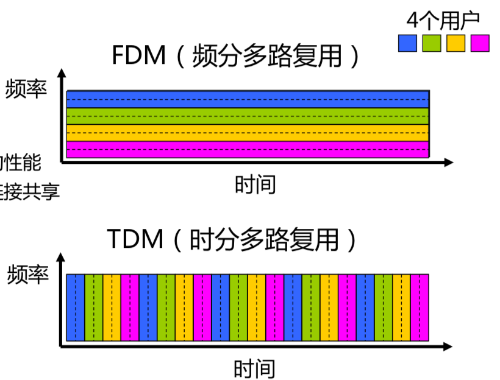
</div>
        -   每一条线路资源专用，空闲也不让给其他连接
        -   无法应对突发流量


#### 分组交换与电路交换对比

   <div style="text-align: center;">
   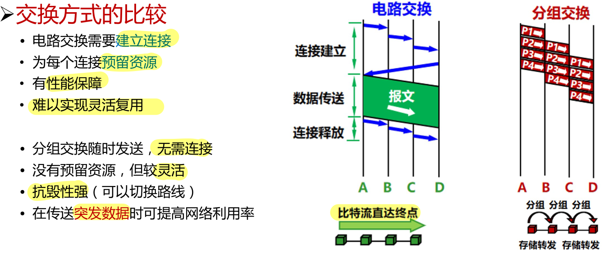
</div>

   <div style="text-align: center;">
    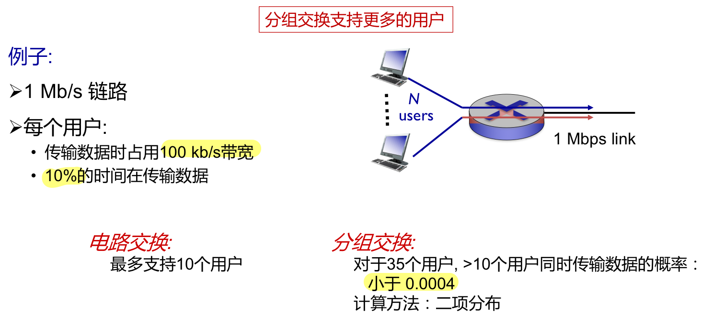
</div>

   <div style="text-align: center;">
    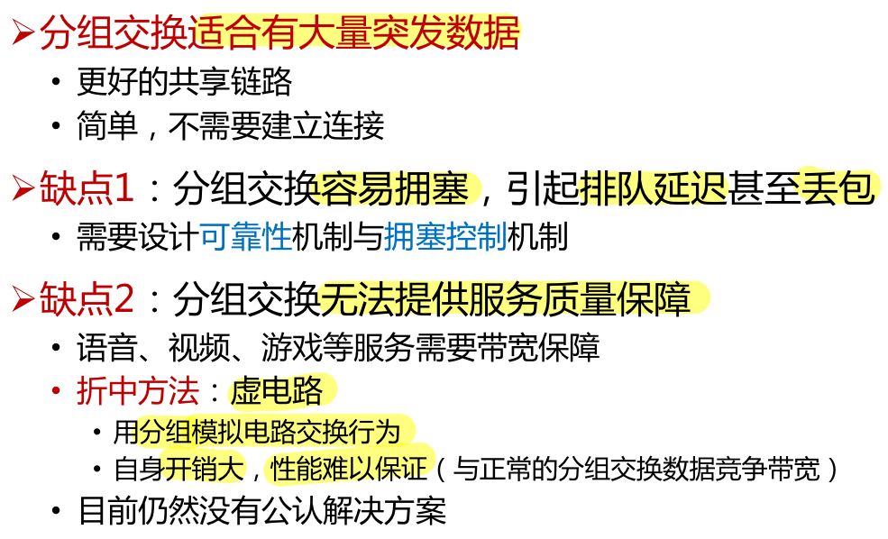
</div>

## 服务
### 面向连接的服务
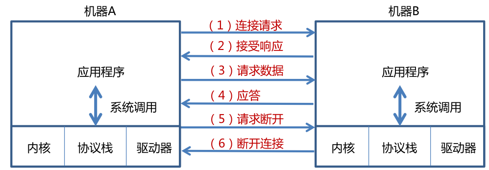
### 无连接的服务
无需连接或应答，想传就传
### 性能指标
   <div style="text-align: center;">
    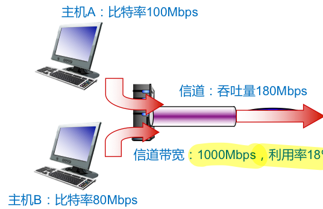
</div>

#### 带宽
-  单位时间内网络中某**信道**所能通过的最大的数据量
-  与物理特性有关
#### 包转发率
-  **交换机/路由器**转发包的速率
-  端口满负载时转发帧，转发率可达到该端口线路的最高速度（线速）
    -  大包更易使端口达到线速
    -  转发的数据量相同时，小包数量多，处理包的代价高，更难达到线速
#### 比特率（数据量/传输速率）
-  单位时间内主机传输到信道上的数据量
-  接入网的传输速率
#### 吞吐量
-  单位时间内通过某个信道/端口的数据量
-  有效吞吐量：单位时间内目的主机正确接收到的有用的数据量
#### 利用率
-  信道利用率：信道有多少时间在被使用
-  网络利用率：全网信道利用率加权平均
#### 丢包率
-  丢失数据包的数量/发送数据包的数量
#### 🌟时延
-  传输/发送时延（transmission delay）：从网络结点发送到链路中
-  传播时延（propogation delay）：数据（电磁波）在信道中传播的时间
-  处理时延（processing delay）：网络结点收到分组时处理分组的时间
-  排队时延（queueing delay）：分组在**路由器**输入/输出队列中排队等待处理的时间
    -  最难以确定，导致时延抖动
    -  排队论，Litte's Law: $L = A \times W$
        -  平均队列长度L，平均到达速率A，平均等待时间W
-  总时延 = 发送 + 传播 + 排队 + 处理
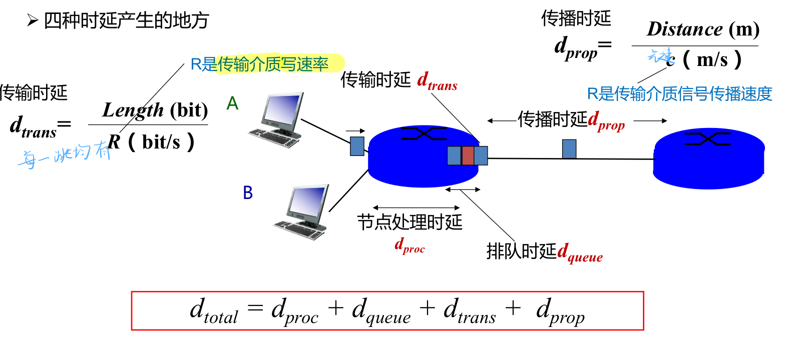
   <div style="text-align: center;">
    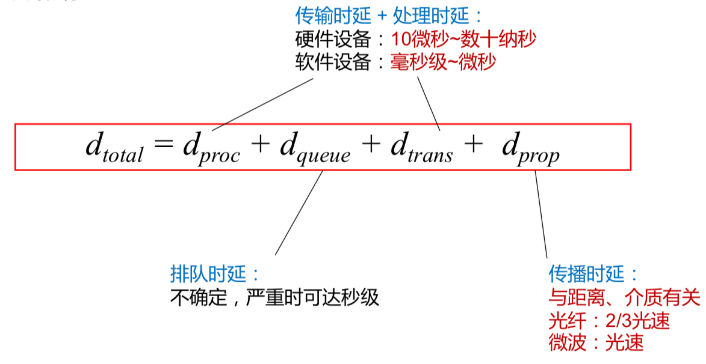
</div>

-  往返时延（RTT）

    -  ```ping```命令
   <div style="text-align: center;">
    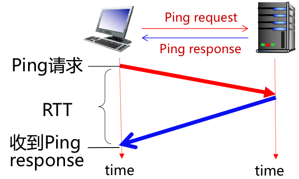
</div>

-  时延带宽积
    -  时延带宽积 = 传播时延 x 带宽：按bit计数的链路长度
    -  发送的数据逐bit在链路中流动
        -  第一个bit到达时（经过一个传播时延），发送端已经发了时延带宽积个bit
    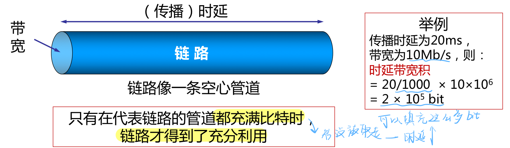

### 其他指标
-  可靠性：不丢包，发一次收一次
-  完整性：数据安全，不被篡改
-  隐私性：数据不被第三方截获，发送方身份...
-  可审计性：日志功能（数据量大很难实现）
## 协议
### 定义
为进行网络中的数据交换而建立的规则、标准或约定；以头部封装的形式定义
### 三要素
-  语法：传输数据的格式（如何讲）
-  语义：需要完成的功能（讲什么）
-  时序：各种操作的顺序（双方讲话的顺序）
### 目标
表明身份；可靠性；资源分配；拥塞控制；自适应性；安全性
## 计算机网络的分层架构
   <div style="text-align: center;">
    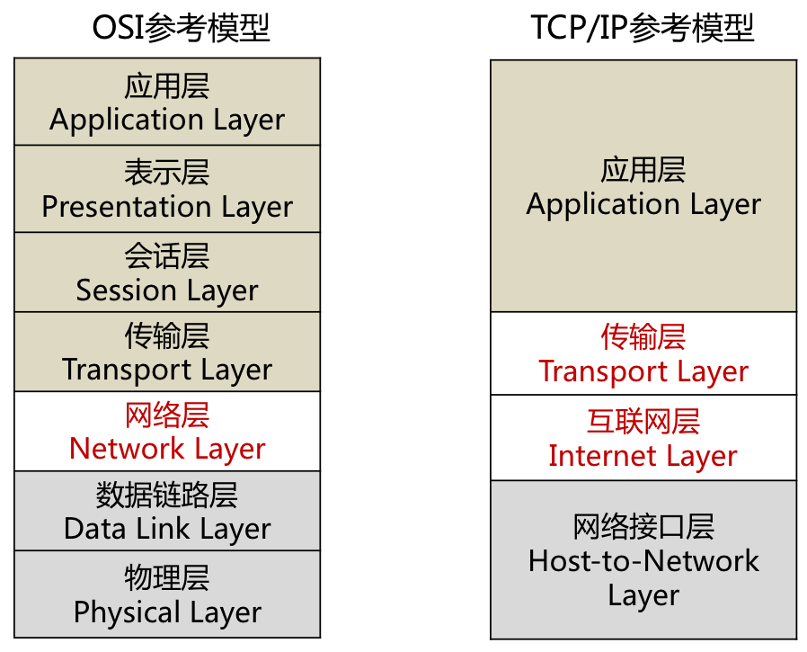
</div>

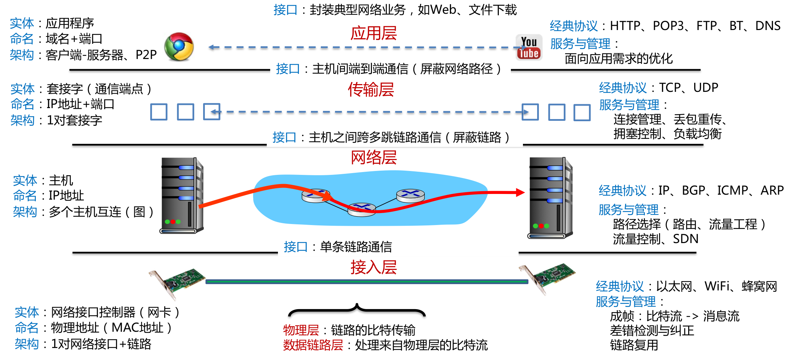

-  每层提供特定功能和服务  
-  层与层之间有接口  
-  同层实体通过该层协议对话  
-  屏蔽各层实现细节   

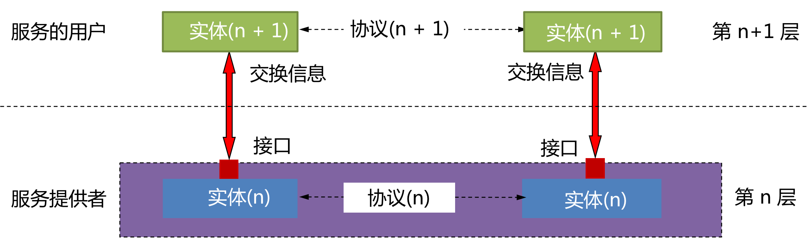

### 分层实现的特征
-  端系统实现所有分层，交换机实现物理层和链路层，路由器实现物理层、链路层和网络层
    -  交换机在局域网内部传输数据，而路由器在广域网内传输数据
-  end2end: 聪明终端笨网络，由端系统负责实现复杂功能
-  以IP协议为核心（沙漏模型）

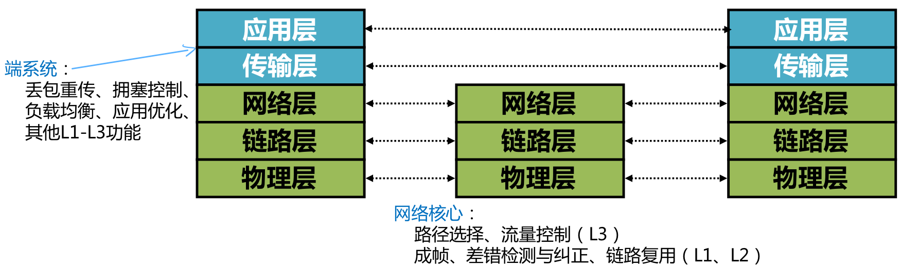


