# 传输层
## 1.   基本概念
-   从网络的角度：屏蔽应用复杂性
-   从应用程序角度：屏蔽底层网络复杂性

### 套接字
-   传输层与应用层的接口
-   应用程序与网络间的API

### 端口号
#### 套接字标识的一部分
-   一个套接字在本地关联一个端口号
-   16 bits
-   报文中两个字段：源端口号和目的端口号
#### 类型
-   知名/熟知端口：0 - 1023，公共域协议使用
-   注册端口：1024 - 49151，向IANA注册后使用（如HTTPS：8080）
-   动态/私有端口：49152 - 65535，用户程序使用
#### 分配
-   自动分配
-   指定端口号

### 复用与分用🌟

#### UDP分用
-   套接字：<IP地址, 端口号>二元组
    -   服务器使用一个套接字服务所有客户

-   <目的IP地址，目的端口号> 相同的UDP报文段被交付给同一个套接字 ，与<源IP地址，源端口号>无关
    -   报文到达目的主机后仅根据目的端口号就可区分进程
    -   报文段中的 <源IP地址，源端口号> 被接收进程用来发送响应报文

#### TCP分用

-   多个连接套接字仍然使用**原监听端口号**
-   此时报文到达目的主机后仅根据目的端口号无法区分进程
    -   需要使用<源IP地址，目的IP地址，源端口号，目的端口号>四元组标识连接套接字

#### UDP和TCP套接字比较

-   多个主机向一个UDP套接字发送报文时，无法区分是哪个主机发的，所以不能随意合并报文；而TCP套接字可以

## 2.   UDP
### 服务
-   对网络层接口进行最简单的封装:网络层 + 多路复用与分用
    -   主机-主机传输->进程-进程传输
-   报文检错（可选）

### 报文格式

### 校验和计算：例子
-   将数据划分为16-bit整数
-   求和
-   发送

-   接收方对UDP报文(包括校验和)及伪头求和，若结果为0xFFFF，认为没有错误
 

### UDP缓冲区
-   端系统实现：Linux无发送缓冲区，有接收缓冲区
-   发送方：从应用层获取的数据，传输层加上UDP头部后直接交给网络层
    -   长消息的分片、缓冲依赖于网络层、链路层提供
-   接收方：每个socket一个缓冲区，存储着来自不同发送方的报文
    -   每次获得一个报文，下一次接收可能得到的是来自另一个发送方的报文
    -   因此，应用层可以感知到报文边界（传输层不能随意合并报文）

### UDP的优势和适用范围
#### 优势
-   无建立连接的延迟
-   不限制发送速率(不进行拥塞控制和流量控制)
-   报头开销小
-   协议处理简单

#### 适用范围
-   容忍丢包但对延迟敏感的应用
    -   如流媒体
-   以单次请求/响应为主的应用
    -   如DNS
-   若应用要求基于UDP进行可靠传输
    -   由应用层实现可靠性

## 3.   一般性可靠传输及其性能优化🌟
### 概念
-   可靠传输：保证有序数据在不可靠信道上完整、正确、进行地从源传送到目的
    -   外部信号干扰导致比特错误（数据损坏）
        -   假设这种随机错误可通过校验技术检测
    -   链路过载导致数据丢失（丢包）
    -   分组交换，多路径独立传输导致乱序

### 完美信道：rdt1.0
-   假设
    -   完美信道:报文不会丢失或受损
    -   始终就绪:发送方/接收方的网络层始终处于就绪状态
    -   瞬间完成:发送方/接收方能够生成/处理无穷多的数据
-   rdt1.0：乌托邦协议
    -   接近无确认的无连接服务

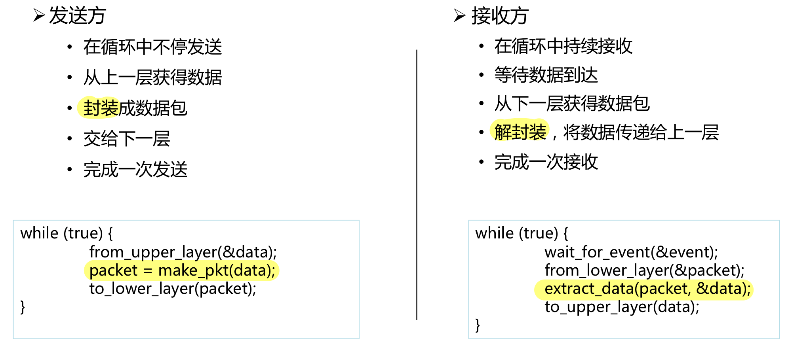

### 有错但不丢包信道：rdt2.0-2.2
-   假设：信道传输数据时，数据包中某些比特会发生0-1翻转，但可以被校验检测
-   思想：自动重传请求（ARQ, Automatic Repeat reQuest）
    -   基于反馈的重传
    -   三要素:（接收方）差错检测、（接收方）反馈、（发送方）重传
#### rdt2.0
-   反馈内容
    -   ACK和NAK
    -   ACK和NAK内容不重要——哑帧
-   停-等式协议：发送1个报文后就停下，等待后再发

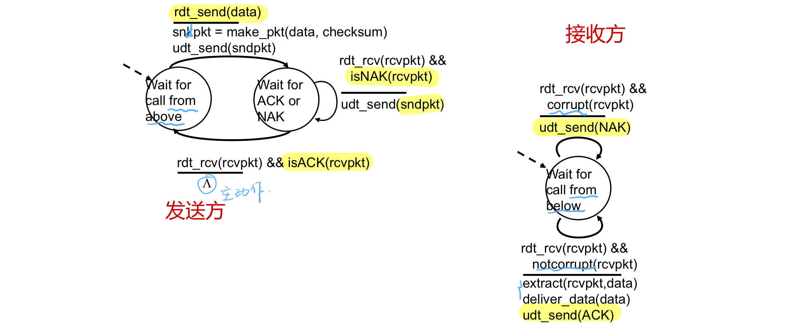

-   缺陷：如果ACK/NAK出错，发送方检出错误后并不知道发送方发的是ACK还是NAK
    -   方案1：通知接收方重传ACK/NAK
        -   缺陷：通知本身也可能出错
    -   方案2：校验码->纠错码
        -   缺陷：需要更多辅助信息，且解码开销大
    -   方案3：发送方直接重传
        -   缺陷：接收方收到重复数据，如何区分是新数据还是重传数据？
        -   序列号seq：停-等协议，发送方一定是顺序逐个发送，只需1 bit区分是否是前一次发送的重传（01交替，重传重复上一次的seq）

#### rdt2.1
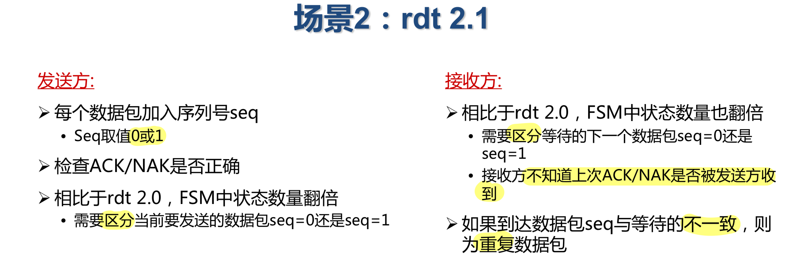

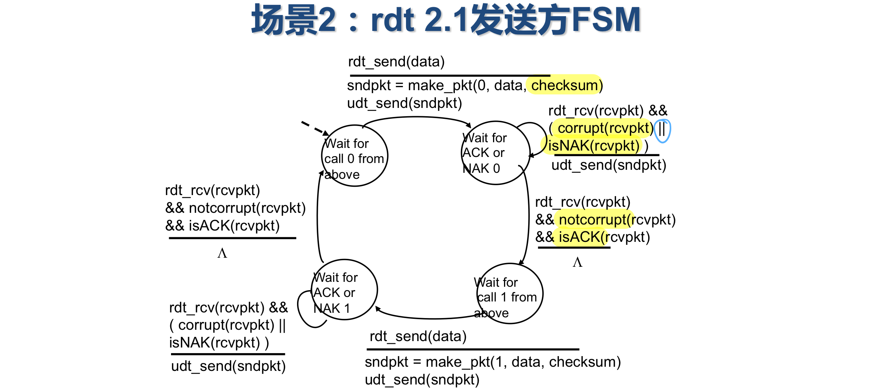

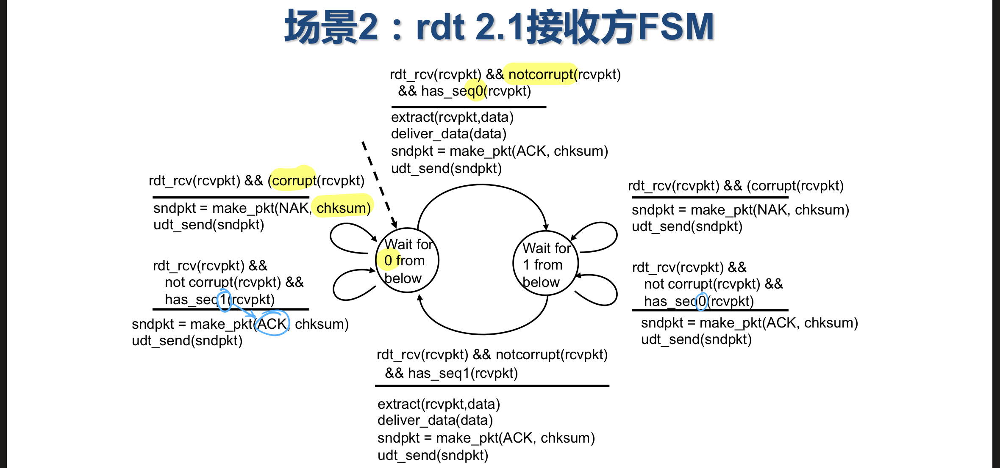

#### rdt2.2
-   在ACK中加上最近成功接收的seq，不再需要NAK

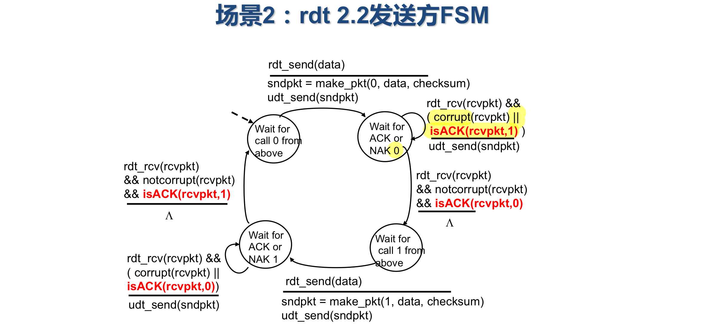

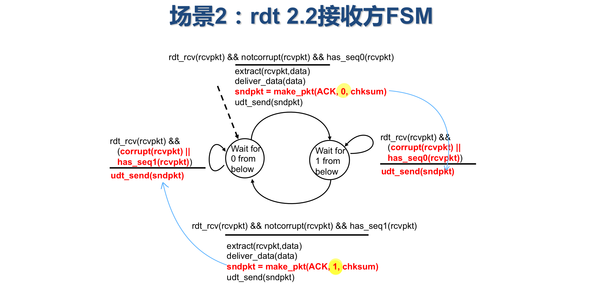

### 有错且丢包信道:rdt3.0
-   假设：信道不仅会出错，还会丢失数据包（永远无法到达接收方）；不考虑乱序
-   增加超时重传
    -   可能因延迟导致重传
        -   前面的协议里延迟并不会导致重传，只是发送方多等一会
    -   接收方仍可通过seq判断重复数据包
        -   对重复数据包也要反馈，和发送方同步发送进度
        -   发送方可能收到对同一个数据包的多个ACK：忽略后面的即可

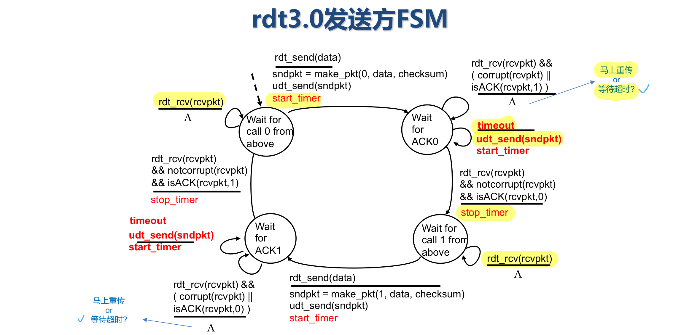

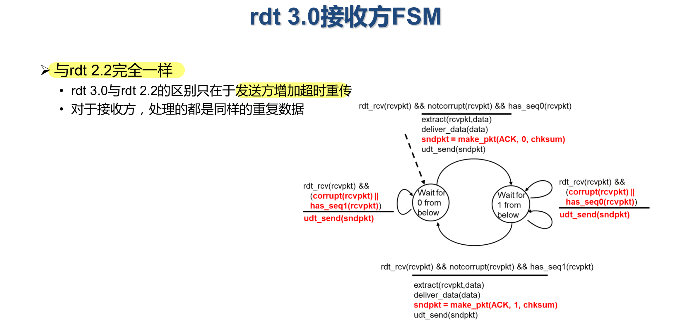

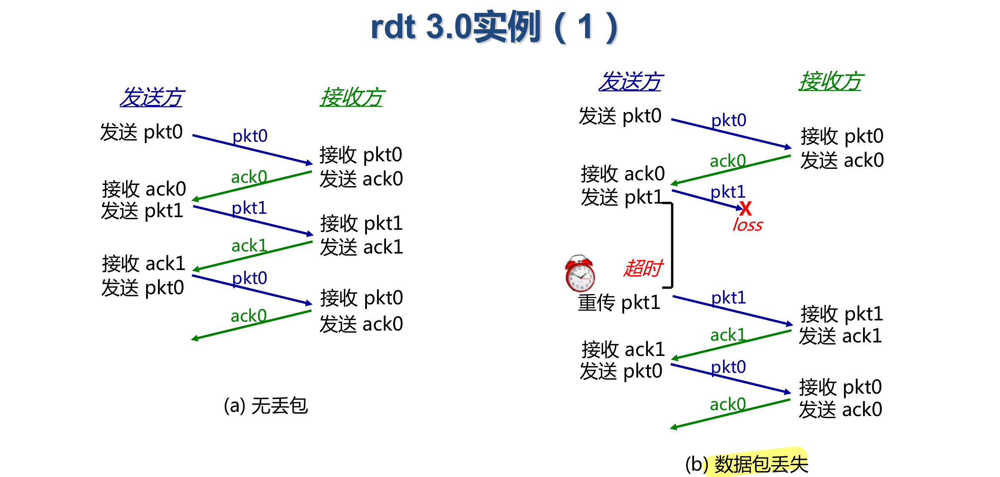

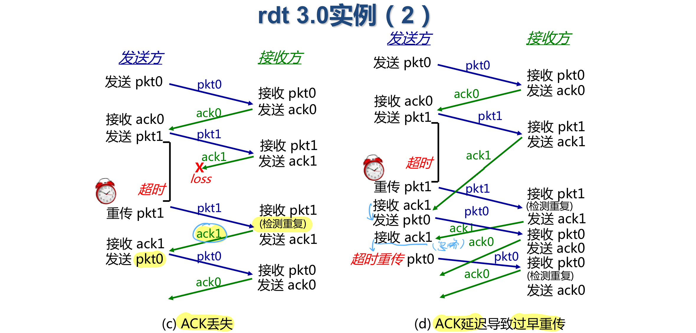

### 停等式协议的效率

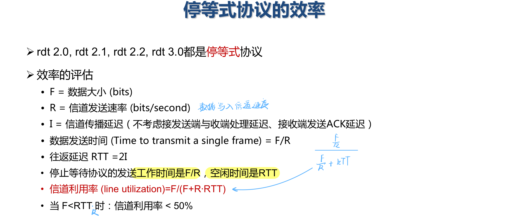

-   长肥网络 (LFN，Long Fat Network):如果一个网络的带宽-延迟乘积 (bandwidth- delay product) 较高(>105 bits，约12 kB)，则可以被认为是长肥网络
    -   停等式协议下如果数据包很小，那么在长肥网络中信道利用率低且延迟长
    -   问题在于只能有一个没有被确认的帧在发送中
        -   管道远远未被注满数据
    -   可以使用更大的帧
        -   物理链路层信道比特错误率限制帧的大小
        -   帧越大越容易出错导致重传

### 性能优化
-   流水线传输：不严格的停等式协议

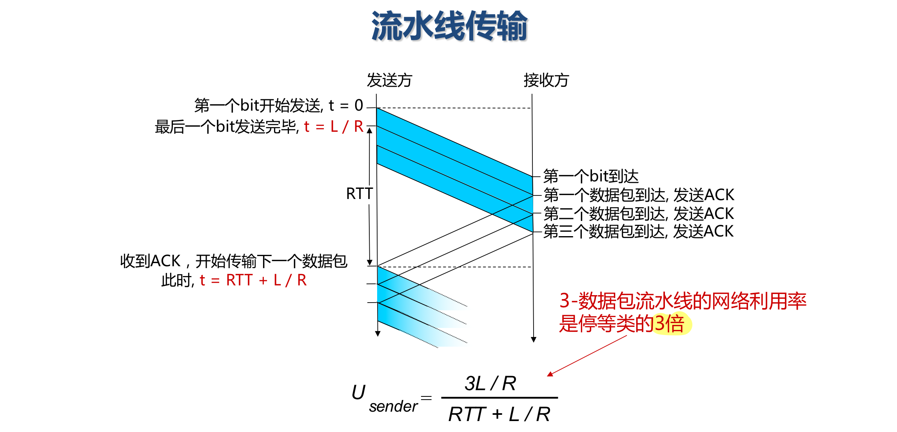

-   要点
    -   增大序号seq的范围
    -   发送方需保存所有未被确认的数据包
        -   滑动窗口机制：限制已发出但未确认数据包的数量上限
        -   对发送方、接收方、网络和seq的记录都友好
        -   窗口大小由流量控制、拥塞控制决定
    -   处理多个数据包的丢失、损坏、超长延迟
        -   差错检测不变
        -   反馈和重传：回退N（GBN）和选择重传（SR）

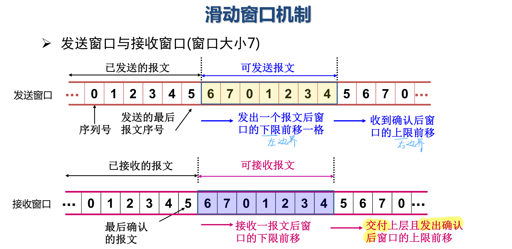

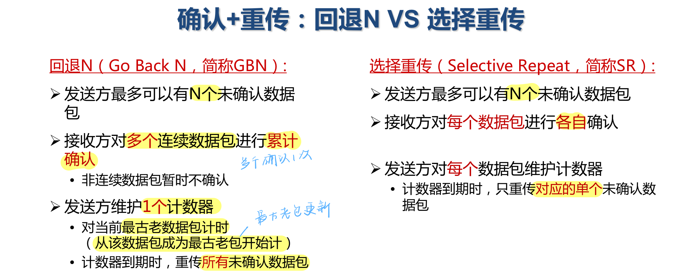

#### 回退N
-   思想
    -   当接收端收到一个出错报文或乱序报文时，丢弃后继所有序号更大的报文，并且不为这些报文发送确认
    -   发送端超时后，重传所有未被确认的报文
-   要点
    -   发送方保存所有未确认数据包
    -   接收端无需保存数据包，只要维护下一个期望收到的seq
-   优缺点
    -   优点:减轻接收端负担
    -   缺点:重传包数量大，增加发送端与信道负担

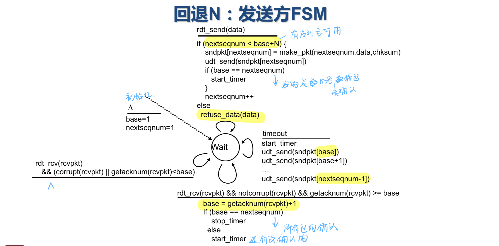

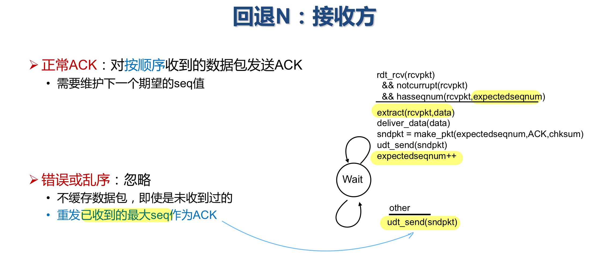

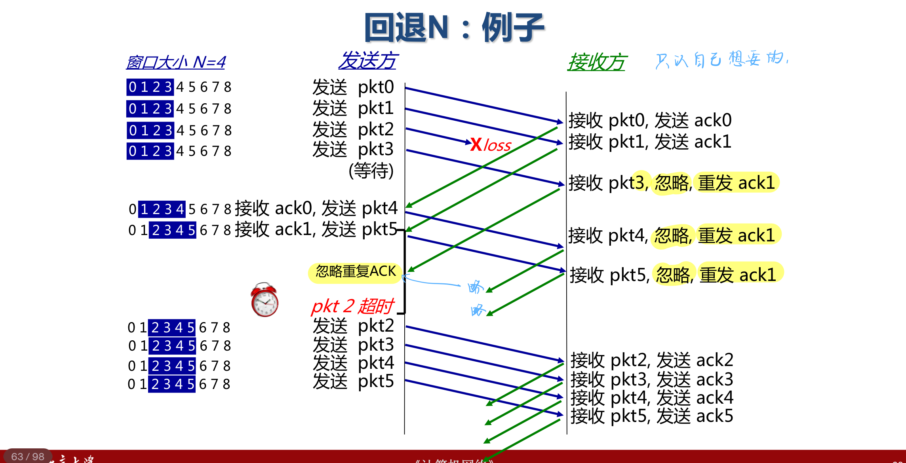

#### 选择重传

-   思想
    -   接收方对每个数据包独立确认
    -   若发送方发出连续的若干包后，收到对其中某一包的ACK错误，或某一包的定时器超时， 则只重传该出错包或计时器超时的数据包

-   要点
    -   发送端需要对每个包维护计时器
    -   接收端需要缓存已经接收的数据包，以便按顺序交付给上一层

-   优缺点
    -   优点：减少重传数量
    -   缺点：接收端缓存、发送端逐包计时器

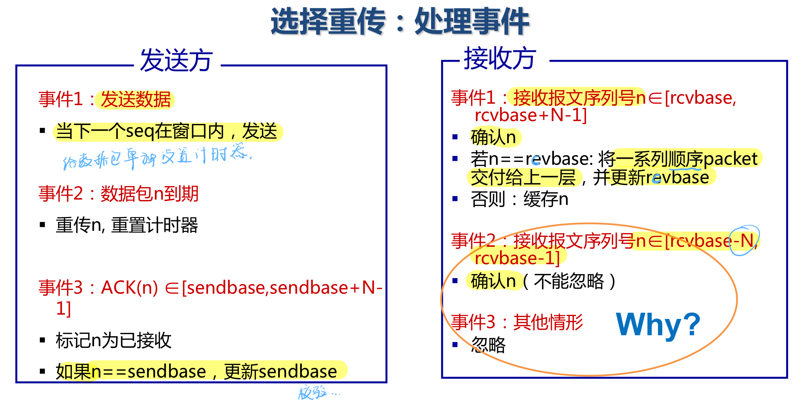
-   图中问题的解答
    -   主要问题在于ACK传输过程中也可能出错或丢包，考虑最坏情况
    -   初始状态：发送方和接收方窗口边界相同:send_base = recv_base
    -   发送方发了整个窗口内的所有报文，但接收方接收到所有报文，逐一发送ACK
    -   只要第一个ACK在传输过程中丢失，就会导致send_base不变，而recv_base' = recv_base + N，两个窗口正好错开
    -   发送方重传窗口内第一个报文，若接收方不进行确认，则发送方窗口一直卡在这里

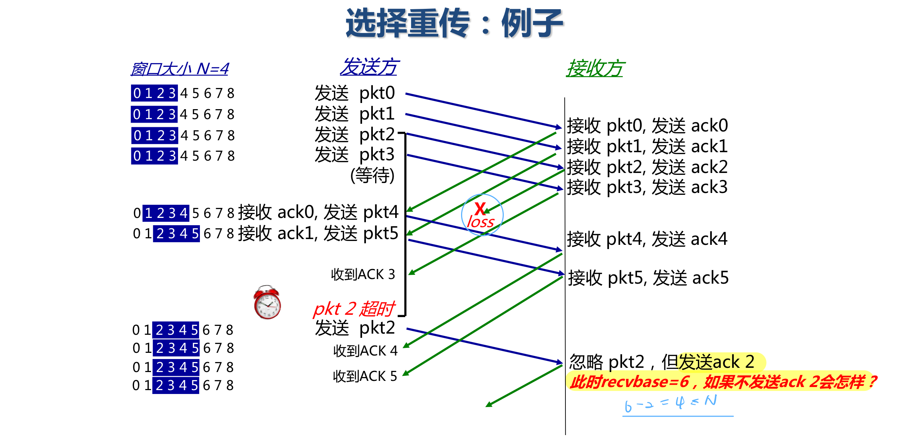

-   复用seq也可能造成问题

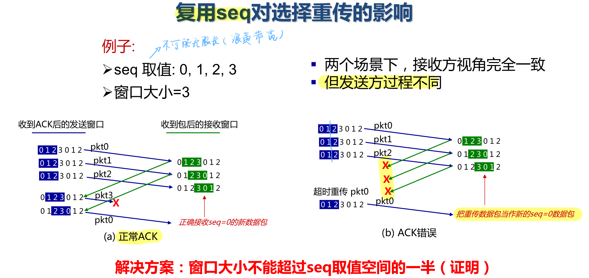
  
-   图中问题的证明
    -   仍然考虑最坏的情况，两个窗口完全错开，长度和为2N
    -   这2N个报文的seq应当不同
    -   结论：seq取值空间的大小 >= 2N

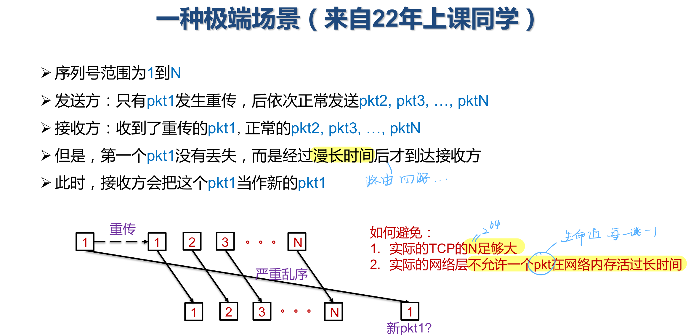

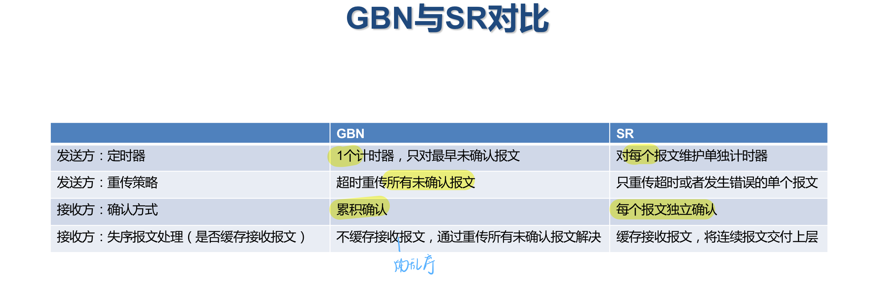

## 4.   TCP可靠传输🌟
### 概述
#### 提供的服务
-   TCP服务模型：在一对通信的进程间提供逻辑上的字节流管道
    -   可靠、有序的字节流：不保留报文边界
-   点到点通信：进程-进程
-   全双工：双向+同时

#### 需要的机制
-   建立连接：通信双方为本次通信建立数据传输所需的状态（套接字、缓存、变量等）
-   可靠数据传输：流水线式发送，报文段检错，丢失重传
-   流量控制:发送方不会令接收方缓存溢出
-   拥塞控制:发送方不会造成网络拥塞

### TCP可靠传输
-   基本机制:流水线传输
    -   发送端:流水线式发送数据、等待确认、超时重传 
    -   接收端:进行差错检测、确认接收
-   对字节建立序号，而非报文
    -   Seq是当前发送字节的序号
    -   ACK值为下一个期望的字节序号，而非当前已经收到的最后一个字节
    -   ACK值放在正常数据包里(捎带，piggyback)
-   乱序处理:协议没有明确规定实现方式
    -   接收端不缓存:可以正常工作，处理简单，但效率低 
    -   接收端缓存:效率高，但处理复杂

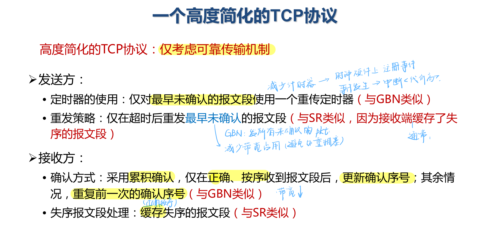

### TCP发送端

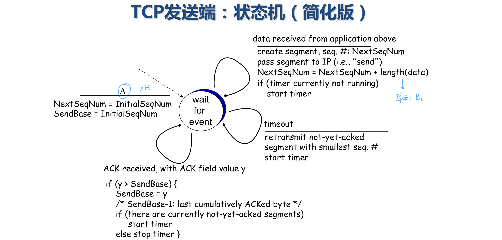

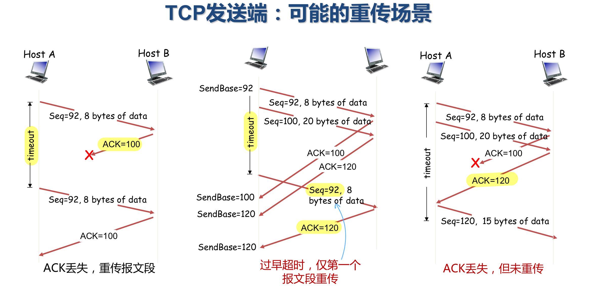
-   一个定时器 + 只重发第一个未确认报文->避免超时设置过小时重发大量报文段
-   流水线式发送 + 累积确认 -> 避免重发某些丢失了ACK的报文段

#### 发送端优化
-   超时值的设置
    -   应大于RTT，需要估计RTT的动态变化
    -   指数加权移动平均：EstimatedRTT = (1 - a) * EstimatedRTT + a * SampleRTT
        -   典型地，a = 0.125
    -   还要加上一个安全距离：DevRTT = (1 - b) * DevRTT + b * |SampleRTT - EstimatedRTT|
        -   典型地， b = 0.25
    -   TimeoutInterval = EstimatedRTT + 4 * DevRTT
    -   估计RTT时需要忽略重传报文段的ACK，因为无法从ACK中判断确认的是原始报文段还是重传报文段（二义性）
    -   重传意味着网络状态不佳，需要增加超时值，但是此时禁止更新超时值
        -   定时器补偿策略：每重传一个报文段超时值加倍，直至达到上限
    -   综合：Karn算法
        -   使用EstimatedRTT估计初始的超时值
        -   若发生超时，每次重传时对定时器进行补偿(超时值加倍)，直到成功传输一个报文段为止
        -   若收到上层应用数据、或某个报文段没有重传就被确认了，用最近的EstimatedRTT估计超时值
-   快速重传
    -   超时前重传
    -   因为累计确认，如果丢包发送方会收到多个重复确认
    -   收到3次就重发

### TCP接收端

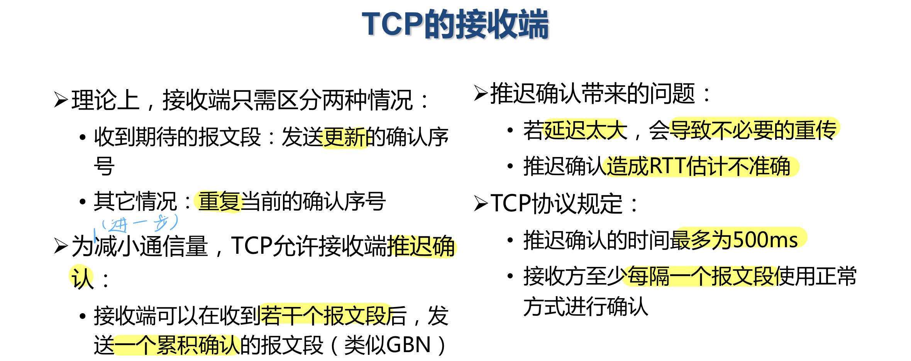

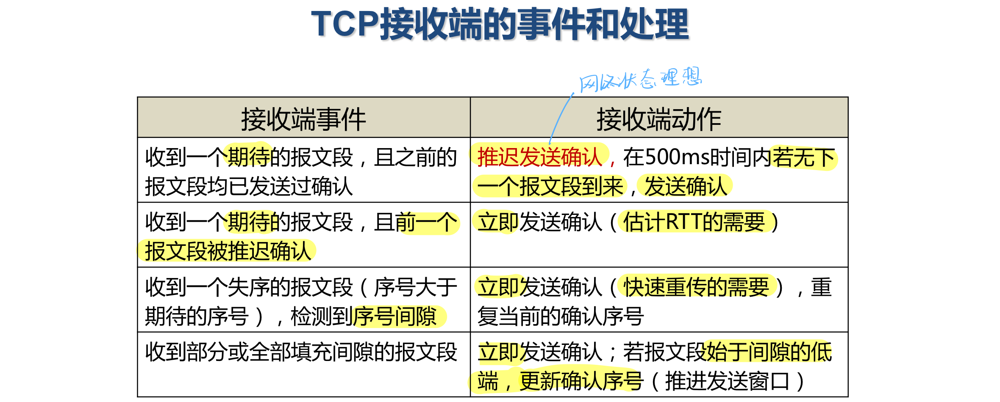

#### 接收端优化
-   推迟确认

## 5.   TCP报文格式

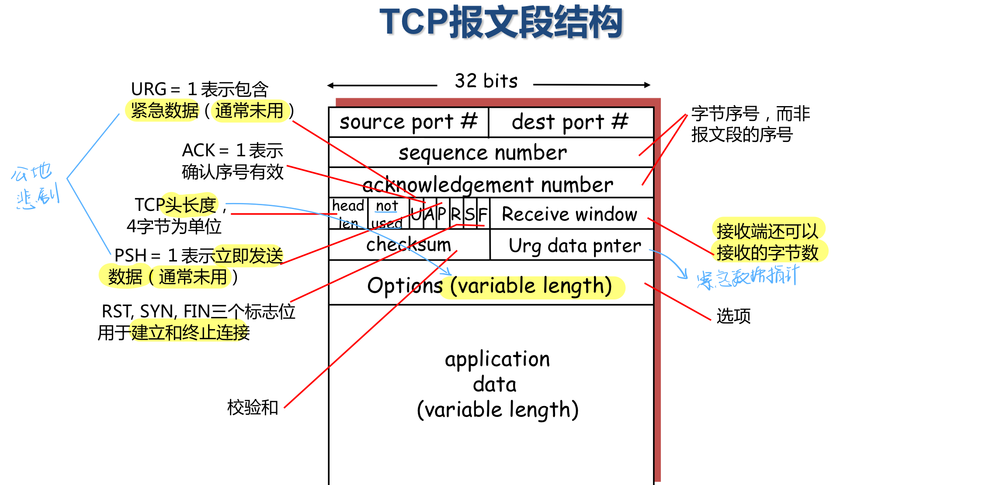

-   发送序号:数据载荷中第一个字节在字节流中的序号
-   确认序号:期望接收的下一个字节的序号

### 重要的TCP选项
-   最大段长度(MSS)：建立连接时声明
-   窗口比例因子(window scale)：建立连接时协商确认
    -   实际接收窗口大小 = window size * 2^window scale
-   选择确认(SACK)：改进的TCP协议引入选择确认，允许接收端指出缺失的数据字节

## 6.   TCP连接建立与关闭
### 连接建立
-   两次握手的问题：客户端下线后仍可能与服务器建立伪连接
    -   主要由于网络延迟

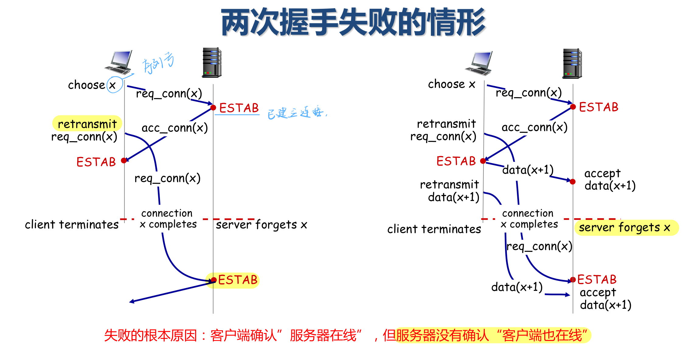

#### 三次握手

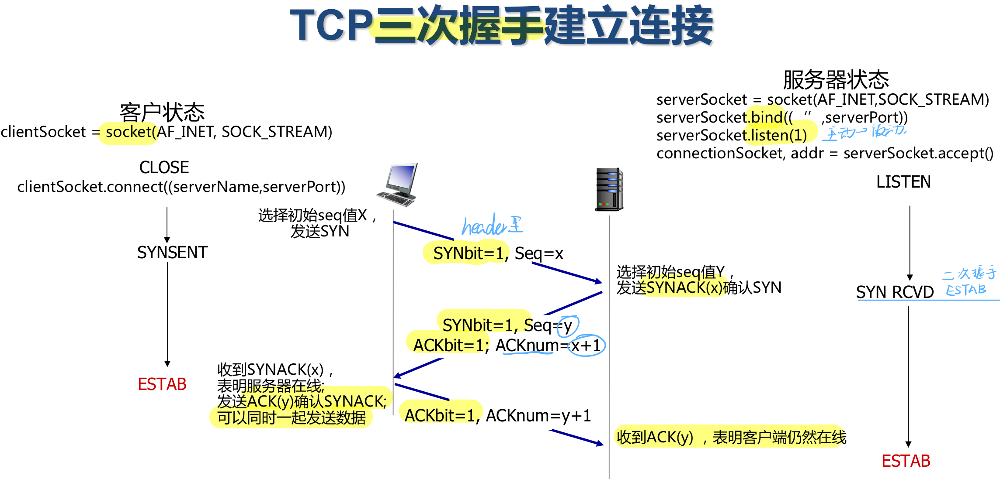

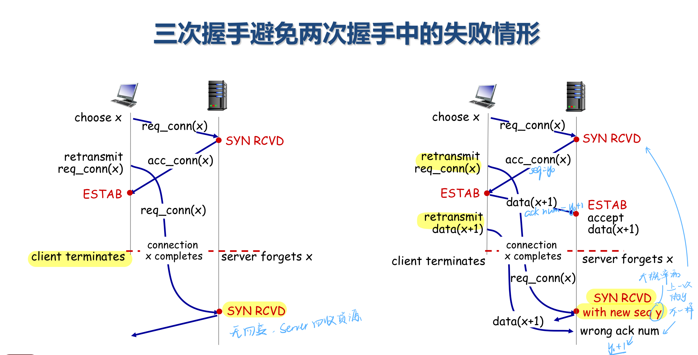

#### 起始序号的选择
-   从0开始不可行：无法区分新连接报文和旧连接重传报文
-   随机选取看运气
-   基于时钟的起始序号选取算法
    -   每个主机使用一个时钟，以二进制计数器的形式工作，每隔ΔT时间计数器加1
        -   ΔT应较小，保证计数器值的增速大于发送序号的增速
    -   新建一个连接时，以本地计数器值的最低32位作为起始序号
        -   确保序号回绕的时间超过分组在网络中的最长寿命
    -   该方法确保连接的起始序号随时间单调增长

### 连接关闭
-   FIN
    -   双方均可发送，可以和ACK一起
    -   一旦发送FIN，就不能再发送用户数据，只能接收用户数据
        -   仍可以发送ACK等消息
    -   一旦收到对方的FIN之后，知道对方不再发送消息，可以在己方数据发送完后安全关闭

#### 四次挥手
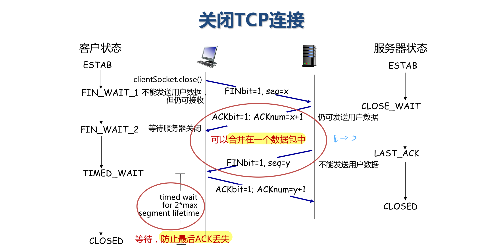
-   丢包重传
-   丢包导致一方下线后另一方仍在线
    -   不断重试
    -   重试失败若干次后：放弃连接or等待重新建立连接（RST bit）

### TCP安全隐患
#### SYN洪泛攻击
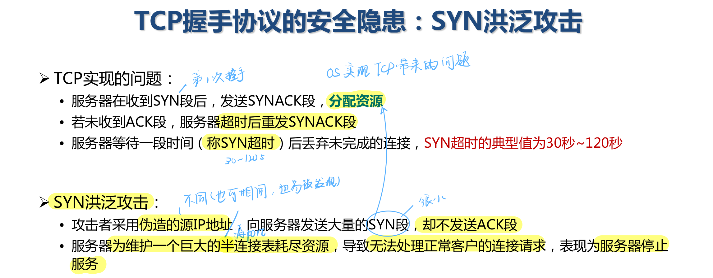
#### TCP端口扫描
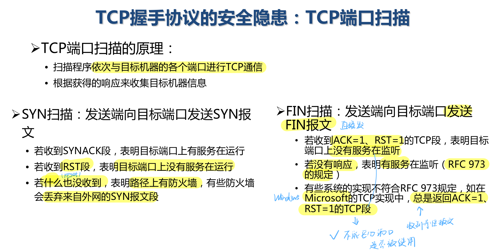

## 7.	TCP流量控制
-   流量控制：发送端TCP通过调节发送速率，不使接收端缓存溢出
    -   UDP报文载荷也放入接收端缓存，但是其并不保证交付，丢了就丢了，因此无需流量控制
-   接收窗口：接收缓存中的可用空间
    -   RcvWindow = RcvBuffer - (LastByteRcvd - LastByteRead)
    -   接收方将RcvWindow放在报头中（窗口通告），向发送方通告接收缓存的可用空间
    -   LastByteSent-LastByteAcked ≦ RcvWindow
    -   接收方通告接收窗口为0时，发送方必须停止发送
    -   当接收窗口变为非0时，接收方应通告增大的接收窗口

### 非零窗口
-   对于接收方，只有收到报文才发ACK，而接受窗口为0时收不到报文
-   发送方收到零窗口通告后定期发送零窗口探测报文段
    -   坚持定时器
    -   seq为上一个段中最后一个字节的序号

### 糊涂窗口
-   数据的发送速度很快、而消费速度很慢
    -   接收方不断发送微小窗口通告
    -   发送方不断发送很小的数据分组
    -   带宽浪费
-   接收方策略：Clark策略
    -   零窗口通告后窗口大小显著增加再发送非零窗口通告
    -   显著增加：窗口大小达到缓存空间的一半或者一个MSS，取两者的较小值
    -   与推迟确认结合：希望推迟间隔内有更多数据被消费
-   发送方策略：Nagle算法
    -   积聚足够多的数据再发送，避免发送太短的报文段
    -   维护发送缓存
    -   新建的连接上只要有数据就组成TCP段发出
    -   如果有未确认数据，后续数据进入发送缓存
    -   清空缓存，用一个TCP段发出
        -   数据量达到一个MSS且接收方窗口大小大于等于MSS
        -   或收到所有已发数据的确认
    -   优点
        -   适应网络延时、MSS长度、发送方速度的各种组合
        -   常规情况下不会降低网络的吞吐量（让数据在发送端而不是网络中等待）
    -   缺点
        -   增加延迟，尤其与延迟确认共同使用时
        -   不考虑接收端是否真的消费了数据

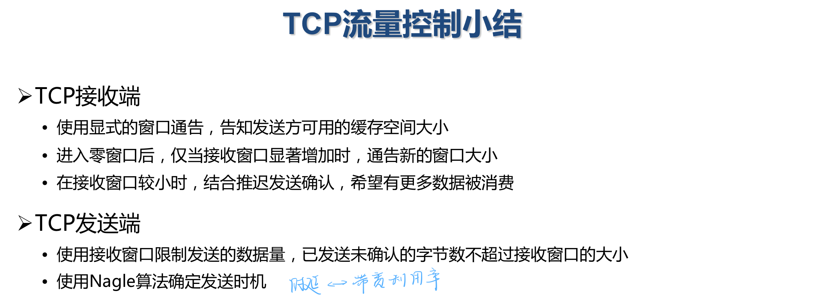

## 8.	TCP拥塞控制🌟
- 简介
  - 传统TCP：端到端拥塞控制
    - 感知拥塞：丢包判定
    - 限制发送速率：拥塞窗口cwnd
      - LastByteSent-LastByteAcked <= cwnd
      - rate = cwnd / RTT Bytes/sec
      - cwnd随发送方感知的网络拥塞程度而变化
      - 还要满足：LastByteSent-LastByteAcked <= RcvWindow
    - cwnd大小调整
      - AIMD：乘性减（迅速减小发送速率，缓解拥塞）加性增（缓慢增大发送速率，避免振荡）
  - 现代TCP变种：网络辅助拥塞控制

-   拥塞控制策略
    -   原则1:正常收到ACK确认意味网络运作良好
        -   考虑增大cwnd
        -   cwnd较小时，可以激进地增大
        -   cwnd较大时，可以较为保守
    -   原则2:丢包(收到3个重复ACK或超时)，意味网络状态较差  
        -   考虑降低cwnd

### 慢启动（在新建连接上）
#### 思路
-   令cwnd = 1 MSS，起始速度= MSS/RTT
-   指数增大cwnd
-   直至检测到丢包 or 达到足够大发送速率(此时终止慢启动)
    -   后者由ssthresh区分，ssthreash同样动态调整
-   慢是和无拥塞控制TCP相比

#### 实现
-   每收到一个ACK段，cwnd增加一个MSS(大致等价于每个RTT加倍)
    -   cwnd_0 = N * MSS
    -   发N个报文，大约经过1个RTT收到N个ACK
    -   cwnd_1 = N * MSS + N * MSS = 2N * MSS
    -   发2N个报文...

### 拥塞避免
-   慢启动指数增长到线性增长
    -   cwnd达到ssthresh后
    -   cwnd=cwnd + MSS*(MSS/cwnd)

### 拥塞状态
-   不管在哪个阶段发生丢包，都进入拥塞状态
-   AIMD：cwnd减半
    -   并非标准
    -   重复ACK丢包和超时丢包表示的网络拥塞状态是不同的，需要区分二者
### 区分两类丢包：Tahoe算法和Reno算法
#### Tahoe
-   不区分两类丢包，都重新开始慢启动

#### Reno
-   收到3个重复ACK，进入快速恢复阶段
    -   将ssthresh降低至cwnd/2
    -   将cwnd降至当前cwnd/2+3（因为收到了3个重复ACK）
    -   采用新机制调节cwnd（cwnd增长比拥塞避免阶段快，可以试图发送一些新数据）
        -   重传
        -   继续收到该重复ACK：cwnd+=MSS
        -   收到新ACK：降低cwnd至ssthresh，进入拥塞避免阶段
        -   超时：进入慢启动阶段
-   超时，重新开始慢启动
    -   将ssthresh降低至cwnd/2
    -   将cwnd=1MSS
    -   使用慢启动增大cwnd

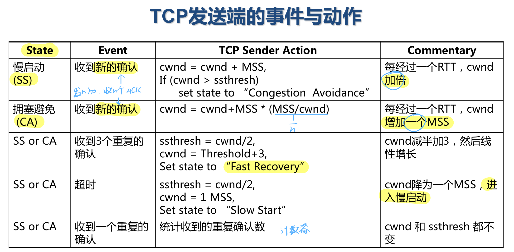

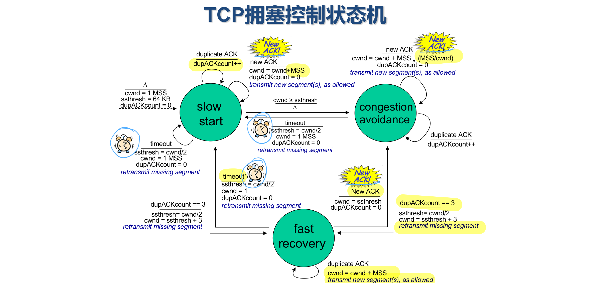

### AIMD吞吐量与公平性
#### 吞吐量
-   忽略慢启动阶段(该阶段时间很短)
    -   近似AIMD
-   W = 发生丢包前/时的拥塞窗口
    -   throughput = W/RTT
-   发生丢包后调整 cwnd=W/2(忽略+3)
    -   throughput = W/2RTT
-   假设在TCP连接的生命期内，RTT和W几乎不变
    -   Average throughout = 0.75 W/RTT

#### 公平性
-   目标：如果K条TCP连接共享某条带宽为R的瓶颈链路，每条连接应具有平均速度R/K
    -   AIMD可保证

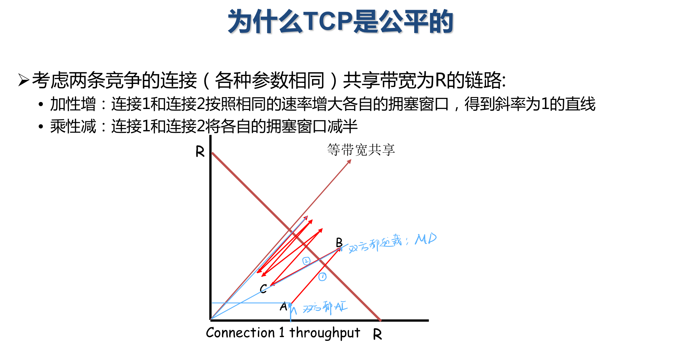

-   不公平的情形
    -   相互竞争的TCP连接具有不同的参数(RTT、MSS等)
    -   并行TCP连接
        -   一条速率为R的链路上有9条连接
        -   若新应用建立一条TCP连接，获得速率R/10
        -   若新应用建立11条TCP，可以获得速率0.55R

## 9.	新型传输层技术

### BIC与CUBIC
-   用于提高传输效率
-   当端到端时延带宽乘积(BDP)较大时，拥塞窗口线性增长过慢，导致信道无法满载

#### BIC(Binary Increase Congestion Control)

-   使用二分查找来搜索合适的cwnd
    -   希望cwnd更快接近最大带宽支持的窗口大小
-   上界和下界的确定
    -   如果发生丢包的时候，窗口的大小是W1，初始化Wmax=W1
    -   如果丢包后将窗口乘性减到了W2(W/2 + 3)后，成功收到重传报文的ACK，初始化Wmin=W2
-   ACK驱动的二分搜索
    -   没经过一个RTT，若无丢包发生，便将窗口设置到Wmax和Wmin的中点，一直持续到接近Wmax
    -   更新Wmin

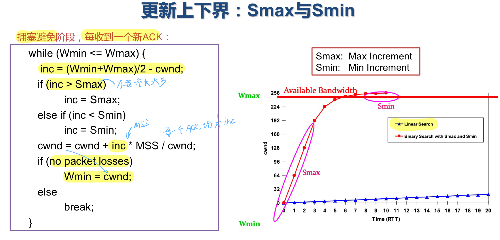

-   cwnd超过WMax，说明新的Wmax还没有达到
    -   按照逼近Wmax的路径倒回去，即采用与之对称的方案

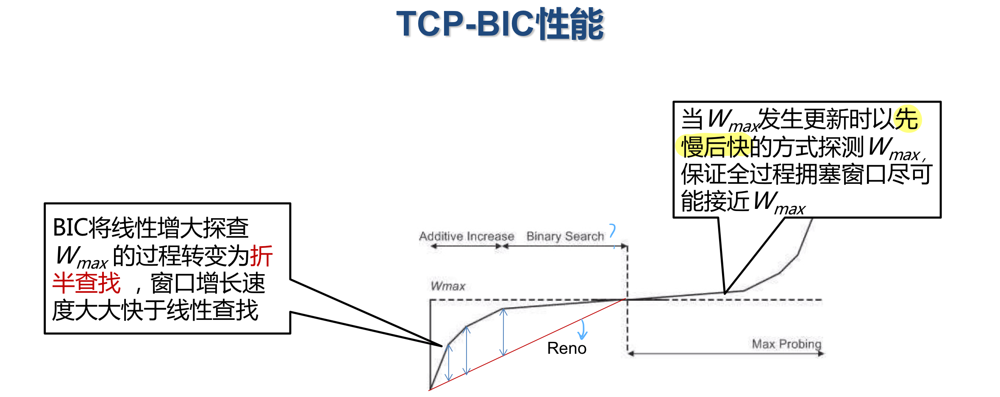

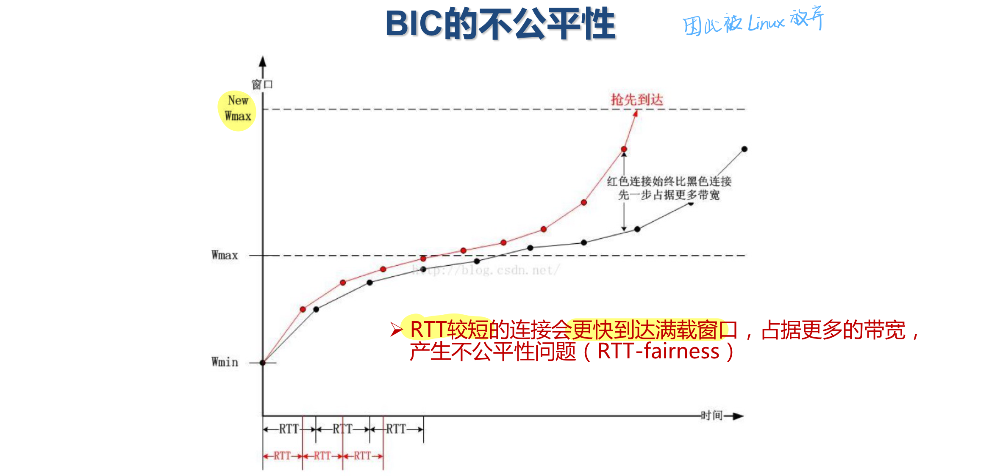

#### CUBIC
-   BIC的问题：推迟确认和ACK丢失的存在；不公平性
-   思想
    -   窗口增长函数仅仅取决于当前距离上次丢包经过的时间t
        -   t是本地局部时间
        -   消除了对RTT和ACK的依赖
    -   在多条共享瓶颈链路的TCP连接之间保持了良好的RTT公平性
-   实现
    -   三次函数拟合BIC算法曲线
    -   拥塞窗口成为距上次丢包的时间t的函数
    -   两个阶段
        -   Steady State Behavior阶段:以凹函数增长逼近最近一次丢包时窗口
        -   Steady State Behavior阶段:以凹函数增长逼近最近一次丢包时窗口
        -   绝大多数时间内，拥塞窗口都在Wmax附近，保持了较高的发送效率

### BBR
-   重新分析了拥塞的发生
    -   瓶颈链路带宽BtlBw，决定了端到端路径上的最大数据投递速率
    -   数据量到达瓶颈链路BDP时，在瓶颈链路处形成排队，导致RTT延长(甚至超时)
    -   数据量持续增加到BDP + BufferSize时，开始丢包
-   BDP = BtlBw × Rtprop
    -   瓶颈链路带宽BtlBw:不会引起路由器缓存排队的最大发送速率
    -   RTprop:”发送端-接收端”整个路径往返时间
    -   瓶颈链路装满时，整个网络管道里的数据量
        -   包含瓶颈链路与其他链路

#### 传统TCP拥塞控制和BBR优化目标的区别
-   传统TCP拥塞控制
    -   以丢包事件为驱动，意味着缓冲区被填满
    -   认为BDP + BtlneckBufSize是最优窗口大小

-   BBR
    -   不要排队，认为BDP是最优窗口大小
    -   相同的吞吐量
        -   在网络中排队->在发送端等待
    -   更低的延迟（RTT）、更小的丢包风险
        -   发送速率低，但是不在网络中排队，因此RTT低，吞吐量相同

#### 思想
-   获知当前BDP，将cwnd往BDP调整

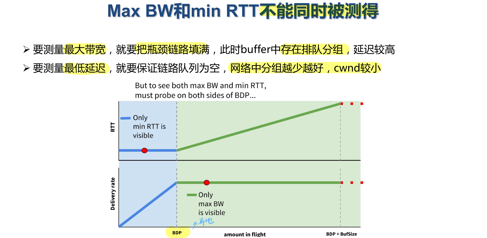

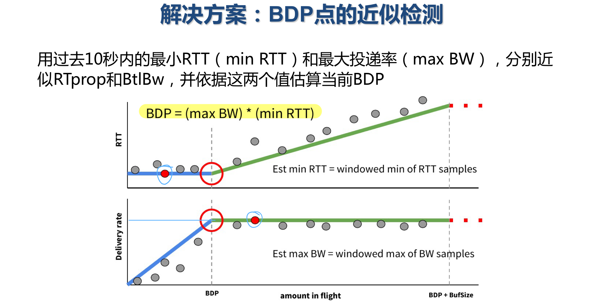

### DCTCP
-   面向数据中心的TCP
-   数据中心的流量特点
    -   通信模式-Partition/Aggregate：Aggregator将上层应用任务划分给下层的worker执行
    -   >90% TCP连接
        -   时延敏感的短流(50KB-1MB)
        -   吞吐敏感的长流(1MB-50MB)
        -   突发流量：时间<1s，大小<2KB
        -   结论：缓冲区队列长度需要被维持在一个较低的水平（和BBR类似）
-   数据中心的性能问题
    -   Incast：短时间内大量流量同时到达交换机的一个端口，导致缓冲区被占满，最终导致丢包
    -   Queue Buildup：长流和短流同时通过交换机的同一个端口时，长流占据缓冲区导致短流延迟增大/丢包
    -   Buffer Pressure：交换机的不同端口通常共享同一块缓冲区，不够用

#### 交换机
-   当队列长度超过阈值K时，给随后到来的包的报文头标记ECN
-   显式的拥塞反馈
    -   使得发送端在丢包之前就感知到拥塞
    -   根据拥塞程度精确调节窗口，使得发送窗口的变化比较平滑

#### 接收端
-   仅当ECN报文首次出现或首次消失时才立即发送ACK
    -   及时通知发送方网络拥塞/解除拥塞
-   否则采取Delay ACK的策略
    -   可以推迟更多，因为不再需要用ACK来估计RTT了

#### 发送端
-   每个RTT更新一次发送窗口
-   a = (1 − g)a + gF，这个值反应了拥塞程度
-   F = # of mared ACKs / Total # of ACKs
-   cwnd = (1 - a / 2) * cwnd

### QUIC
#### TCP的问题
-   实现在操作系统内核中
-   握手时延大
-   队头阻塞问题
    -   TCP传输需要保持有序性：出现丢包时，后面的数据需要等丢失的包重传完 成才能使用，这就导致了队头阻塞
    -   一般也不会采用多个TCP连接并行，而是选择多流复用
        -   某个数据流的数据包丢失，会使得TCP连接上所 有数据流都需要等待

#### 传统的传输架构和基于QUIC的传输架构
-   传统的传输架构
    -   TCP提供数据传输服务
    -   TLS(传输层安全性协议)对数据进行加密
    -   HTTP协议定义如何发起请求-响应请求
    -   应用在HTTP之上实现

-   基于QUIC的传输架构
    -   QUIC替代TCP、TLS和部分HTTP的功能；用户态实现，迭代快
    -   底层基于UDP实现
        -   QUIC包作为UDP的数据载荷
    -   拥塞控制是模块化的，可以方便地使用各种TCP拥塞控制算法，如CUBIC等

#### QUIC的优势
-   简化了连接建立过程
-   一个连接上可独立传输多个可区分字节流
    -   独立的多流复用
    -   各个流相互独立，某个流的数据包丢失不影响其它流的数据交付，解决了队头阻塞问题
    -   限制单个流对接收端缓冲区的占用不能超过阈值
-   分离确认接收与向上层交付数据
    -   交付数据时，判断重复数据与顺序
-   解决重传歧义（TCP的重传包使用和原包相同的seq）
    -   每个packet number只会出现一次，ACK没有歧义
-   IP地址/端口切换无需重新建立连接
    -   使用Connection ID来表示每个连接
    -   对连接建立了一层抽象，消除了传输层对网络层的依赖
    -   IP地址或端口的变化不影响对原有连接的识别
-   易于部署和更新
    -   整个QUIC包被加密传输
        -   保护用户数据隐私
        -   避免被中间设备识别和修改
    -   QUIC在用户态实现
        -   与操作系统解耦，从而能和应用一同快速迭代
        -   如:预留接口，用户可自定义拥塞控制
    -   版本协商机制
        -   由于QUIC的快速迭代特性，会同时存在众多QUIC版本
        -   客户需要和服务器进行版本协商(不引入额外时延的协商机制)
