# 网络层
## 1.   基本概念
### 网络层功能
#### 基本功能
-   主机-主机间数据传输可达
    -   多跳传输
    -   实现在每台主机和路由器中
    -   路由器检查数据包首部，转发给下一跳

#### 核心功能
-   转发：数据平面，局部执行
    -   将数据报从路由器的输入接口传送到正确的输出接口
    -   核心：转发函数（转发表）
-   路由：控制平面，全局执行
    -   选择数据报从源端到目的端的路径
    -   核心：路由算法与协议

#### 多跳传输服务模型
-   向传输层提供的接口类型：面向连接(电路交换) or 无连接(分组交换)
-   谁负责可靠交付：网络 or 端系统
-   服务质量是否有保障：无保障 or 性能保障

#### Internet：无连接的数据报服务
-   不保证任何东西，简单所以可扩展性强
-   无连接+数据包独立转发+尽力而为交付

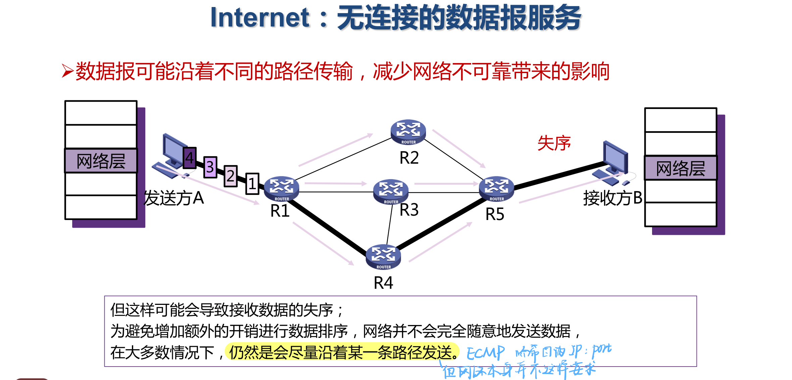

##  2. 路由器架构

### 控制平面
-   控制平面（控制）：运行各种路由协议，学习去往不同目的的转发路径:路由表
    -   可同时运行多个路由协议（多核...）
    -   也可不运行任何路由协议，只使用静态路由和直连路由
    -   若存在多个“去往同一目的IP”的不同类型路由，路由器根据路由优先级，选择最佳路由，形成核心路由表
        -   直连路由 > 静态路由（手动配置） > 动态路由
    -   控制层将核心路由表下发到数据层，形成转发表(FIB)

### 数据平面
-   数据平面（转发）：根据上述路由表，将收到的IP分组转发到正确的下一跳链路
#### 转发过程
-   链路层解封装，IP头部校验
-   获取报文目的IP地址
-   用目的IP地址，基于最长前缀匹配规则查询转发表
-   查询失败，丢弃报文
-   查询成功
    -   IP头部“TTL”字段值减1，重新计算IP头部“校验和”
    -   获取转发出接口和下一跳链路层地址
    -   重新进行链路层封装，发送报文
-   注:普通IP报文转发过程中，路由器不查看传输层及以上层协议的内容

#### 输入端口

-   输入端口:接口卡 (interface card)
    -   物理层处理、链路层解封装
    -   转发表查询(该工作在**输入接口卡**处理)
    -   通过交换结构将报文排队发往目的接口卡(发送过快将产生拥塞)

-   去中心化数据交换：每个输入端口独立计算输出端口
    -   每个输入端口在内存里维护转发表
        -   匹配-动作模式
    -   优势:每个端口独立工作，达到线速
        -   线速(line rate):每个端口的传输带宽
    -   如果报文到达速度超过交换结构速度：输入端口队列缓存->丢包
-   转发策略
    -   基于目的地址的转发
    -   通用转发：可根据任意字段组合，更灵活
-   基于目的地址的转发：最长前缀匹配
    -   与转发表的存储介质TCAMs有关
    -   0, 1, *

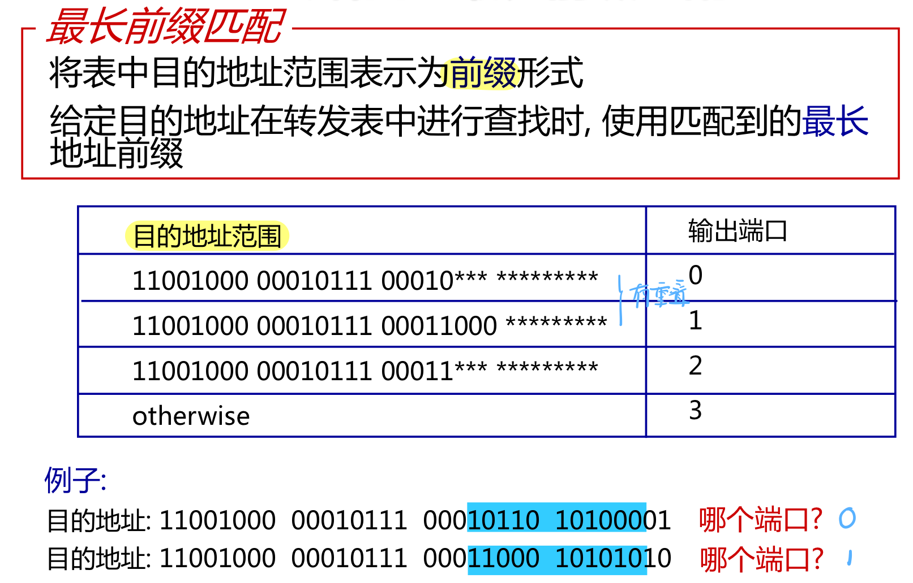

-   缓冲队列与排头阻塞（Head-of-the-Line blocking, HOL blocking）
    -   前面的报文由于对应的输出端口被占用在输入端口缓冲队列中排队等待，导致后续的报文也需要等待，尽管它们对应的输出端口空闲

#### 交换结构
-   交换速率：所有输入端口到输出端口的总速率
    -   N个输入端口，理想状态下为N被线速
-   三种典型交换结构
    -   共享内存
    -   共享总线
    -   纵横式（cross bar）

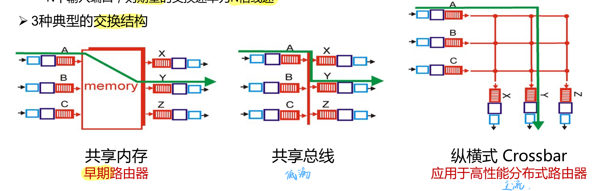

-   共享内存
    -   需要路由处理器控制，控制平面参与转发
    -   交换流程
        -   报文到达输入端口时，产生中断信号通知路由处理器
        -   路由处理器将报文复制到内存中，查询对应输出端口，再将报文复制到输出端口
    -   性能瓶颈:内存拷贝
-   共享总线
    -   不经内存，无需处理器干预
    -   交换流程
        -   输入端口查询转发表后给报文加上标签指明输出端口
        -   总线广播报文到所有输出端口
        -   输出端口根据标签判断是否应转发
    -   总线1次只能广播1个报文，交换速率受总线带宽制约
-   纵横式Crossbar
    -    使用2N条总线连接N个输入端口与N个输出端口
    -    优势
        -   不重叠的交换路径，可并行

#### 输出端口

-   缓冲队列:交换结构的数据超过发送数据时
    -   与输入端口不同，可以不是FIFO
    -   也可能发生排队和丢包
    -   缓冲区大小：RTT * C / sqrt(N)，C为链路带宽，N为报文流的个数（二元组流/五元组流）
-   队列调度:从缓冲队列中选择数据报文
    -   兼顾性能和公平性（网络中立原则）
    -   FIFO：溢出时仍需考虑丢弃报文的策略
        -   Tail drop:丢弃新来的报文
        -   Priority drop:根据优先级丢弃报文
        -   Random drop:随机丢弃
    -   优先级调度：多个优先级队列，公平性不佳
    -   轮询调度：多个队列，在队列间轮询
    -   加权公平队列(weighted fair queuing, WFQ)
        -   每个队列拥有权重值
        -   权重高的队列，轮询到的次数更多
        -   可以每发送一个将权重-1

## 3.   IPv4报文格式和报文分片
### IPv4协议简介
-   网际协议版本4，无连接
-   两个基本功能：寻址（路由+转发）+分片

### IPv4数据报格式

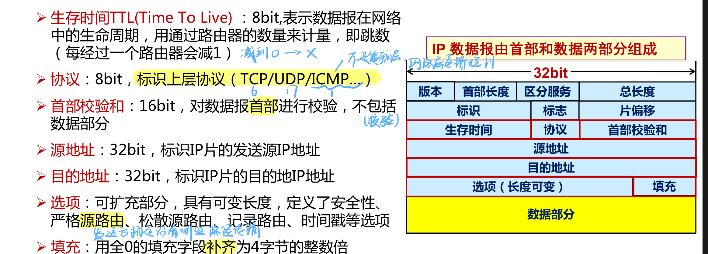

### 报文分片

-   数据报大小受链路限制
-   MTU(Maximum Transmission Unit), 最大传输单元
    -   链路MTU
    -   路径MTU = 瓶颈链路MTU
    -   以太网MTU为1500字节
-   分片策略
    -   允许途中分片:根据下一跳链路的MTU实施分片（多用）
        -   发送方不用负责分片
    -   不允许途中分片:发出的数据报长度小于路径MTU
        -   发送方分好片
        -   发送方需要路径MTU发现机制
        -   违背了端到端原则：网络内部应对端系统透明
-   重组策略
    -   途中重组，实施难度太大
    -   目的端重组(Internet采用的策略)
    -   重组所需信息:原始数据报编号、分片偏移量、是否收集所有分片

### 总结

## 4.   IP地址和路由器转发
### 网络接口
-   接口(interface):连接主机/路由器与物理链路之间的模块
    -   路由器由多个接口
    -   每个主机通常有1-2个接口
    -   IP地址针对接口分配
    -   接口之间通过链路层技术连接
### IP地址
-   IP地址:网络上的每一台主机(或路由器)的每一个接口都会分配一个唯一的32位的标识符
    -   两个字段：网络号(网络地址)+主机号(主机地址)
    -   网络前缀：网络号相同的连续的IP地址空间
-   子网划分
    -   子网掩码：一个IP地址一个，32bit二进制数，置1表示网络位，置0表示主机位
    -   子网：有相同网络地址的网络**接口**
        -   子网内的接口可以不需要网络层路由就可以进行数据传输
        -   通过链路层技术

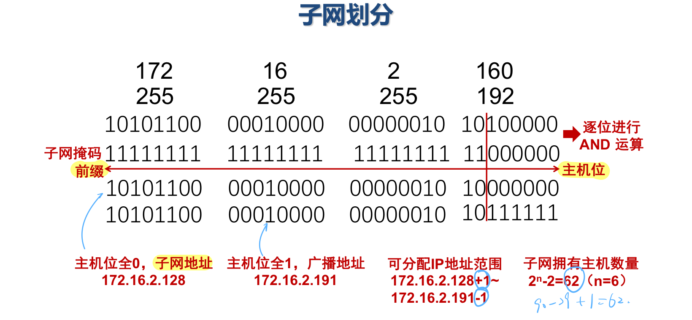

-   特殊IP地址（不考）

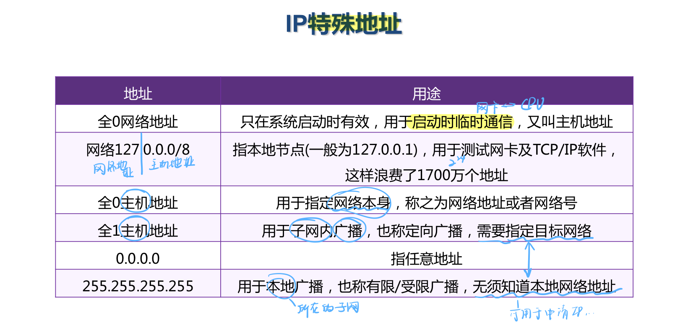

-   无类域间路由CIDR(Classless Inter-Domain Routing)
    -   网络地址可以是任意长度
    -   表示:将32位的IP地址划分为前后两个部分，并采用斜线记法，即在IP地址后加上“/”，然后再写上网络前缀所占位数
-   CIDR地址/路由聚合
    -   子网内进一步划分对外只暴露1个CIDR网络地址
    -   子网迁移无需修改自身地址
        -   修改路由表/转发表即可
        -   最长前缀匹配：将数据包送到正确的**子网**
    -   子网内转发
        -   对目的IP地址进行最长前缀匹配——网络层路由器完成
        -   根据目的MAC地址转发——链路层交换机完成

### 路由器转发🌟
-   子网内转发：使用目的MAC地址
    -   通过ARP协议获取**子网内**IP-MAC地址映射

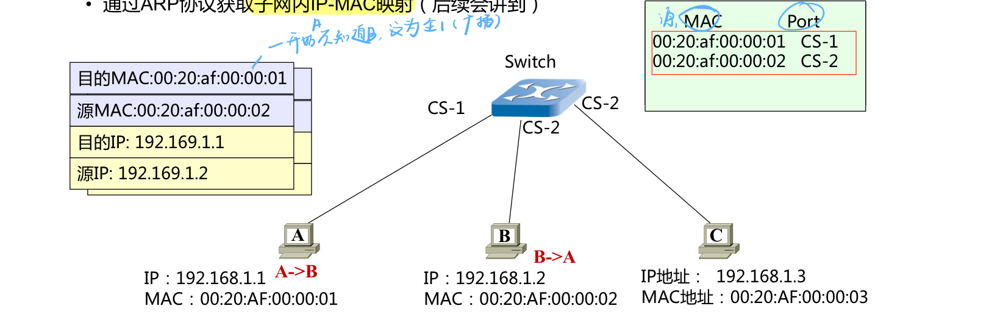

-   跨子网转发：使用目的IP地址
    -   子网内仍使用MAC地址

## 5.  ARP, DHCP, NAT, ICMP
### ARP

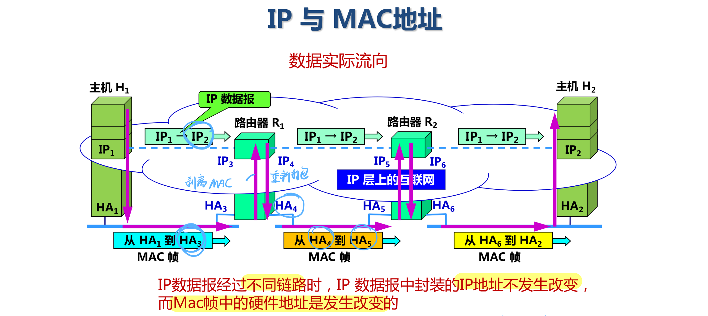
#### ARP地址解析过程
-   A已知B的IP地址，需要获得B的MAC地址
-   如果A的ARP表中缓存有B的IP地址与MAC地址的映射关系，则直接从ARP表获取
-   如果A的ARP表中未缓存，则A**广播**包含B的IP地址的ARP query分组
    -   局域网（子网）内的所有结点都可收到ARP query
-   B接收到ARP query分组后，将自己的MAC地址发送给A
-   A在ARP表中缓存B的IP地址和MAC地址的映射关系
    -   超时后删除
#### 子网内转发过程（从A到B）
-   A检查B的IP地址的网络号部分
-   确定主机B与主机A属于同一子网
-   将IP数据包封装到链路层帧中，（不经过路由器）直接发送给主机B
    -   在帧头部填写A与B的MAC地址
    -   若B的MAC地址未知则通过ARP query获取

#### 跨子网转发过程（从A到E）
-   A创建IP数据报
    -   源IP地址为A的，目的IP地址为E的
-   A在自己的路由表中找到**子网网关**路由器R的IP地址
-   A根据R的IP地址通过ARP得到R在该子网内接口的MAC地址
-   A创建链路层数据帧，封装IP数据报
    -   源MAC地址为A的，目的MAC地址为R接口的
-   A发送数据帧，R接收数据帧
-   R根据目的IP地址查询转发表，确认输出端口以及下一跳结点的IP地址
-   R修改数据帧中的源MAC地址和目的MAC地址
    -   目的MAC地址为下一跳（路由/目的主机）的MAC地址
    -   如果下一跳的MAC地址未知，R通过ARP协议获取
-   R转发数据帧到下一跳

#### ARP Spoofing攻击
-   ARP无状态协议，不会记录是否发送过请求，只要收到响应就缓存
-   攻击需要攻击者与受害者在**同一子网**内
-   情况1:攻击者任意地发送ARP响应
    -   可以使用任意的源IP地址与MAC地址构造ARP响应，声明某个IP地址（如网关或其他主机）的MAC地址为攻击者自己的MAC地址
    -   受害者收到ARP响应，更新ARP表
    -   受害者后续数据将被发往攻击者提供的MAC地址
        -   不再经过路由器
    -   攻击者可以修改自己的IP转发功能，将截获的受害者数据继续转发
    -   也可以声明一个不存在的MAC地址，产生网络黑洞
-   情况2:攻击者任意地发送ARP请求
    -   耗尽网络带宽

### DHCP
#### 获取IPv4地址
-   静态设定：申请固定IP地址，手工设定，如路由器、服务器
-   动态获取
    -   使用DHCP协议或其他动态配置协议
    -   当主机加入IP网络，允许主机从DHCP服务器动态获取IP地址（有时效）
        -   DHCP服务器可能在子网内部也可能不在，可能有多个
    -   可以有效利用IP地址，方便移动主机的地址获取
    -   也可以申请延长IP地址的占用

#### 架构：C-S
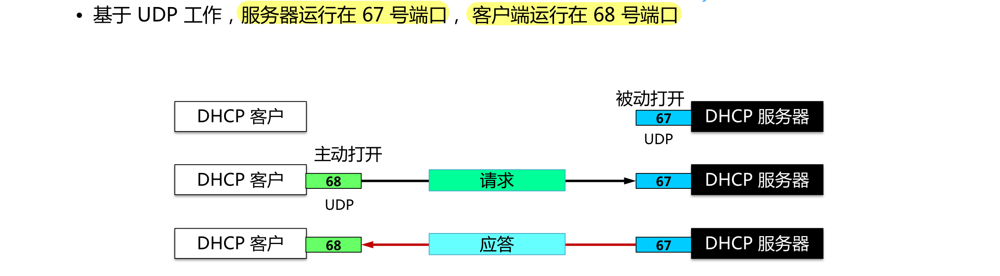
#### 工作过程
-   DHCP客户从UDP端口68以**广播**形式向服务器发送发现报文(DHCP DISCOVER)
    -   因为此时客户端还没有IP
-   DHCP服务器广播或单播发出提供报文(DHCP OFFER)
    -   包含可供分配的IP地址
-   DHCP 客户从多个DHCP服务器中选择一个，并向其以广播形式发送DHCP请求报文(DHCP REQUEST)
-   被选择的DHCP服务器广播或单播发送确认报文(DHCP ACK)

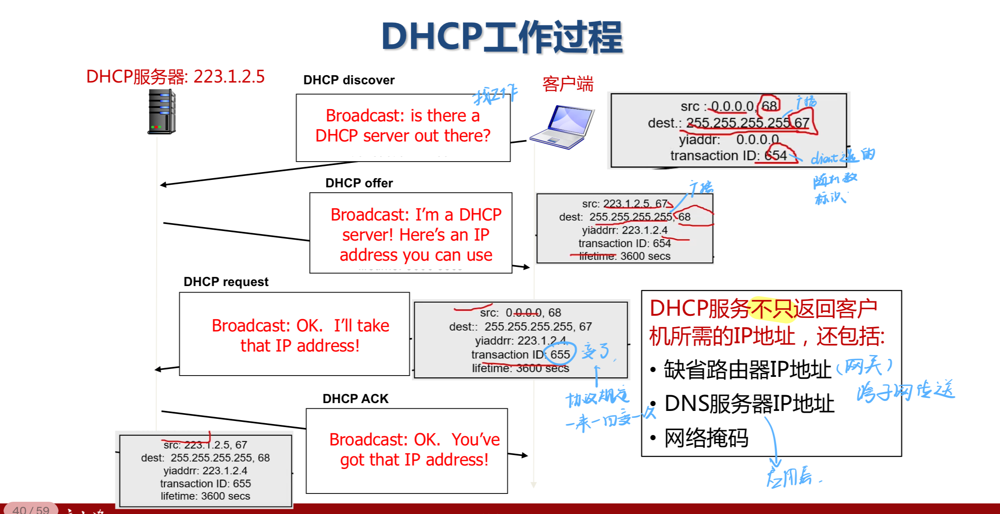
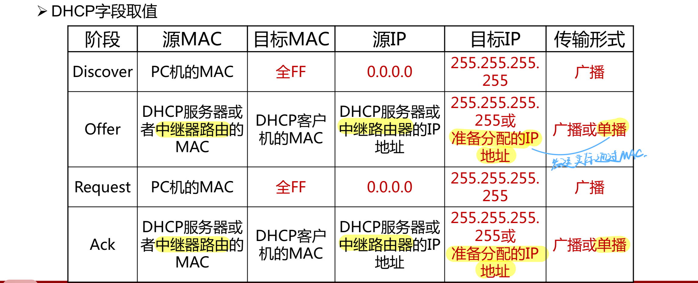
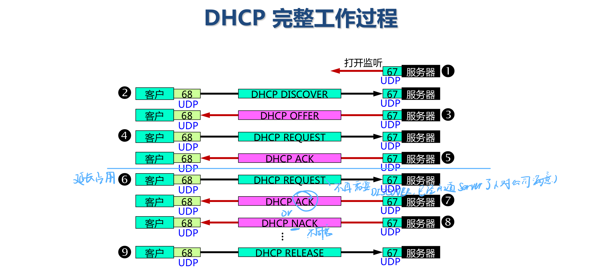

#### 安全问题
-   DHCP耗竭攻击(DHCP Starvation Attack)
    -   攻击者短时间内发送大量DHCP请求，将子网内可用IP地址全部占用
    -   后续主机无法获取新IP地址
-   流氓DHCP(Rogue DHCP attack)
    -   通常在DHCP耗竭攻击之后，先耗尽DHCP的所有IP，其他主机就只能用自己提供的
    -   攻击者启动自己的DHCP服务，给网络中的其他主机提供虚假的配置，包括DNS服务器IP与网关IP
        -   可实现流量截获...

### NAT
-   网络地址转换：用于解决IPv4地址不足的问题，将私有(保留)地址转化为公有IP地址
    -   只有公有IP地址需要保证唯一性
-   私有IP地址（可复用）
    -   A类地址:10.0.0.0--10.255.255.255
    -   B类地址:172.16.0.0--172.31.255.555
    -   C类地址:192.168.0.0--192.168.255.255
#### 工作过程
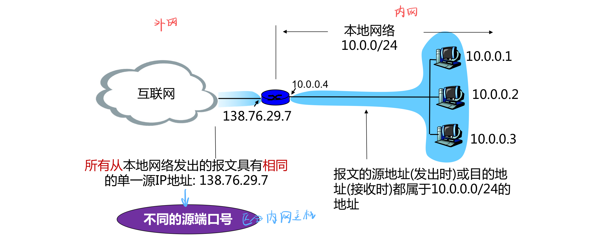
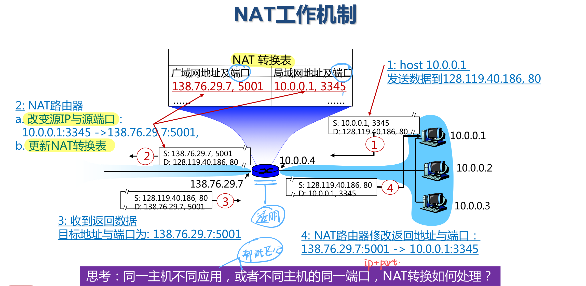
-   出数据报:外出数据报用NAT IP地址(全局), 新port # 替代 源IP地址(私有), port #
-   NAT转换表:每个(源IP地址, port #)到(NAT IP地址, 新port #)映射项
    -   根据不同的IP上层协议（TCP/UDP）进行NAT表项管理
-   入数据报:对每个入数据报的地址字段用存储在NAT表中的(源IP地址, port #)替代对应的(NAT IP地址, 新port #)

#### 优缺点
-   优点
    -   节省合法地址，减少地址冲突
    -   灵活连接Internet
    -   保护局域网的私密性
-   缺点
    -   违反了IP的分层模型，路由器处理传输层协议
    -   违反了端到端的原则
        -   一个管道被拆分为两段，管理难度加大（拥塞控制、可靠传输...）
    -   不能处理IP报头加密
    -   新型网络应用的设计者必须要考虑 NAT场景
        -   如P2P应用程序（如何找到对等结点？）

### ICMP
-   互联网控制报文协议
    -   允许主机或路由器报告差错情况和提供有关异常情况的报告
    -   由主机和路由器用于网络层信息的通信
    -   ICMP报文携带在IP数据报中: IP上层协议号为1
-   报文类型
    -   ICMP差错报告报文（发生错误的结点生成）
        -   终点不可达:不可达主机、不可达网络，无效端口、协议
    -   ICMP询问报文（用户主动发起）
        -   回送请求/回答 (ping使用)

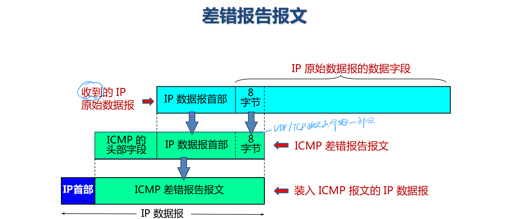

#### Ping
-   PING (Packet InterNet Groper)
    -   PING用来测试两个主机之间的连通性
    -   PING使用了ICMP回送请求与回送回答报文
        -   连通性
        -   往返时延
        -   单向转发跳数
        -   也可根据剩余TTL值推断初始TTL值，大致判断对方主机操作系统类型
            -   Linux/Unix: 64
            -   Windows: 128
#### Traceroute
-   获取整个路径上路由器的IP地址
-   源向目的地发送一系列UDP段(不可能的端口号)
    -   第一个 TTL =1
    -   第二个 TTL=2
    -   ...
-   当第n个数据报到达第n个路由器（TTL=0）
    -   路由器丢弃数据报
    -   向源发送一个ICMP报文(类型 11, 编码0)
    -   报文的源IP地址就是该路由器的IP地址
-   源收到ICMP报文，计算 RTT
    -   Tracert针对同一路由器执行上述过程3次
-   停止条件
    -   UDP段最终到达目的地主机
    -   目的地返回ICMP “端口不可达”分组 (类型3, 编码3)
    -   当源得到该ICMP，停止

## 6.   网络路由
### 简介
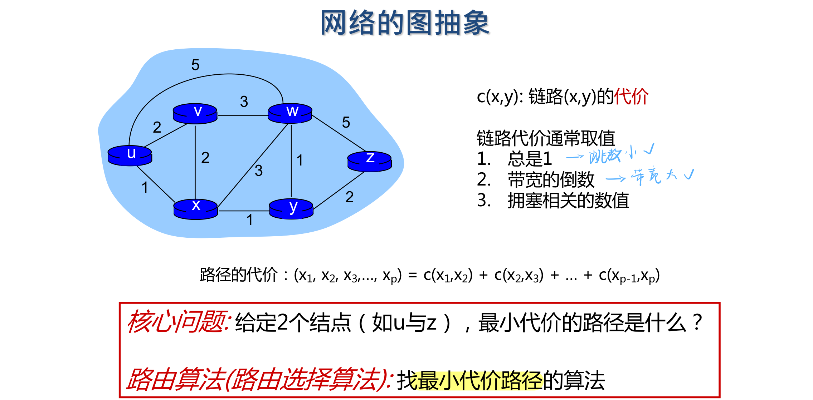

-   汇集树
    -   所有的源节点到一个指定目标节点的最优路径的集合构成一棵以目标节点为根的树
    -   一般不会出现回路（反证）

### 距离向量（DV）算法🌟
-   基于Bellman-Ford算法

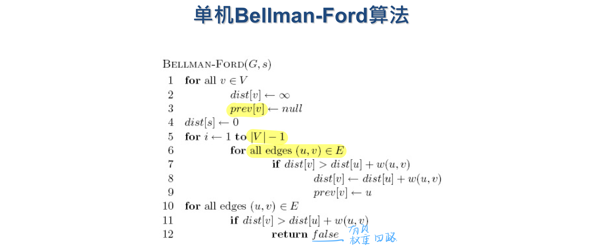

-   从单机Bellman-Ford到分布式更新
    -   数据的分布式
    -   计算的分布式

#### 分布式信息存储：距离向量
-  每个结点x维护
   -  到达每个邻居结点v的**实际**开销:c(x,v)
   -  距离向量Dx = [Dx(y): y є N ]，该结点x到网络中**所有**其他结点y的最小代价的**估计值**
   -  距离向量Dv = [Dv(y): y є N]，每个邻居结点v的距离向量

#### 分布式计算
-   每个结点不断重复
    -   (发送)每个节点向邻居发送它自己到某些节点的距离向量（同步/初始化）
    -   (接收)当节点x接收到来自邻居y的新DV估计，更新所保存的y的DV信息
    -   (计算)使用B-F方程更新其自己的DV
        -   因为邻居的距离向量变了
        -   如果更新，通知邻居

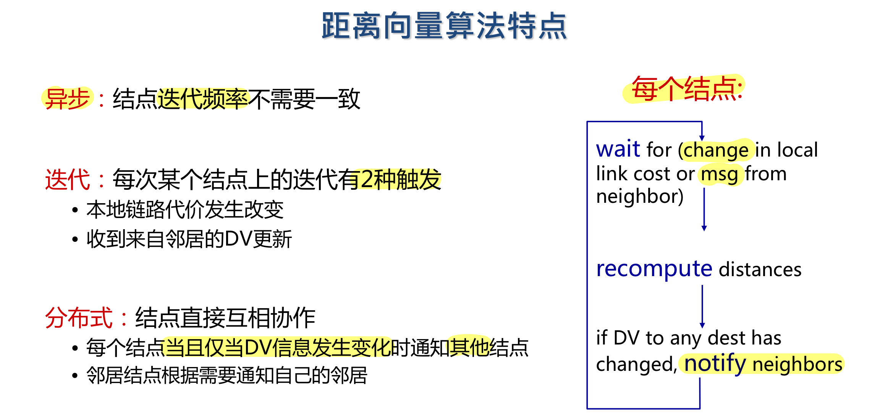

#### 例子
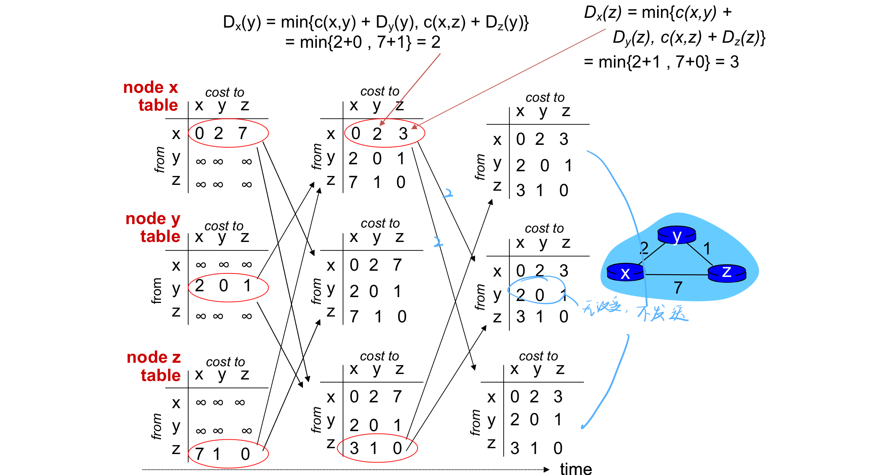
-   第一步：初始化，每个节点向邻居发送自己的距离向量
-   第二步：x, y, z各自尝试更新自己的距离向量
    -   x和z距离向量更新
    -   x通知y和z，z通知x和y
-   第三步
    -   x保存z更新后的距离向量，尝试更新自己的距离向量
    -   y保存x和z更新后的距离向量，尝试更新自己的距离向量
    -   z保存x更新后的距离向量，尝试更新自己的距离向量
    -   都没有再更新，算法收敛

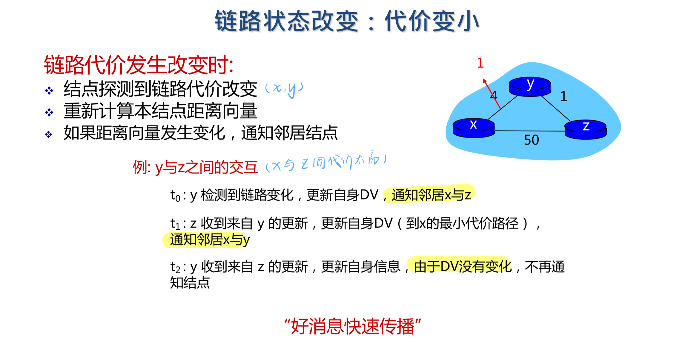

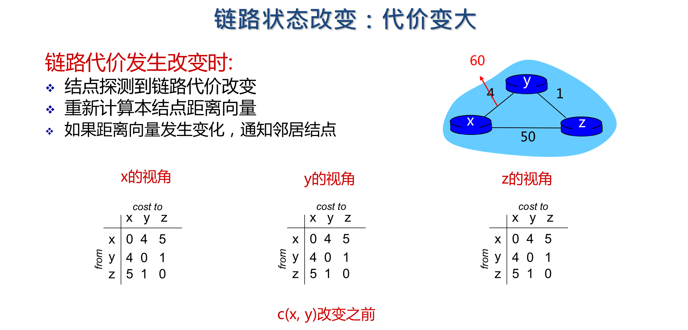

-   c(x, y)从4变为60
-   x探测到状态改变，更新距离向量
    -   D(x, y) = min(c(x, y)+D(y, y), c(x, z)+D(z, y)) = min(60, 50 + 1) = 51
    -   D(x, z) = min(50, 60 + 1) = 50
-   同时，y探测到状态改变，更新距离向量
    -   D(y, x) = min(60, 1 + **5**) = 6
    -   D(y, z) = min(1, 60 + 5) = 1
-   x通知y和z，y通知x和z
    -   各自保存收到的新的距离向量（进行同步）
    -   0 51 50 / 6 0 1 / 5 1 0
-   更新各自的距离向量
    -   x, y各自的距离向量不变
    -   z变为0 51 50 / 6 0 1 / 7 1 0
-   z通知x和y
    -   x和y保存收到的新的距离向量
-   x和y更新自己的距离向量
    -   x自己的距离向量不变
    -   y变为0 51 50 / 8 0 1 / 7 1 0
-   y通知x和z
    -   x和z保存收到的新的距离向量
-   x和z更新距离向量
    -   x自己的距离向量仍不变
    -   z变为0 51 50 / 8 0 1 / 9 1 0
-   ...

**问题：y认为自己可以通过z到达x，但是z实际上是通过y到达x的，距离向量并没有这部分信息**
-   y和z的距离向量中各自到x的值每次+2
-   正确结果应当为0 51 50 / 51 0 1 / 50 1 0
-   4 -> 5 -> 6 -> 7 -> ... -> 49 -> 50 || -> 50 -> 51
-   共发送50 - 4 + 2 = 48次消息（课件上似乎没有算上最后2次更新需要发送的消息）
    -   坏消息传播慢：无穷计数问题

#### 毒性逆转

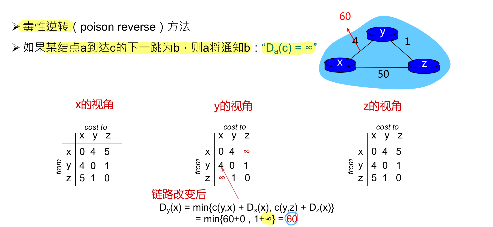

### 链路状态（LS）算法🌟
-   基于Dijkstra算法
-   每个结点都知道网络拓扑与链路开销
    -   通过链路状态广播得到
    -   所有结点都有相同的信息 
-   每个结点计算以自己为源节点到其他所有结点的最短路径
    -   生成该结点的转发表

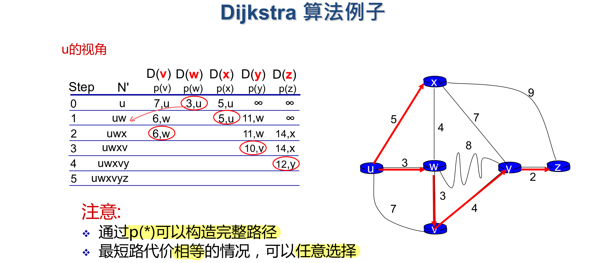
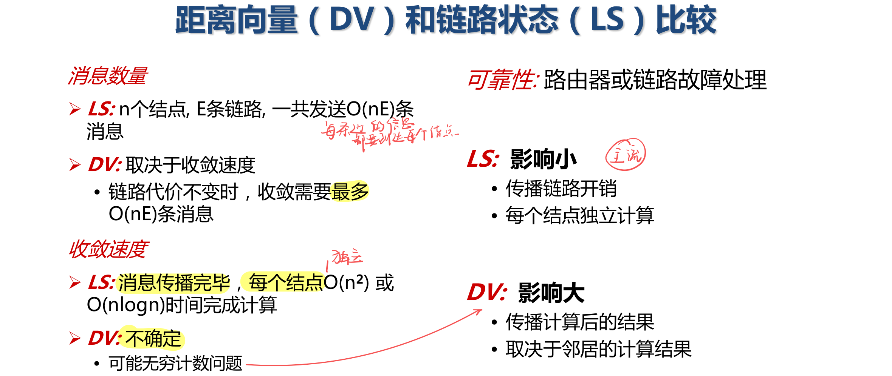

### 层次路由
#### 基本思路
-   减少存储转发表和交换路由信息的开销
    -   通过地址聚合进一步缩减路由条目（基于子网的转发）
    -   问题：子网管理员对网络的管理受到限制，不能随意分配不连续地址
-   另一种方案：自治系统(AS，Autonomous System)
    -   一个管理机构控制之下的网络
    -   一个AS内部通常使用相同的路由算法/路由协议，使用统一的路由度量(跳数、带宽、时延 ...)
    -   不同的AS可以使用不同的路由算法/路由协议
    -   每个AS有一个全球唯一的ID号:AS ID
    -   自治系统内还可以进一步划分层次
-   自治系统内部使用内部网关路由协议，Interior Gateway Protocols (IGP)
    -   每个自治系统域内路由算法可不同
    -   典型IGP协议:OSPF(LS)，RIP(DV)，IS-IS(DV,OSI)，IGRP，EIGRP......
-   自治系统之间之间使用外部网关路由协议，Exterior Gateway Protocols (EGP)
    -   各自治系统域之间的路由需统一
    -   典型EGP协议:边界网关协议BGP (Border Gateway Protocol)

### BGP
#### 简介
-   边界网关协议BGP (Border Gateway Protocol)
    -   目前互联网中唯一实际运行的自治域间的路由协议
-   BGP功能
    -   eBGP:从相邻的AS获得网络可达信息
    -   iBGP: 将**网络可达信息**传播给AS内的路由器
    -   基于网络可达信息和策略决定到其他网络的“最优”路由

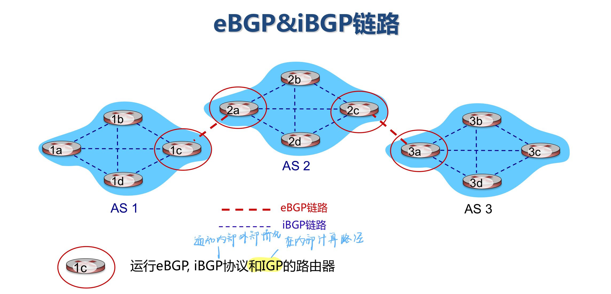

#### 路由通告
-   BGP路由器之间建立TCP连接（179端口），交换BGP报文
    -   Open报文:用于建立BGP对等体(peer)之间的会话连接，协商BGP 参数(该过程需要认证)
    -   Update报文:通告/撤销路径
    -   Keepalive报文:用于保持BGP会话连接
    -   Notification报文:用于差错报告和关闭BGP连接
-   通告路径
    -   BGP路径:路径前缀(目的网络)+属性
    -   两个重要属性
        -   AS路径(AS-PATH):想要到达某个目的网络，需要经过的所有AS号，如:AS 67, AS 17
        -   下一跳(NEXT-HOP):想要使用这条路径，对应的下一跳IP地址
    -   网关路由器接收到路由通告时，通过既定策略采纳或拒绝

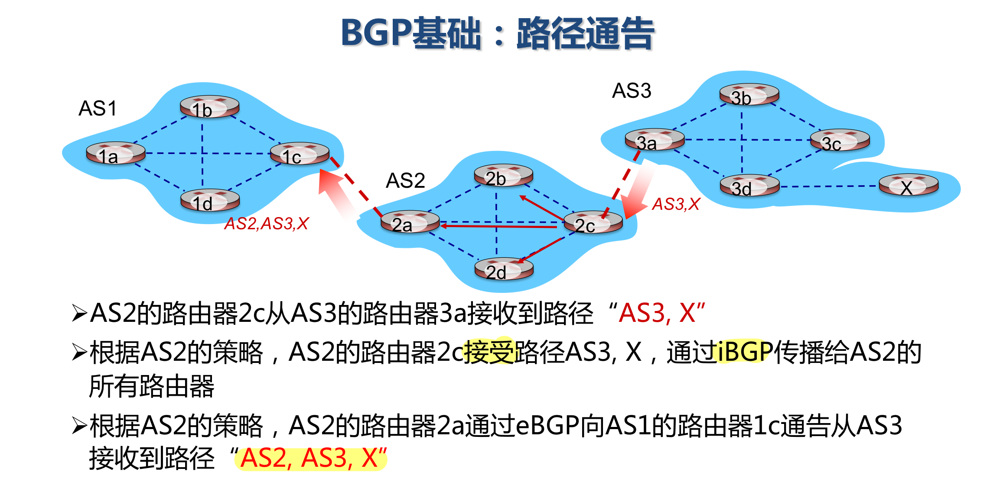

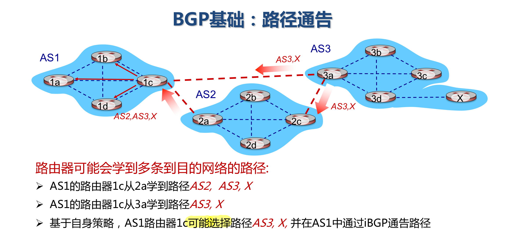
-   每个AS的边界路由器数量很少->一个路径通告信息经过的结点数是自治系统数的量级
-   一个AS在BGP刚刚运行时，向相邻AS获取整个BGP路由表
    -   之后更新变化的部分
-   BGP为每个AS提供
    -   从邻居AS获取网络可达信息 (eBGP协议)
    -   传播可达信息给所有的域内路由器(iBGP协议)
    -   根据“可达信息”和“路由策略”决定路由

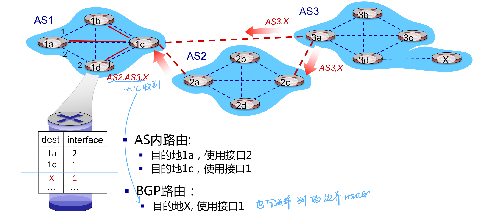

#### 路由策略
-   几类策略
    -   路由器可能从多个对等体收到针对同一目的IP的路由，需要选择一条最佳路由
        -   策略的优先级
            -   本地偏好值属性:政策决策
            -   最短的AS-PATH
            -   最近的NEXT-HOP路由器
            -   附加标准...
            -   最低路由器ID
    -   接受或拒绝接收到的路由通告
    -   是否向其他相邻AS通告路径信息

-   AS间策略

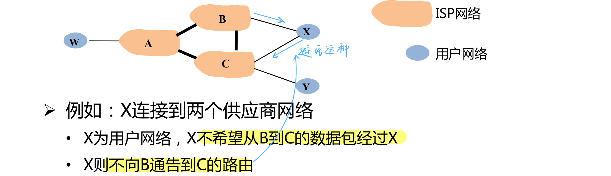
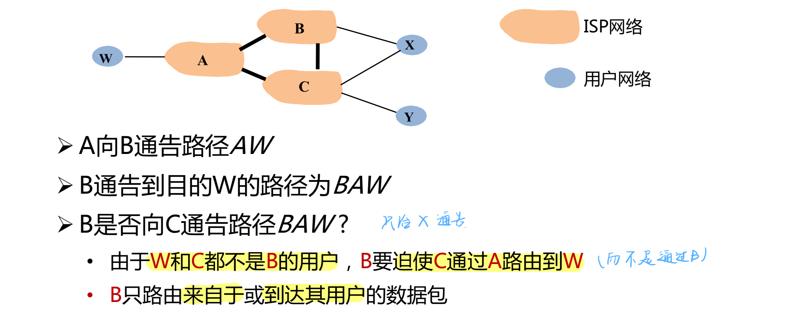

-   AS内策略

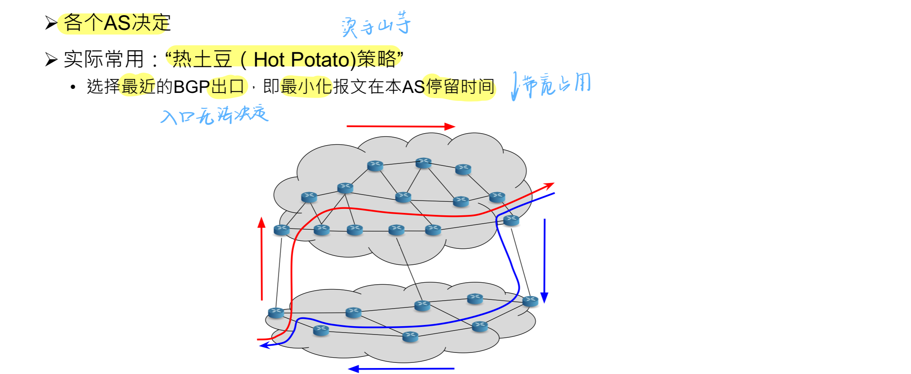

## 7.   广播、组播、选播
### 广播
#### 方法1:给每个主机单独发送一个数据包 
-   效率低、浪费带宽
-   Server需要知道每个目的地址

#### 方法2:多目标路由(multi-destination routing)
-   在需要转发的路由器线路复制一次该数据报（Server只发送一次）
-   网络利用率高
-   Server依然需要知道所有的目的地址

#### 方法3:泛洪(flooding)
-   一种将数据包发送到所有网络节点的简单方法
-   将每个进入数据包发送到除了进入线路外的每条出去线路
-   用途
    -   保证性:一种有效广播手段，可确保数据包被传送到网络中每个节点
    -   容错性:即使大量路由器被损坏，也能找到一条路径(如果存在)
    -   简单性:仅需知道自己的邻居
- 无控制的泛洪
  -   实现广播最显而易见的技术
  -   环路可能导致广播风暴
  -   路由器可能收到多个副本
  -   节点需要跟踪已泛洪的数据包以阻止洪泛
  -   即使利用跳数来限制，也会出现成倍爆炸

- 受控制的泛洪(每个路由器进行有选择的泛洪)
  -   逆向路径转发(reverse path forwarding, RPF)

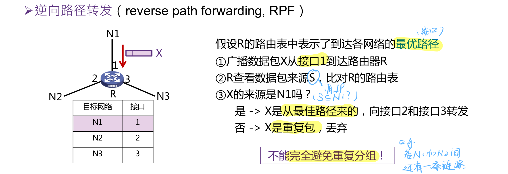

#### 方法4:生成树(spanning tree)

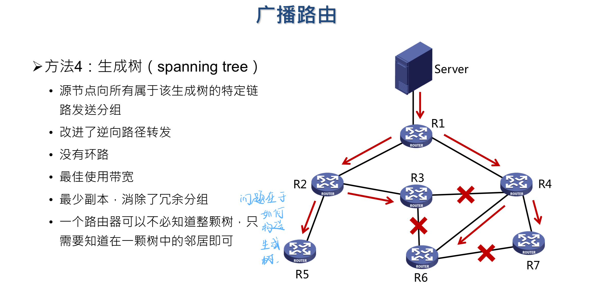

#### 后面的没整理完😭，可以看看总结
