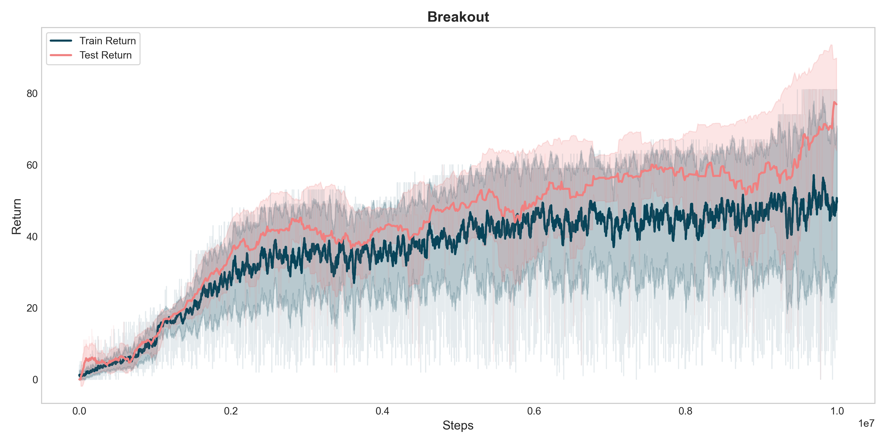

# DQN实验报告

在Atari Breakout环境中训练DQN。

## 整体框架

最终方案采用了Double DQN + n-step TD，目标网络当前网络使用同一backbone，每10000步更新一次目标网络。仍然采用图像作为输入网络的状态，但是对图像进行了帧堆叠，相邻的四帧图像堆叠送入网络。Backbone的结构为Conv-Conv-Conv-FC-FC，具体见代码。

由于agent在1个episode中有5条命，所以在训练过程中加入了额外的逻辑来判断agent是否掉命。训练过程中epsilon逐渐从1衰减至目标值，以在前期鼓励探索。

## 超参数

```python
T_stack = 4 # 帧堆叠
in_channels = T_stack

n_step = 32  # TD步长
gamma = 0.99
target_update_freq = 10000  # 目标网络更新频率

buffer_size = 1000000    # replay buffer容量

total_steps = 10000000
epsilon_start = 1.0
epsilon_end = 0.05
epsilon_decay_steps = 1000000
start_learning_steps = 50000

batch_size = 32
learning_rate = 1e-4
```

## 实验结果



实验结果证实了该方案的有效性，测试回报稳步提升至80分左右，表明模型已成功习得游戏的核心策略。较大的步长设置（n=32）虽然加速了价值信号的传播，但也引入了显著的方差，导致训练曲线呈现剧烈震荡。此外，过长的TD时间步容易使模型更多关注长期累积收益，从而在一定程度上削弱了对高动态场景的即时响应能力，这可能阻碍了agent在游戏后期球速极快时进一步学习策略。

此外，由于训练结束时回报曲线仍保持着较强的上升趋势，10M训练步数可能有所不足，可能可以通过延长训练时间进一步提升性能。

## 其他尝试

在实验过程中尝试了多种方案，最终发现引入n-steo TD对模型收敛至关重要。以下是一些尝试过的方案：

- 仅使用vanilla DQN：未引入n-step TD时，模型训练过程不稳定，回报曲线震荡剧烈，难以收敛。
- 仅使用double DQN：在没有n-step TD的情况下，模型仍然难以稳定收敛。
- 还尝试了多种参数的组合。