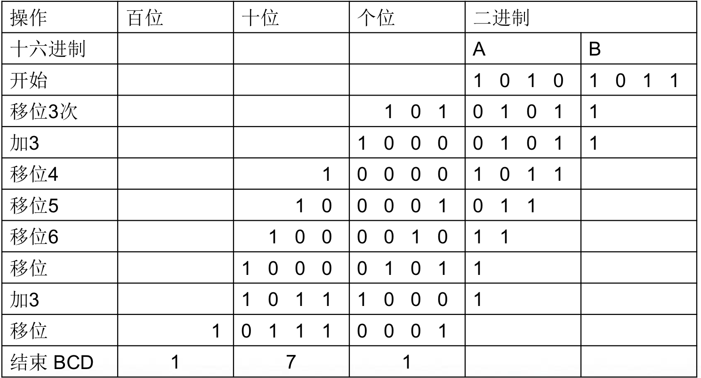

# 数制与布尔代数

## 数制
$N=(a_{n-1}a_{n-2}...a_1a_0.a_{-1}a_{-2}...a_{-m})_r=\Sigma_{i=-m}^{n-1}a_ir^i$

### 进制转换

一般以十进制为媒介比较方便

若从A进制转换为B进制，则整数部分采用除数取余法：    

$$N=\Sigma_{i=0}^{n-1}b_{i}B^{i}$$

$$N/B=\Sigma_{i=-1}^{n-2}b_{i+1}B^{i}$$

其中$b_0B^{-1}$为余数$r_0$，故$b_0=r_0B$，依此类推，$b_i=r_iB^{i+1}$，故可以通过不断除以k取余数得到转换为B进制后的结果$b_{n-1}b_{n-2}...b_{0}$  

小数部分采用乘数取整法，原理与整数部分类似：

$$N=\Sigma_{i=-m}^{-1}b_{i}B^{i}$$

$$NB=\Sigma_{i=-m+1}^{0}b_{i-1}B^{i}$$

 若$B=A^k$，则可将$N$中的数字每$k$个分为一组进行转换（如二进制转换为十六进制）

## 有符号数的表示

### 原码和补码

**原码**：用一个单独的数位表示符号

$$N=\pm(a_{n-1}a_{n-2}...a_1a_0.a_{-1}a_{-2}...a_{-m})_r \\ =(sa_{n-1}a_{n-2}...a_1a_0.a_{-1}a_{-2}...a_{-m}),\\
s = r-1 \text{ if negative, else } s=0$$

**补运算**

$(N)_r=(a_{n-1}a_{n-2}...a_1a_0.a_{-1}a_{-2}...a_{-m})_r=\Sigma_{i=-m}^{n-1}a_ir^i$

则 $N$ 的补 $[N]_r = r^n-(N)_r$

简单的方法：每位数字$a_i$用$(r–1)-a_i$替换，末位加一

**补码**

不同于补运算，一般指二进制补码

补码计算判断溢出的充分必要条件：
$$MSB_{carryin}\text{ xor }MSB_{carryout}$$

### 其他编码方式

**8-4-2-1码（BCD码）**

用四个二进制位表示一个十进制位（0-9）

BCD码加法直接使用二进制加法存在溢出的情况，此时要将结果加上6进行修正

二进制数与BCD码的转换：逐位左移，当某个BCD位（四个二进制位）大于5时加3修正（因为左移相当于乘2）

**格雷码**

循环对称码，相邻数字的编码只有一位不同（海明距离为1）

为什么要使用格雷码？信号传输过程中的不同步，如01->10的过程中由于两个位信号传输的不同步，很可能出现00或11的中间态，增加噪声

如何构造格雷码：从0和1开始，翻转后前一半补0，后一半补1

0,1->00,01,11,10->000,001,011,010,110,111,101,100->...

**校验码和纠错码**

如果信息编码提供$t$位的纠错能力和附加的$s$位的检
错能力，一般有

$$d_{min}\ge2t+s+1$$

经典的例子——海明码

## 布尔代数

### 公理

封闭性、交换律、结合律、恒等性（单位元）、分配律、互补性

需要注意的是$+$对$·$的分配律

### 基本定理

对偶原理、幂等性、零元、自反律、吸收率...

需要掌握基于公理的证明方法