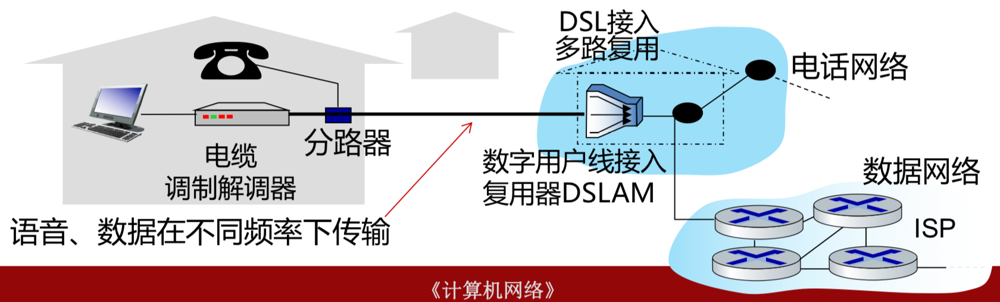
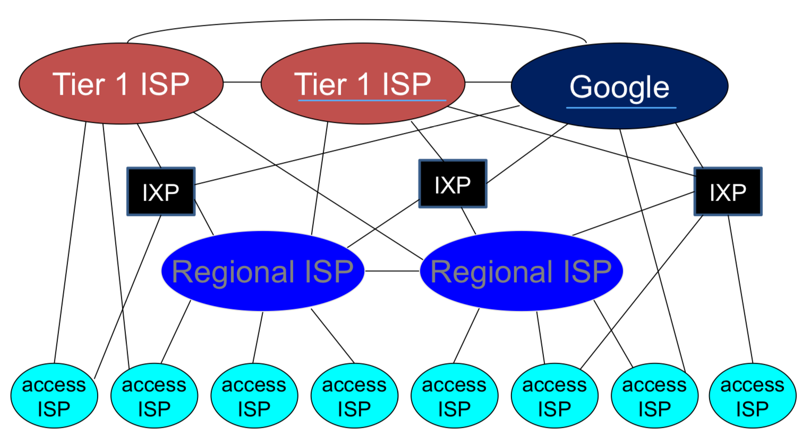
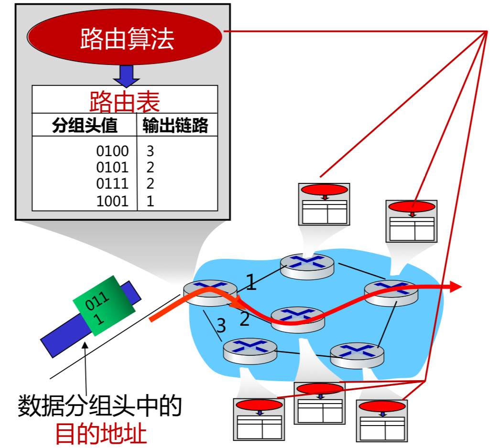
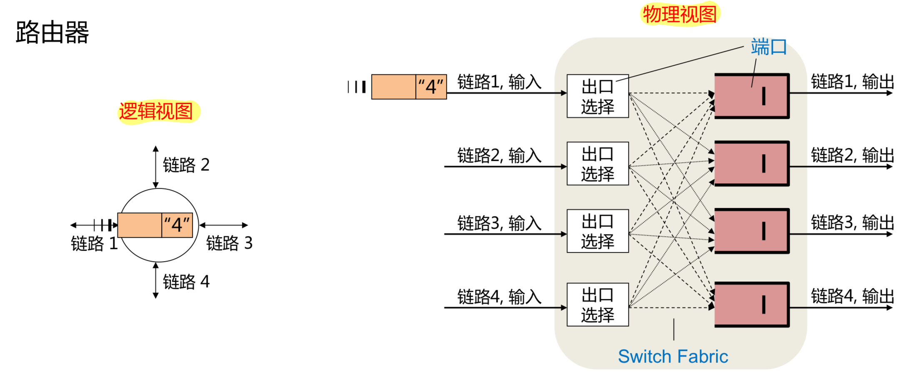

# 网络基础知识
## 实体：网络的组成、命名和结构
### 网络的类型
个域网PAN；局域网LAN；城域网MAN；广域网WAN  
### 网络的构成
-  网络边缘
    -  端系统：位于互联网边缘；与互联网相连
    -  端系统由主机构成
-  接入网
    -  连接边缘端系统与网络核心
    -  本质是通信链路（光纤、铜缆、无线电、激光链路）
    -  ISP：提供网络接入和互连服务
-  网络核心
    -  由分组交换设备和通信链路组成
    -  互联端系统
    -  分组交换：路由器、交换机 
### 网络边缘：主机
-  Client-Server架构
-  内部结构
    -   网络设备硬件：网卡
    -   内核软件：驱动和协议栈
    -   用户软件：使用内核提供的socket接口

-  命名：如何在网络中区分主机
    -  硬件网卡：全球唯一的48位MAC地址
        -  烧写在ROM中，不可修改
        -  IEEE分配命名空间
    -  IP地址：32（v4）/128（v6）位  
        -  可以根据需要配置
    -  主机名：字符串
### 接入网
-  边缘路由器：端系统去往任何其他远程端系统的路径上的第一台路由器
-  接入技术：有线和无线
    -  拨号上网、同轴电缆、双绞线的DSL、光纤到户FTTH、以太网
    -  WiFi、4G/5G，卫星广域覆盖
-  物理介质（引导型/非引导型）
    -  双绞线：2根绝缘铜线缠绕为1对；电话线1对，网线4对
    -  同轴电缆：两根同心铜导线；支持双向传输和频分复用
    -  光纤：玻璃纤维传播光脉冲；高速运行+低误码率（免疫电磁噪声）
    -  无线电：不依赖介质；半双工；易受干扰
        -   Wi-Fi、蜂窝网、蓝牙、地面微波、卫星
-  数字用户线DSL（ADSL）：电话线复用；每户有独立线路；现在支持同时传输语音和数据，拨号上网时代不行；ADSL：下行快上行慢

-  有线电视信号线（同轴电缆）：电视线复用；多个家庭共享电缆头端；混合光纤同轴电缆HFC：同轴电缆先连到光纤节点

-  光纤到户（FTTH）：带宽大线路稳定；有源（独立线路）/ 无源（共享线路）
-  无线接入：通过基站
### 🌟网络核心
#### Internet架构
-  本地网络提供商（access ISP）与端系统相连
-  全局ISP；区域ISP：连接本地和全局ISP
-  去中心化的分布式架构

-  互联网公司搭建内容提供网络：提高性能，降低成本

#### 转发与路由
-  路由：全局操作；路由算法配置路由表，需要全局信息
-  转发：本地操作；查本地路由表

    

#### 分组交换
-   分组交换：
    -   主机对数据分组，以分组为单位发送，逐跳传输
    -   存储-转发：路由器收到完整的包之后才能发送；额外的传输延迟
    -   分组首部含有控制信息（目的和源...）
    -   分组可独立选择传输路径
    -   统计多路复用：不同主机的报文分组按需共享带宽
#### 电路交换
-   电路交换：建立连接后连续发送比特流，不分组

## 服务
## 协议
## 实现与管理
## 计算机网络的分层架构