# 应用层
## 1.  C-S和P2P模式
### 模式与协议
-  许多APP有相同的通信模式（C-S），应用层以协议（HTTP...）的形式封装这些共同模式
### Client-Server (C-S)
#### 概念
-  两个应用进程（IP:port）
-  客户：服务请求方（主动请求服务，被服务）
-  服务器：服务提供方（被动接受服务请求，（主动）提供服务）

    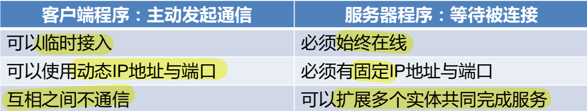

#### 分类
基于面向连接/无连接以及循环服务/并发服务
-  无连接+循环

    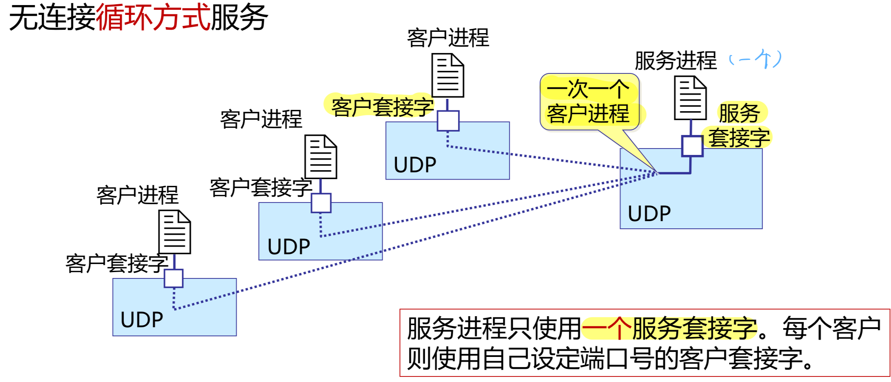

-  无连接+并发：不可行。无连接，服务器无法使用服务套接字与多个客户端通信
    -  如果使用新的服务套接字，客户端不可知新的套接字端口号
    -  可能需要额外的OS支持才能实现并发

-  面向连接+循环

    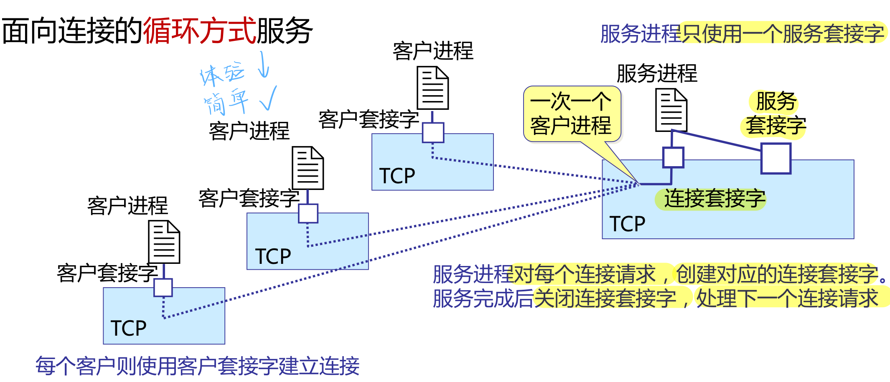

-  面向连接+并发

    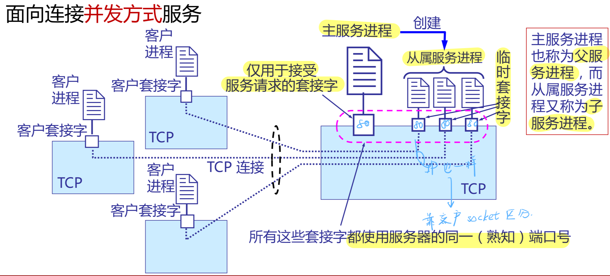

### Peer to Peer (P2P)
#### 概念
-  两个进程，不区分服务的请求方和服务的提供方
-  平等对等的通信
-  通信的进程即是客户端也是服务器
#### 实体的特点
可以假设P2P中任意时刻均有大量APP在运行
-  无需总是保持在线
-  可以随时进入和退出
-  任意两个实体间可之间通信
-  易扩展（计算资源共用）

## 2.  Web基本概念
### 万维网（World Wide Web, WWW）
-  IP网络之上的网络，Overlay网络
-  由Web对象，C/S，以及HTTP协议组成
### Web对象
-  Web页面：包含多种对象或链接（指向其他对象的URL）
-  网页，多媒体资源，脚本...
-  分为静态和动态对象，对应静态服务和动态服务
    -  静态对象
        -  文本，表格，图片，图像和视频等多媒体类型的信息（实现语言：标记语言，如HTML，XML，PHP等）
        -  字体、颜色和布局等风格类型的信息（实现语言：层叠样式表CSS）
    -  动态对象
        -  交互信息，比如，用户注册信息、登录信息等（实现：PHP/JSP等语言+MySQL等数据库）
        -  动态页面的创建也可以在浏览器进行
        -  通用网关接口CGI：定义在服务器创建动态文档的过程
        -  脚本语言+数据库：解释程序（可运行在浏览器中）解释执行脚本
-  通过统一资源定位符（URL）定位：**协议类型://主机名:端口//路径和文件名**

## 3.  HTTP🌟
### 基本概念
-  基于TCP，缺省使用HTTP的80端口
-  无状态协议：不记录历史状态信息

### 各版本HTTP与服务过程
#### HTTP/1.0
-  无状态，非持久连接
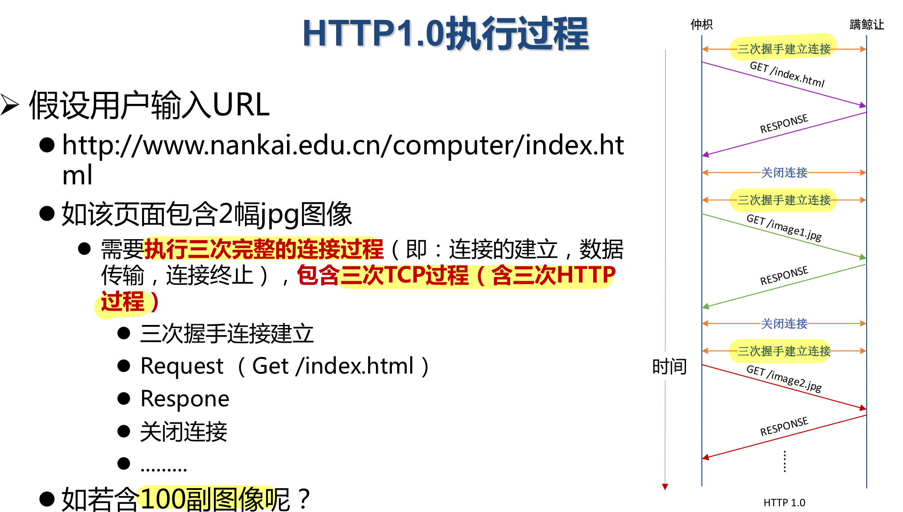
-  每次传输都需要经历TCP慢启动阶段
-  收到一个请求的响应后才可发送下一个请求
#### HTTP/1.1
-  支持持久连接+流水线机制
-  缓存策略优化，部分资源请求，断点续传
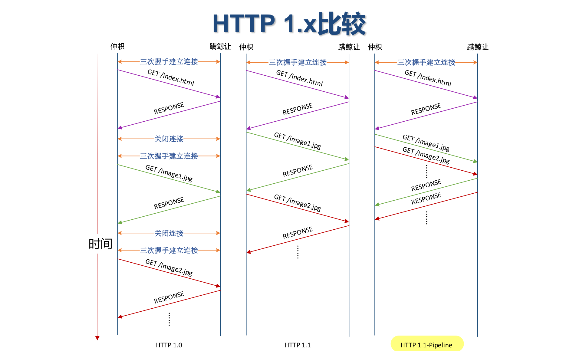
-  较少的慢启动
-  Pipeline要求服务器按序响应

#### HTTPS
-  HTTP + SSL/TLS，TCP之上的安全机制

#### HTTP/2.0
-  目标：进一步提高带宽利用率，降低延迟
-  二进制格式、TCP多路复用、头压缩、服务端推送...
    -  允许请求/响应交错（乱序），可自定义报文优先级
    -  主动推送消息：可以用于确认客户端是否在线和预测资源请求，从而支持在应用层上进行流量控制

#### HTTP/3.0
-  QUIC+UDP替代下层TCP
### 报文格式
#### 请求报文
-  开始行（请求行）+首部行+实体主体

    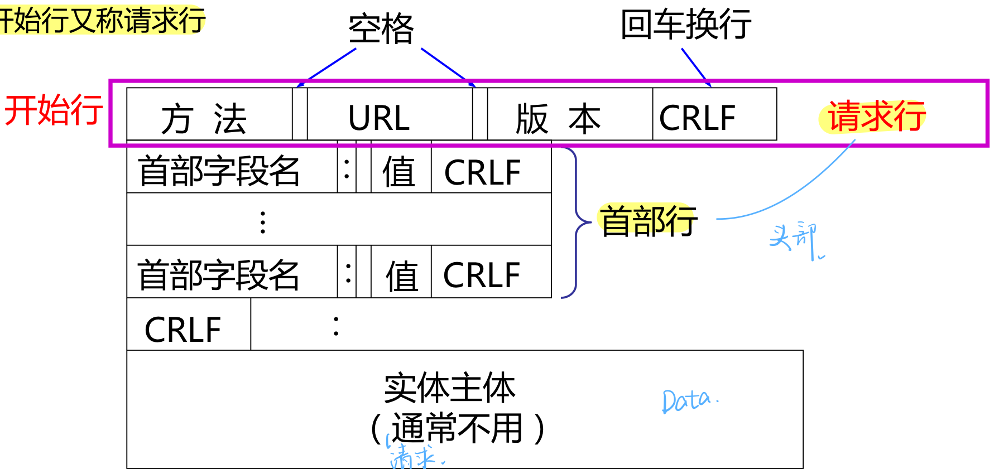

-  方法（命令）：知名对所请求的对象进行的具体请求操作
    -  GET：请求读取由 URL所标识的对象
    -  POST：向URL标识的对象提交数据（参数、注释...）

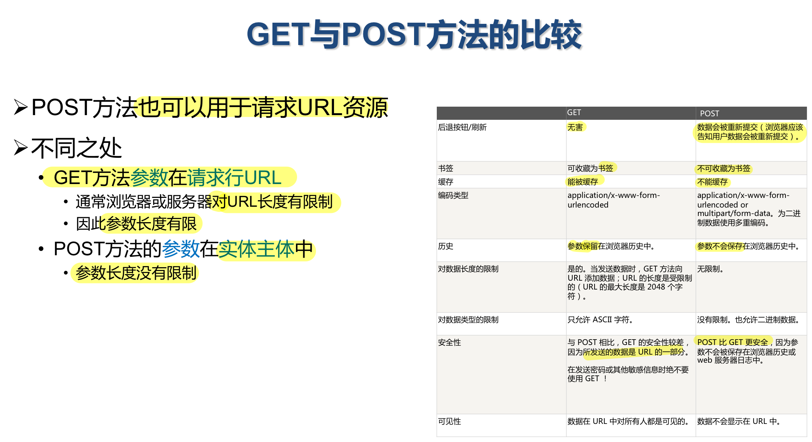

#### 响应报文
-  开始行（状态行）+首部行+实体主体

    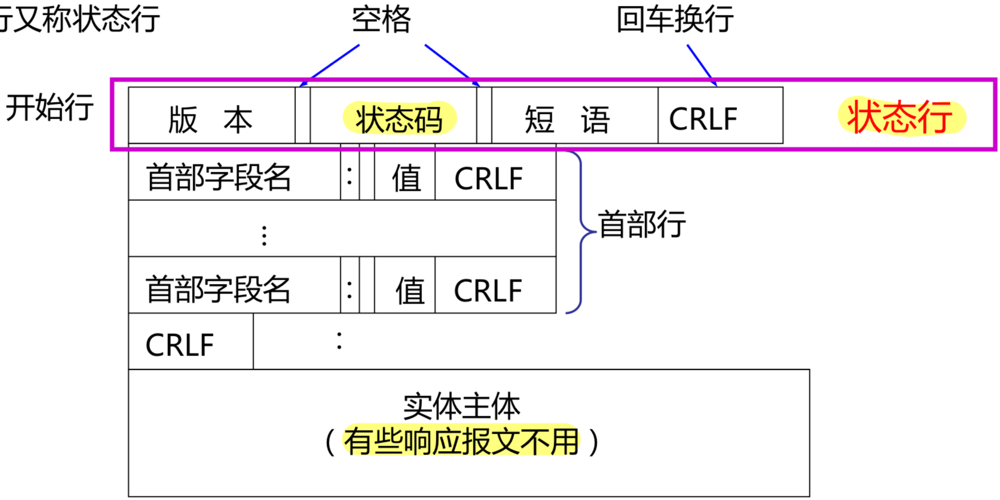

-  状态码
    -  200 OK：请求成功，对象放在实体主体
    -  301 Moved Permanently：对象位置改变，新的位置在响应中通过Location:给出
    -  400 Bad Request：服务器无法解析请求报文
    -  404 Not Found：服务器找不到对应文档
    -  505 HTTP Version Not Supported：服务器不支持对应HTTP版本

### 缓存
#### 基本概念
-  浏览器缓存
    -  浏览器主机上保留访问过的Web页面副本
    -  需要保证副本与服务器中的一致
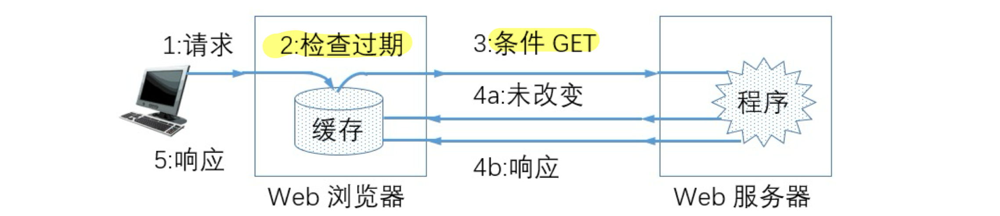

-  代理缓存
    -  ISP安装代理缓存服务器，保存客户访问过的Web页面副本
    -  副本供所有用户访问，降低时延，减少冗余流量

    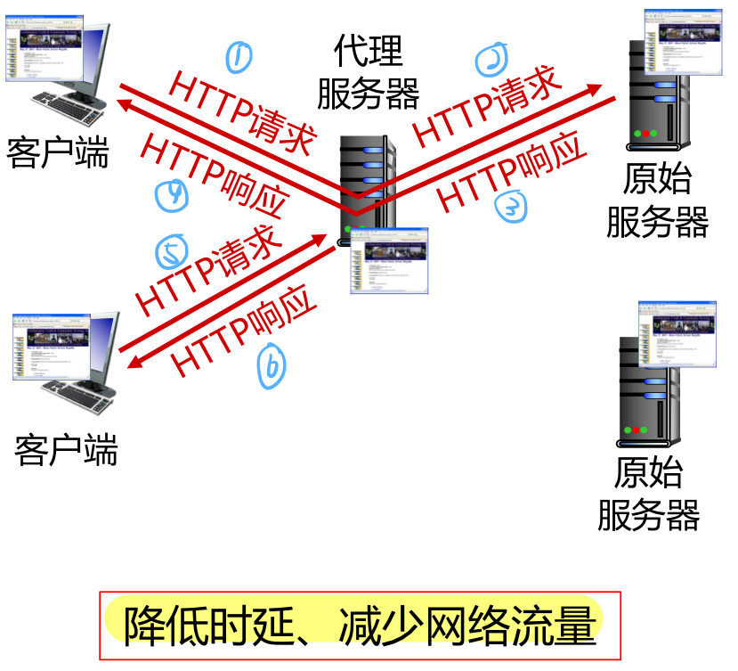

#### 代理缓存性能分析例子
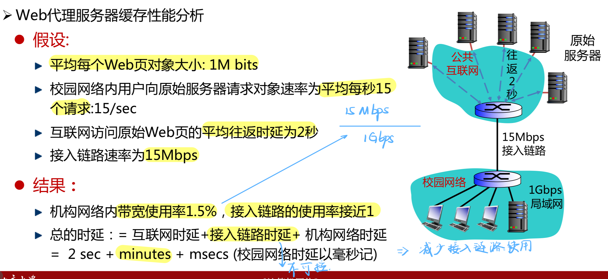

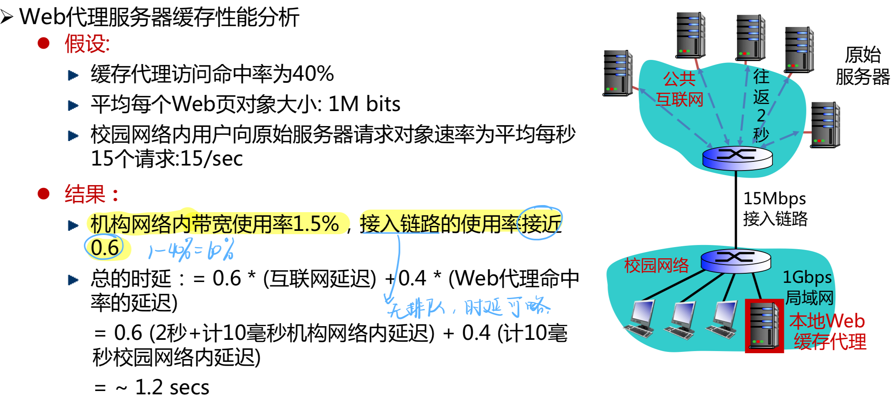

#### 副本一致性问题
-  启发式策略（较少使用）：原始服务器在响应报文中设置Last-Modified头和Expires头
-  询问式策略（常用）：代理服务器询问原始服务器

    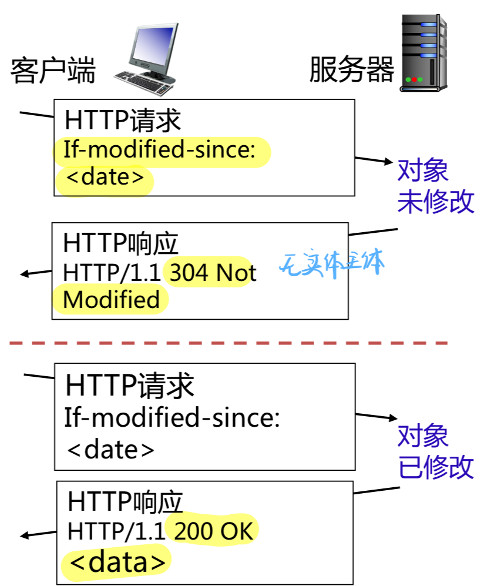

-  注：服务器可以禁止缓存特定页面（no-cache）；需要授权访问的页不应被缓存

### Cookie
#### 基本概念
-  HTTP无状态协议，服务器无法直接得知用户状态，使用cookies维护用户状态
    -  响应报文首部行设置set-cookie:，选择唯一cookie
    -  cookie文件保存在用户主机中，包含服务器返回的一些附加信息，由浏览器管理
    -  服务器建立后端数据库，记录用户信息，cookie作为关键字

    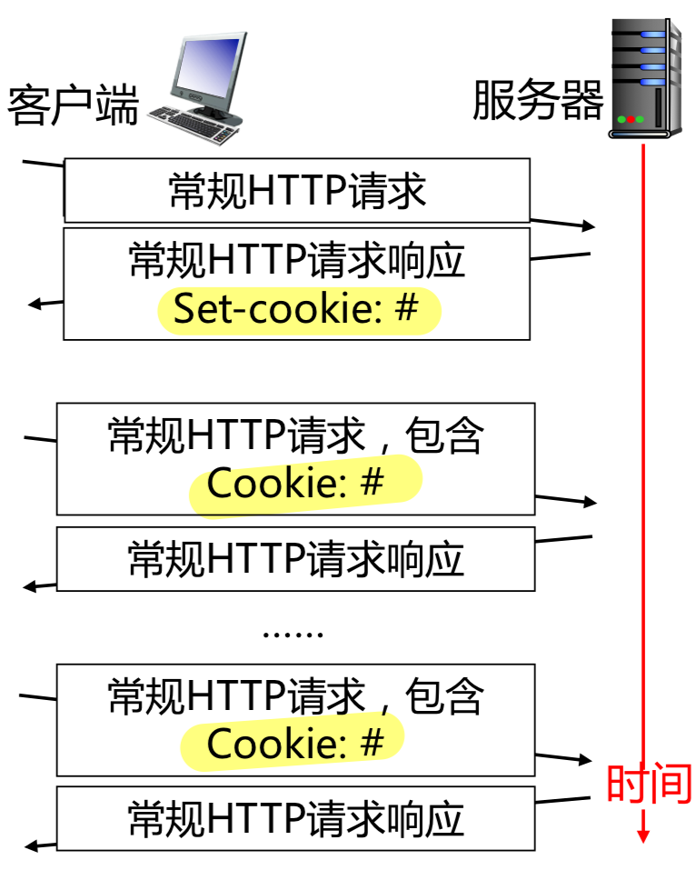

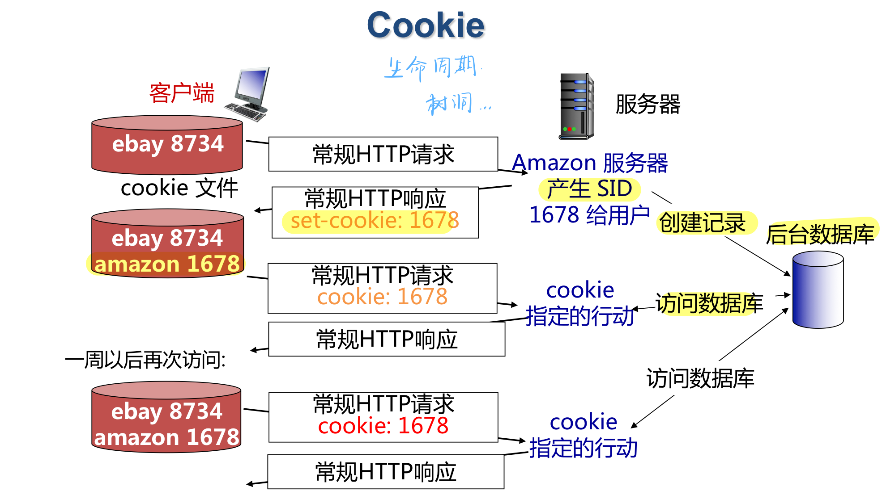

#### 内容
-  域：Cookie来源
-  路径：服务器文件系统中哪些部分可以使用该cookie
-  内容：name=value对，最大4KB，是字符串而非可执行程序
-  安全：指示浏览器是否只向使用安全传输连接（HTTPS）的服务器返回cookie

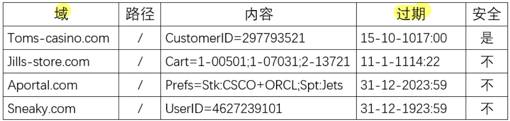

#### 隐私问题
-  好处：可分析用户喜好，实现个性化推荐
-  坏处：跟踪用户网络浏览痕迹，泄漏用户隐私（可限制浏览器使用cookie）
    -  获取cookie后即可伪造用户请求
-  误区：cookie容易被嵌入木马/间谍程序
    -  cookie中保存的是字符串

## 4.  DNS
### 域名系统服务
-   负责域名和IP地址之间的映射
-   hosts.txt -> 域名服务器
-   Internet DNS：层次化、分布式

#### 域名结构

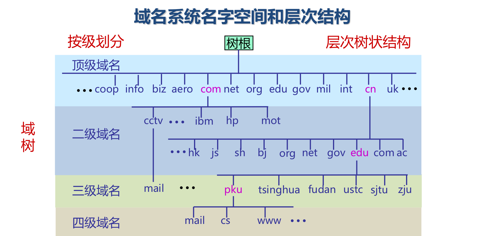

### 域名服务器
-   简介
    -   保存域树(domain tree)的结构和设置信息
        -   保存相邻域名服务器信息
    -   负责域名解析（对用户透明）
-   分类
    -   本地/迭代域名服务器：三级域及以下的域名服务器
    -   权威域名服务器：二级域的域名服务器
#### 根服务器
-   每个根服务器都知道所有的顶级域名服务器的域名及其IP地址
    -   有多套，每套可有多个镜像，定期和对应根服务器同步
-   不直接把主机用户所查的域名转换成IP地址

#### 顶级域名服务器
-   管理在该顶级域名服务器注册的所有二级域名

#### 二级/权威域名服务器
-   每一个主机都必须在某个二级域名字服务器处注册登记
-   二级域名单位可将域名划分为若干个区
    -   每个区有权威域名服务器
    -   域名服务器

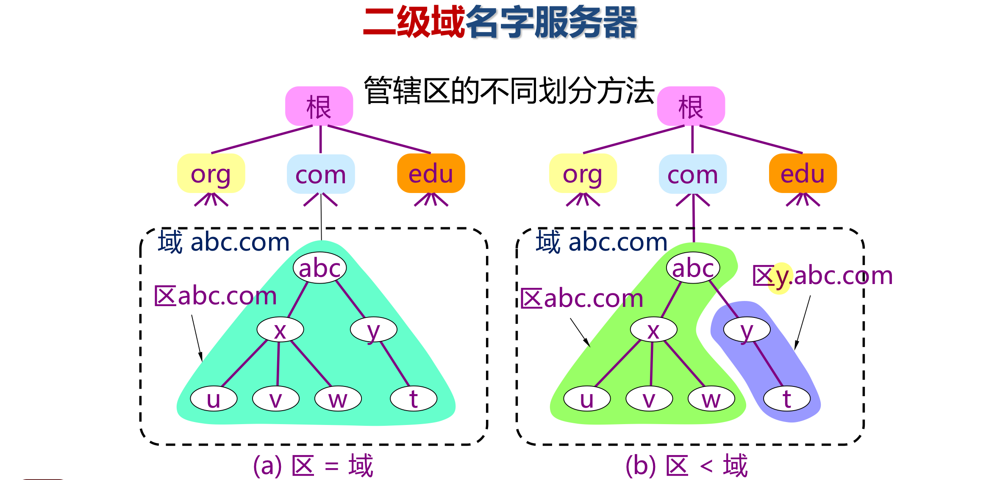

#### 本地DNS服务器
-   ISP拥有并提供给用户，距离用户主机较近
-   可能部署在不同层次的域名上，也可能部署多层

### 域名解析🌟
#### 递归查询
-   替客户端继续查询
-   本地服务器内部采用

    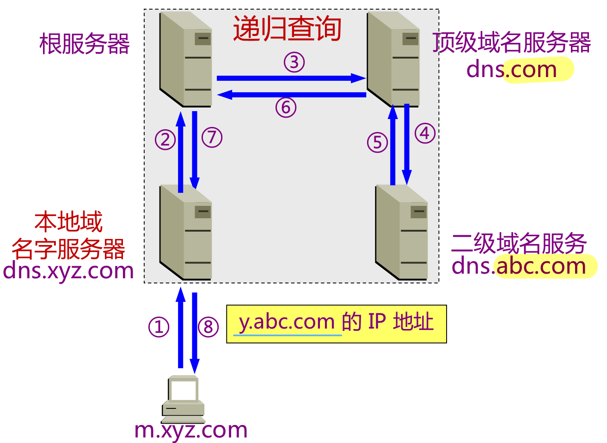

-   注意：本地域名服务器直接向根服务器发送请求

#### 迭代查询
-   告知客户端下一步应查询的服务器的IP地址
-   本地DNS之上使用

    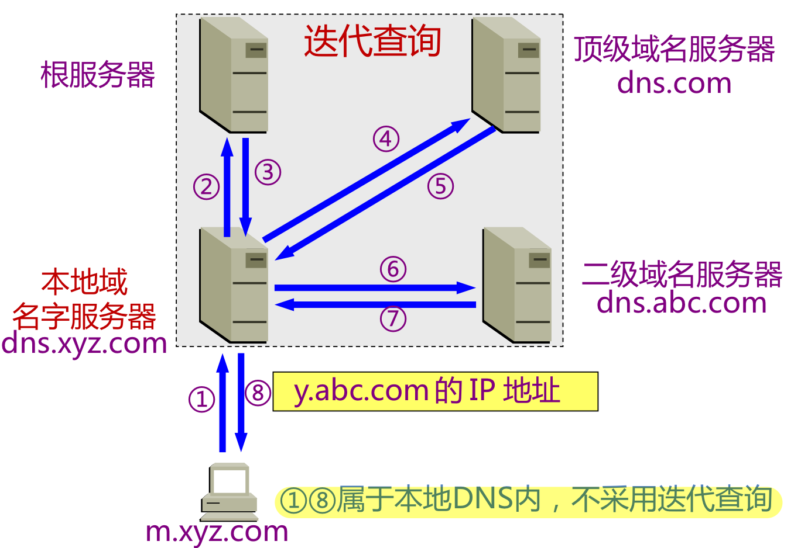

-   注意：迭代查询的起点一般并非客户而是最上层本地域名服务器

### DNS协议
-   三部分：基础结构（报文首部）、问题、资源记录（RR）
    -   资源记录只在DNS响应报文中出现
-   报文类型：查询请求/响应
-   基于UDP，端口号53

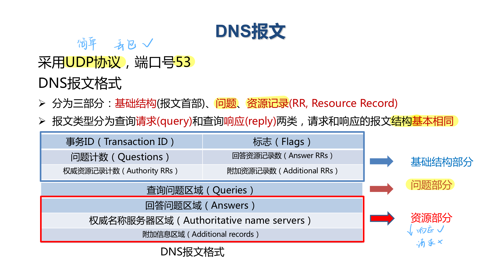

### 域名系统高速缓存
-   减少DNS报文流量，提高查询效率
-   缓存域名->IP映射以及顶级域名服务器信息（无需再向根服务器查询）
-   主机一般也缓存：hosts.txt
-   有超时判定

### DNS安全
#### DNS的安全性问题
-   UDP明文传输，RR无认证和加密措施
-   通信链路窃听，服务器收集（DNS日志）

#### DNS的保密性
-   源IP地址的保密性
    -   在本地域名服务器上，源IP地址一般是用户主机的IP地址
    -   在更上层的域名服务器上，源IP地址一般是本地域名服务器的IP地址（迭代查询）
-   解析过程的保密性
    -   QNAME包含查询的域名
    -   可能泄漏用户偏好

#### DNS认证：DNSSEC安全机制
-   域名服务器用私钥对资源记录(Resource Record, RR)签名
-   解析服务器用域名服务器的公开密钥对收到的应答信息进行验证

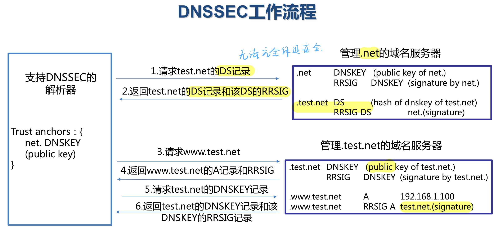

-   基本原理：私钥签名，公钥（DNSKEY）验签，哈希不可逆

0.  解析器先向根服务器查询到管理.net的域名服务器的IP地址
1.  请求test.net的DS记录（委派签名，子域test.net DNSKEY的哈希值）
    -   哈希函数公开（如SHA256）
2.  .net的服务器返回test.net的DS记录和对应的RRSIG
    -   RRSIG由.net的私钥签名
    -   解析器收到后用.net的公钥（本地存储）验签
    -   安全地传输了test.net DNSKEY的哈希值
3.  解析器请求www.test.net
4.  服务器返回www.test.net的IP地址（A记录）和同名的RRSIG
    -   RRSIG由test.net的私钥签名
    -   如何验签？需要test.net的DNSKEY，但是本地只有哈希后的
5.  解析器请求test.net的DNSKEY
    -   也需要保证安全传输
    -   前面收到的哈希后的test.net DNSKEY就派上用场了
6.  服务器返回test.net的DNSKEY记录
    -   计算哈希，如果和前面收到的结果相同，则DNSKEY未被篡改，安全
    -   再用这个DNSKEY验证4中收到的A记录，最终实现全流程的安全传输

## 5.   电子邮件
### 电子邮件系统的组成
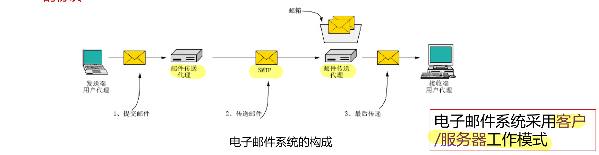
-   用户代理：邮件客户端
    -   使用户和电子邮件系统交互
    -   和邮件服务器交互，收发邮件
-   传输代理：邮件服务器
    -   分发送端服务器和接收端服务器
    -   邮箱：一块内存区域，保存收到的邮件
        -   电子邮件名作为邮件接收者的标识
        -   local-part@domain-name
        -   domain：服务器的域名
        -   local-part：对应该服务器下的用户
    -   服务器间的邮件传输采用电子邮件协议（SMTP...）
        -   TCP，端口25
        -   直接投递
        -   3个阶段：连接建立、邮件传送、连接关闭
        -   ASCII字符串命令+（状态码，短语）响应
            -   邮件必须为7位ASCII

### 各种协议的功能
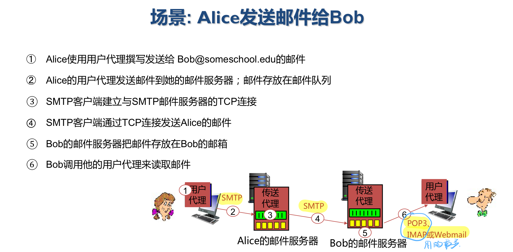
#### SMTP
-   功能
    -   负责邮件在邮件服务器间的传输
    -   客户使用HELO命令起始对话
-   不足
    -   无认证：FROM命令可以给出任何发件人地址
    -   传输ASCII字符：需要Base64 MIME编码方案，效率低下
    -   明文传输：无加密功能用于防止隐私窥探
-   邮件格式
    -   SMTP：HTTP，传输邮件
    -   邮件格式：HTML，解释邮件
    -   基本ASCII电子邮件：RFC 5322
    -   多用途Internet邮件扩展（MIME）

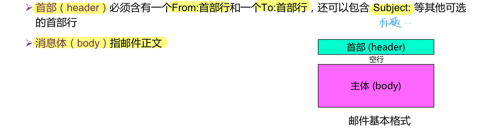

#### 最终交付/邮件访问协议：POP3, IMAP, Webmail
-   从邮件服务器的邮箱中获取邮件
    -   POP3: Post Office Protocol-Version 3，第三版邮局协议
    -   IMAP: Internet Message Access Protocol，Internet邮件访问协议
    -   Webmail(HTTP): 基于Web的电子邮件
-   为什么不能使用SMTP获取邮件?
    -   SMTP：推协议，推送目标（服务器）保持在线，主动权在推送方手中
    -   取邮件：拉操作，主动权在“推送”目标（用户代理）手中

-   POP3
    -   TCP，110端口
    -   三个阶段（功能）
        -   认证(Authorization)：处理用户登录的过程
        -   事务处理(Trnsactions)：用户收取电子邮件，并将邮件标记为删除
        -   更新(Update)：将标为删除的电子邮件删除
    -   POP客户程序+POP邮件服务器

-   IMAP：
    -   用于最终交付的主要协议
    -   IMAP服务器（端口143）+客户端
    -   功能：支持远程（在线）阅读和处理邮件
        -   把每个邮件与一个文件夹联系起来
        -   允许只获取邮件的一部分
        -   还支持远程查询
        -   维护了用户状态信息
    -   缺点：如果没有下载邮件到本地就只能在线阅读

-   Webmail
    -   使用Web作为界面，用户代理就是普通的浏览器
    -   用户及其远程邮箱之间的通信通过HTTP进行

## 6.   P2P🌟
### 基本概念
-   每个实体都是一个对等结点(peer)
-   服务特点:去中心化的连接与传输
    -   不需要长期在线服务器
    -   任意的对等结点可以直接建立连接
    -   对等结点可以随时加入或退出
    -   对等结点可以变换IP地址

-   优势
    -   避免单点故障
    -   避免中心化结点造成的性能瓶颈

### C-S和P2P的对比

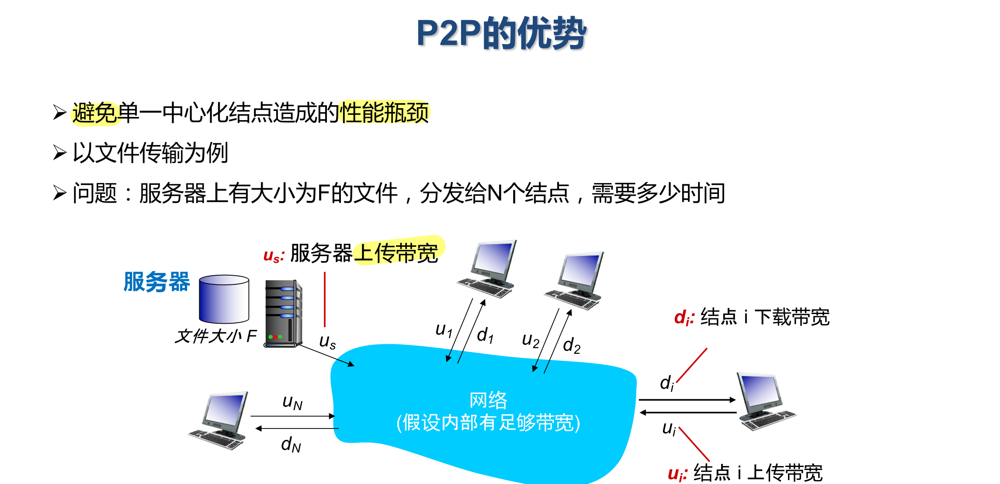
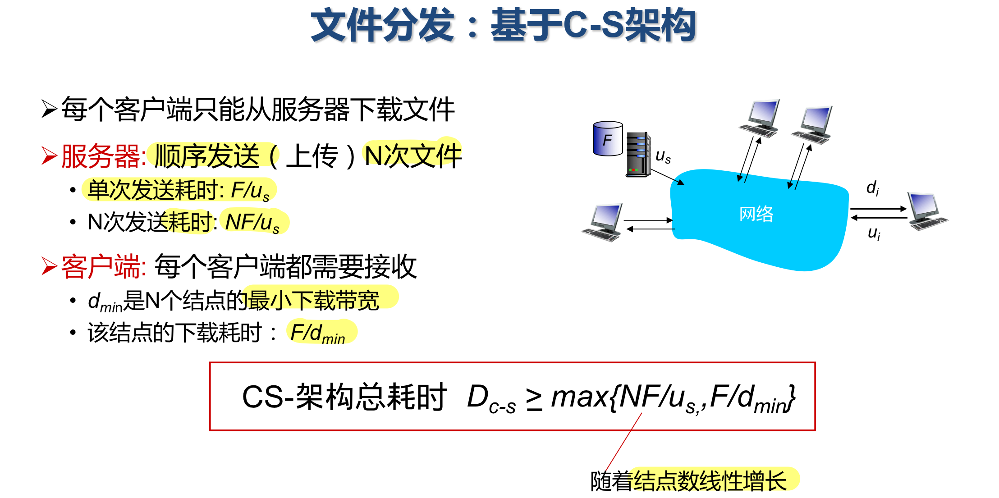
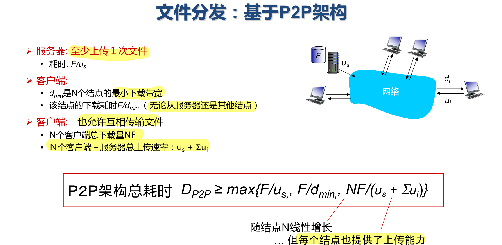
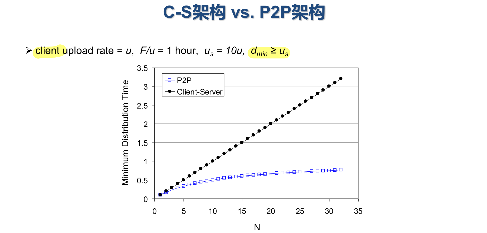

### 核心问题：资源索引
-   给定资源，要找到所有拥有资源的peer
-   例子
    -   P2P文件传输
        -   索引系统:记录文件到网络位置(IP地址 + 端口号)的映射
        -   通过索引系统，定位文件的下载地址
        -   需要动态追踪每个peer拥有的文件
    -   P2P即时通讯
        -   索引系统:记录用户ID到网络位置(IP地址 + 端口号)的映射
        -   用户启动即时通讯软件时，告诉索引系统当前IP地址与端口号
        -   Peers通过索引系统，查找发送目标的网络位置
#### 中心化索引
-   资源索引中心化，资源传输去中心化
-   peer加入时需告知中心化服务器自己的IP地址和拥有的资源
-   工作流程

#### 去中心化索引
-   每个peer在本地记录自己的资源
-   peer间建立TCP连接（Overlay网络，一般一个peer小于10个连接）
-   查找资源：洪泛请求（Query Flood）+ 递归查询
    -   向所有邻居查询，邻居如果没有邻居就向自己所有的邻居查询
    -   问题: 产生大量网络消息，可扩展性有限

#### 混合索引
-   超级结点可任意连接，去中心化索引（洪泛请求）
-   普通结点连向至少一个超级结点，中心化索引
-   工作流程

### BitTorrent协议
#### 简介
-   基于P2P，不是纯P2P
-   所有正在交换某个文件的peer，组成一个torrent(种子)
-   中心化的跟踪器(Tracker)
    -   一个独立服务器维护着一个正在主动上传和下载该内容的所有其他对
等用户列表
    -   对等方可以通过Tracker(跟踪器)找到其他对等方
#### 工作流程
-   torrent结点的文件被划分成块（256KB）
-   当一个peer向跟踪器注册后加入torrent，此时它没有任何块，此后它逐渐从其他peer获取块
-   和其他peer交换各自拥有的块列表/自己知道的peer列表
-   可从其他peer下载自己没有的块，也可为其他peer提供他们没有的块（互通有无）
    -   总体策略：优先下载罕见块、匹配对等结点、付出越多回报越多
    -   请求块策略：周期性查询其他peer的块列表，请求下载其中自己缺失的块，优先下载罕见块
    -   发送块策略：优先给向自己发送数据最快/多的（4个）结点发，每隔一段时间（10s）重新统计这些结点，偶尔（每30s）也可随机选择一个结点，期望从对方得到回报
-   peer动态加入/退出，获取到自己想要的块后可能会自私地离开

### 分布式哈希表（distributed hash tables, DHTs）
#### 简介
-   优化去中心化资源索引
    -   P2P系统本质上是将资源（关键字key的集合）分散到多个peer上
    -   洪泛请求：资源任意分布，需要bfs遍历peer
    -   分布式哈希表：组织资源的分布，优化搜索

#### 实现：Chord
-   思想
    -   对所有peer地址和key分别计算哈希值（一般用同一个哈希函数）后取模，排列在圆环上
    -   则存储key的peer为在环上顺时针方向的与key最近的peer结点
        -   最近的情况：在环上的同一个位置

-   工作过程
    -   peer加入
        -   计算哈希后取模
        -   找到并通知环上的前驱和后继peer，后继peer可能需要将部分或全部数据迁移到新peer
        -   如果多个peer同时加入，多轮更新
            -   周期性咨询后续Peer:谁是你的前驱peer
            -   进行邻居关系更新、数据迁移
    -   peer退出
        -   通知前驱结点、后续Peer更改邻居关系，将数据迁移至后续Peer
        -   由于peer可能异常退出，需要在多个peer上备份数据
    -   负载均衡
        -   原因：哈希不均衡，peer结点性能不同...
        -   将性能强的peer拆分为多个虚拟peer结点

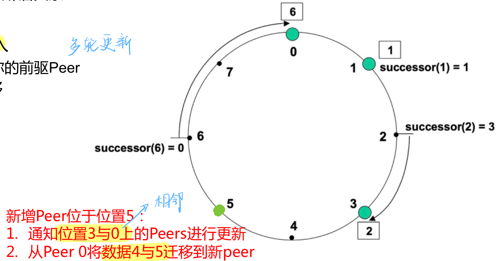
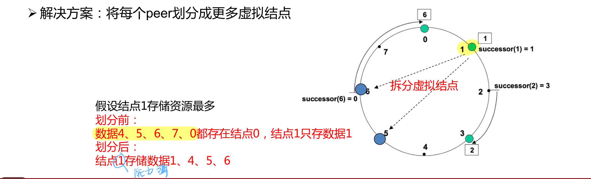

## 7.   流媒体
### 简介
-   概念
    -   连续媒体(音视频)经压缩编码、数据打包后，经过网络发送给接收方
    -   接收方对数据进行重组、解码和播放
-   特性
    -   端到端时延约束
    -   时序性约束：流媒体数据必须按照一定的顺序连续播放
    -   具有一定程度的容错性:丢失部分数据包也可完成基本功能
### 三种服务模式
#### 媒体点播
-   媒体点播：提前录制好，边下载边播放(起始时延<10s;类VCR操作(例如拖动进度条)<1~2s)

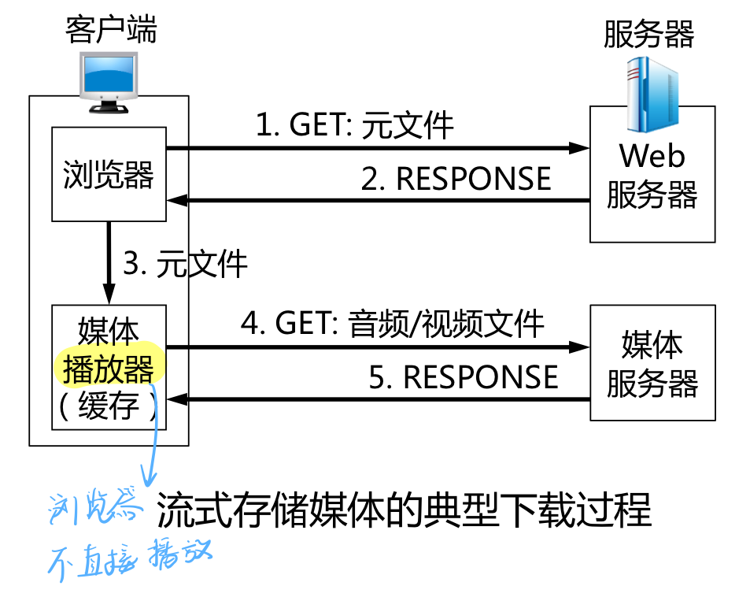
-   元文件中有音/视频文件的统一资源定位符URL
-   媒体播放器边下载边解压缩边播放(通过时间戳同步音频流和视频流)

#### 媒体直播
-   媒体直播：边录制边上传，边下载边播放(大规模直播往往有数秒的时延)
-   接收端缓存后播放，平滑收到的视频流，通过增加时延减少抖动
    通过缓冲区高低阈值进行传输速率控制

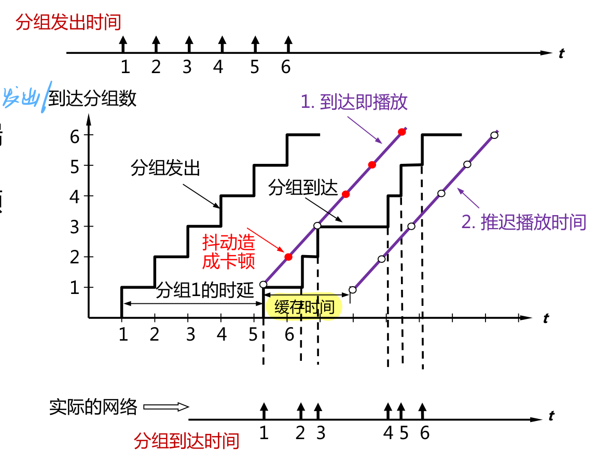

#### 实时交互
-   实时交互：双方或多方实时交互式通信(时延<400ms可接受，VR则需要<25ms)

### RTP、RTCP、RTSP
-   实时传输协议RTP (Real-time Transport Protocol)
    -   UDP
    -   功能
        -   为实时应用提供端到端的数据传输，但不提供任何服务质量的保证
        -   不对多媒体数据块做任何处理(编码、解码、缓存等都交给媒体播放器)
-   实时传输控制协议RTCP (RTP Control Protocol)
    -   与 RTP 配合使用的辅助控制协议
    -   UDP（可将多个 RTCP 分组封装在一个 UDP 用户数据报中）
    -   功能
        -   服务质量的监视与反馈
        -   媒体间的同步
        -   播组中成员的标识
-   实时流式协议RTSP (Real-Time Streaming Protocol)
    -   本身并不传送数据，是一个多媒体播放控制协议，通用性好
        -   没有定义音频/视频的编码方案
        -   没有规定音频/视频在网络中传送时应如何封装在分组中
        -   没有规定音频/视频流在媒体播放器中应如何缓存
    -   既可在 TCP 上传送，也可在 UDP 上传送
        -   UDP传输时底层使用RTP+RTCP
    -   功能
        -   互联网录像机遥控协议（暂停/继续、后退、前进等）
        -   有状态协议，记录用户的初始化状态、播放状态或暂停状态

