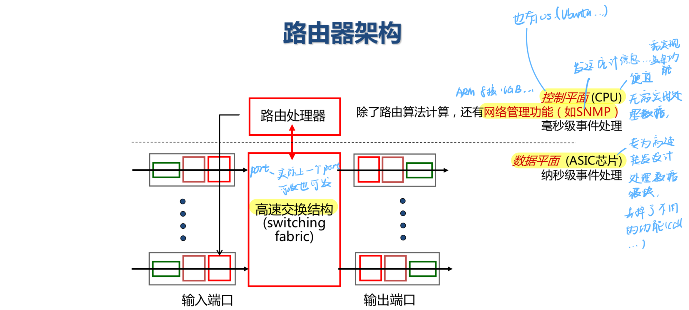
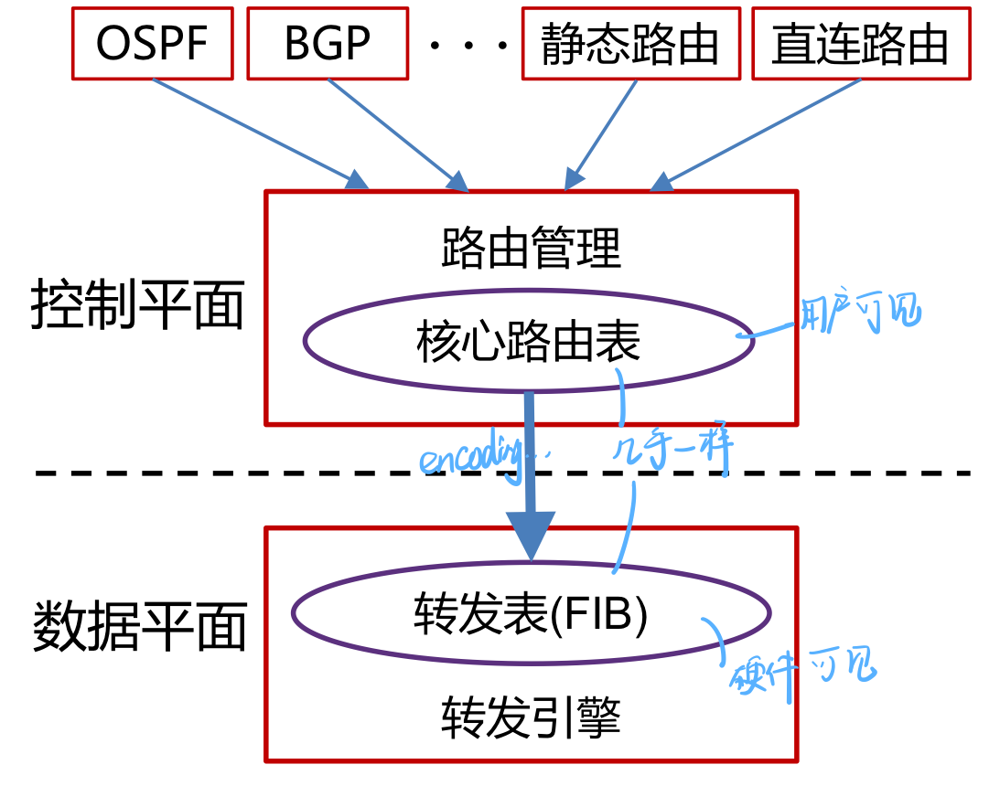
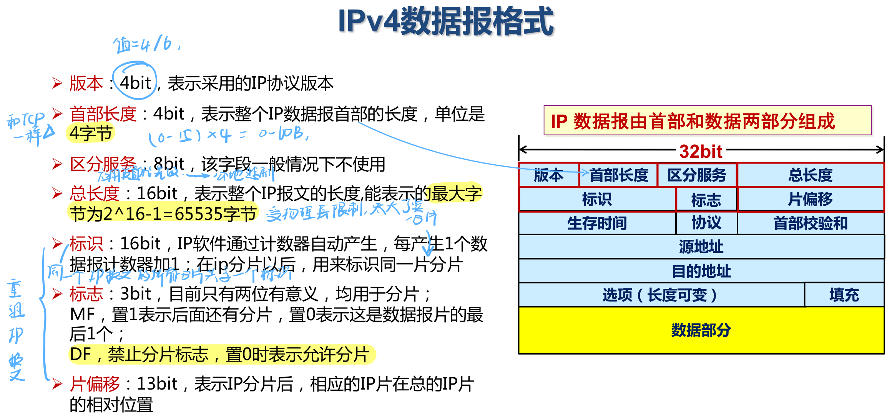
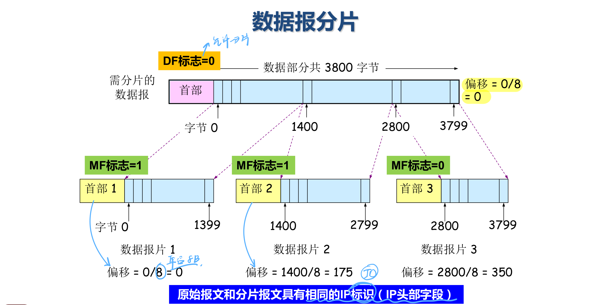
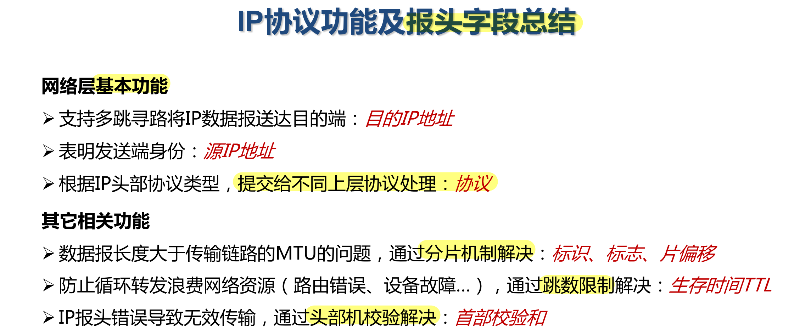
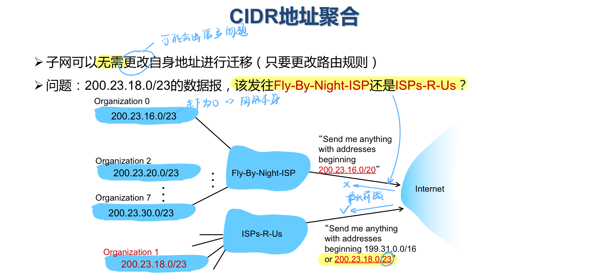
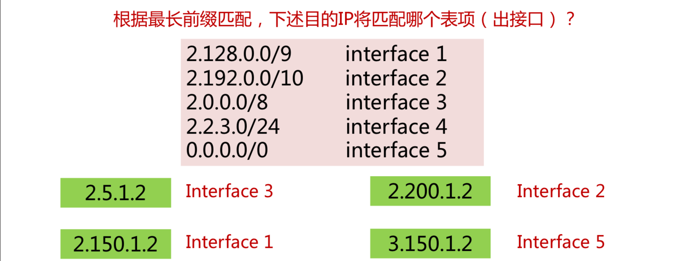
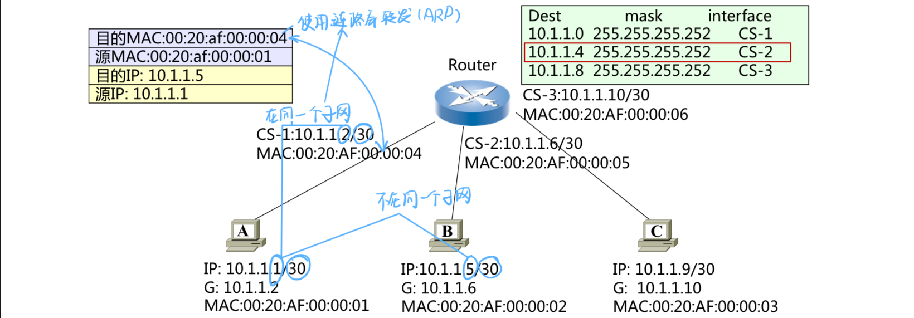

# 网络层
## 1.   基本概念
### 网络层功能
#### 基本功能
-   主机-主机间数据传输可达
    -   多跳传输
    -   实现在每台主机和路由器中
    -   路由器检查数据包首部，转发给下一跳

#### 核心功能
-   转发：数据平面，局部执行
    -   将数据报从路由器的输入接口传送到正确的输出接口
    -   核心：转发函数（转发表）
-   路由：控制平面，全局执行
    -   选择数据报从源端到目的端的路径
    -   核心：路由算法与协议

#### 多跳传输服务模型
-   向传输层提供的接口类型：面向连接(电路交换) or 无连接(分组交换)
-   谁负责可靠交付：网络 or 端系统
-   服务质量是否有保障：无保障 or 性能保障

#### Internet：无连接的数据报服务
-   不保证任何东西，简单所以可扩展性强
-   无连接+数据包独立转发+尽力而为交付

##  2. 路由器架构

### 控制平面
-   控制平面（控制）：运行各种路由协议，学习去往不同目的的转发路径:路由表
    -   可同时运行多个路由协议（多核...）
    -   也可不运行任何路由协议，只使用静态路由和直连路由
    -   若存在多个“去往同一目的IP”的不同类型路由，路由器根据路由优先级，选择最佳路由，形成核心路由表
        -   直连路由 > 静态路由（手动配置） > 动态路由
    -   控制层将核心路由表下发到数据层，形成转发表(FIB)

### 数据平面
-   数据平面（转发）：根据上述路由表，将收到的IP分组转发到正确的下一跳链路
#### 转发过程
-   链路层解封装，IP头部校验
-   获取报文目的IP地址
-   用目的IP地址，基于最长前缀匹配规则查询转发表
-   查询失败，丢弃报文
-   查询成功
    -   IP头部“TTL”字段值减1，重新计算IP头部“校验和”
    -   获取转发出接口和下一跳链路层地址
    -   重新进行链路层封装，发送报文
-   注:普通IP报文转发过程中，路由器不查看传输层及以上层协议的内容

#### 输入端口

-   输入端口:接口卡 (interface card)
    -   物理层处理、链路层解封装
    -   转发表查询(该工作在**输入接口卡**处理)
    -   通过交换结构将报文排队发往目的接口卡(发送过快将产生拥塞)

-   去中心化数据交换：每个输入端口独立计算输出端口
    -   每个输入端口在内存里维护转发表
        -   匹配-动作模式
    -   优势:每个端口独立工作，达到线速
        -   线速(line rate):每个端口的传输带宽
    -   如果报文到达速度超过交换结构速度：输入端口队列缓存->丢包
-   转发策略
    -   基于目的地址的转发
    -   通用转发：可根据任意字段组合，更灵活
-   基于目的地址的转发：最长前缀匹配
    -   与转发表的存储介质TCAMs有关
    -   0, 1, *

-   缓冲队列与排头阻塞（Head-of-the-Line blocking, HOL blocking）
    -   前面的报文由于对应的输出端口被占用在输入端口缓冲队列中排队等待，导致后续的报文也需要等待，尽管它们对应的输出端口空闲

#### 交换结构
-   交换速率：所有输入端口到输出端口的总速率
    -   N个输入端口，理想状态下为N被线速
-   三种典型交换结构
    -   共享内存
    -   共享总线
    -   纵横式（cross bar）

-   共享内存
    -   需要路由处理器控制，控制平面参与转发
    -   交换流程
        -   报文到达输入端口时，产生中断信号通知路由处理器
        -   路由处理器将报文复制到内存中，查询对应输出端口，再将报文复制到输出端口
    -   性能瓶颈:内存拷贝
-   共享总线
    -   不经内存，无需处理器干预
    -   交换流程
        -   输入端口查询转发表后给报文加上标签指明输出端口
        -   总线广播报文到所有输出端口
        -   输出端口根据标签判断是否应转发
    -   总线1次只能广播1个报文，交换速率受总线带宽制约
-   纵横式Crossbar
    -    使用2N条总线连接N个输入端口与N个输出端口
    -    优势
        -   不重叠的交换路径，可并行

#### 输出端口

-   缓冲队列:交换结构的数据超过发送数据时
    -   与输入端口不同，可以不是FIFO
    -   也可能发生排队和丢包
    -   缓冲区大小：RTT * C / sqrt(N)，C为链路带宽，N为报文流的个数（二元组流/五元组流）
-   队列调度:从缓冲队列中选择数据报文
    -   兼顾性能和公平性（网络中立原则）
    -   FIFO：溢出时仍需考虑丢弃报文的策略
        -   Tail drop:丢弃新来的报文
        -   Priority drop:根据优先级丢弃报文
        -   Random drop:随机丢弃
    -   优先级调度：多个优先级队列，公平性不佳
    -   轮询调度：多个队列，在队列间轮询
    -   加权公平队列(weighted fair queuing, WFQ)
        -   每个队列拥有权重值
        -   权重高的队列，轮询到的次数更多
        -   可以每发送一个将权重-1

## 3.   IPv4报文格式和报文分片
### IPv4协议简介
-   网际协议版本4，无连接
-   两个基本功能：寻址（路由+转发）+分片

### IPv4数据报格式

### 报文分片

-   数据报大小受链路限制
-   MTU(Maximum Transmission Unit), 最大传输单元
    -   链路MTU
    -   路径MTU = 瓶颈链路MTU
    -   以太网MTU为1500字节
-   分片策略
    -   允许途中分片:根据下一跳链路的MTU实施分片（多用）
        -   发送方不用负责分片
    -   不允许途中分片:发出的数据报长度小于路径MTU
        -   发送方分好片
        -   发送方需要路径MTU发现机制
        -   违背了端到端原则：网络内部应对端系统透明
-   重组策略
    -   途中重组，实施难度太大
    -   目的端重组(Internet采用的策略)
    -   重组所需信息:原始数据报编号、分片偏移量、是否收集所有分片

### 总结

## 4.   IP地址和路由器转发
### 网络接口
-   接口(interface):连接主机/路由器与物理链路之间的模块
    -   路由器由多个接口
    -   每个主机通常有1-2个接口
    -   IP地址针对接口分配
    -   接口之间通过链路层技术连接
### IP地址
-   IP地址:网络上的每一台主机(或路由器)的每一个接口都会分配一个唯一的32位的标识符
    -   两个字段：网络号(网络地址)+主机号(主机地址)
    -   网络前缀：网络号相同的连续的IP地址空间
-   子网划分
    -   子网掩码：一个IP地址一个，32bit二进制数，置1表示网络位，置0表示主机位
    -   子网：有相同网络地址的网络**接口**
        -   子网内的接口可以不需要网络层路由就可以进行数据传输
        -   通过链路层技术

-   特殊IP地址（不考）

-   无类域间路由CIDR(Classless Inter-Domain Routing)
    -   网络地址可以是任意长度
    -   表示:将32位的IP地址划分为前后两个部分，并采用斜线记法，即在IP地址后加上“/”，然后再写上网络前缀所占位数
-   CIDR地址/路由聚合
    -   子网内进一步划分对外只暴露1个CIDR网络地址
    -   子网迁移无需修改自身地址
        -   修改路由表/转发表即可
        -   最长前缀匹配：将数据包送到正确的**子网**
    -   子网内转发
        -   对目的IP地址进行最长前缀匹配——网络层路由器完成
        -   根据目的MAC地址转发——链路层交换机完成

### 路由器转发🌟
-   子网内转发：使用目的MAC地址
    -   通过ARP协议获取**子网内**IP-MAC地址映射

-   跨子网转发：使用目的IP地址
    -   子网内仍使用MAC地址

## 5.  ARP, DHCP, NAT, ICMP
