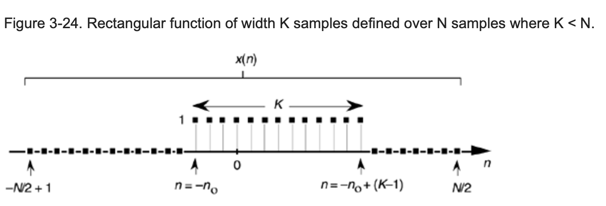
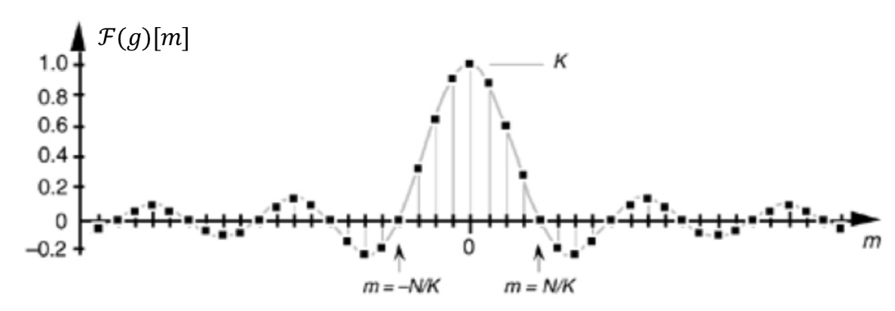
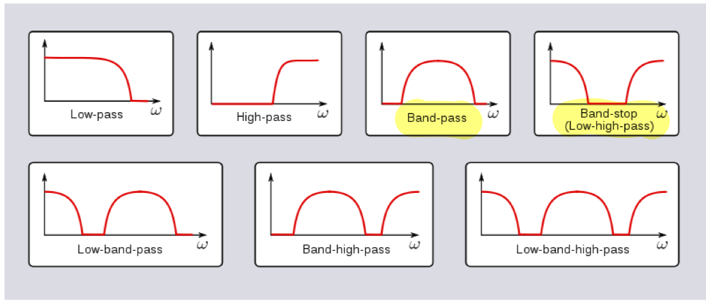
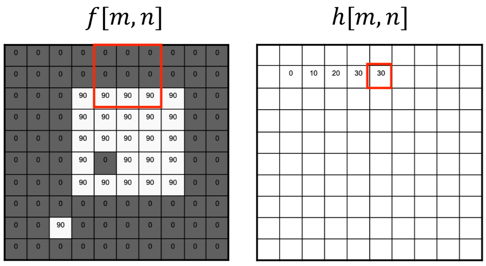

# Lecture 01. Image, Filter, and Edge Detection

## Image

### Image as Functions

A 2-D image can be treated as a function $f: \mathbb{R}^2\rightarrow \mathbb{R}^M$.

$f(x,y)$: the *intensity* at position $(x, y)$.

$M$ is # of channels. E.g., for a colored RGB image: $f(x,y) = [r(x,y), g(x,y), b(x,y)]^\text{T} \in [0,255]^3$.

### Analog2Digital

An (digital) image contains discrete number of pixels. So here the image function $f$ is from $\mathbb{N}^2$ to $\mathbb{R}^M$.

### Image Gradient
$$\nabla f=\left[\frac{\partial f}{\partial x},\frac{\partial f}{\partial y}\right]$$

Gradient magnitude:

$$||\nabla f||=\sqrt{\left(\frac{\partial f}{\partial x}\right)^2+\left(\frac{\partial f}{\partial y}\right)^2}$$

In practice, use finite difference to replace (discretize) gradient.

$$\left.\frac{\partial f}{\partial x}\right|_{x=x_0}\approx\frac{f(x_0+1, y_0)-f(x_0-1,y_0)}{2}$$

The image gradient points in the direction of **the most rapid change** in *intensity*.

## Filters

### 1-D Filter: Moving Average as Example

Signal function: $f[n]$. Signal processing system: $g$. Processed signal function: $h[n]$.

Thus, $h=g(f), h[n]=g(f)[n]$.

For a linear system, the signal processing process can be described by **convolution**.  

#### 1. Linear System

$g(\alpha f_1+\beta f_2)=\alpha g(f_1)+\beta g(f_2)\iff g \text{ is a linear system.}$

$h[n]$ is a linear combination of values from $𝑓[𝑛]$.

It can be proved that linear filters can also be expressed using convolutions.

#### 2. Definition of 1-D Convolution ($*$) ####

On discrete signal:  
$$h[n]=(f*g)[n]=\sum_{m=-\infty}^\infty f[m]g[n-m]$$

On continuous signal:

$$h(x)=(f*g)(x)=\int_{m=-\infty}^\infty f(m)g(x-m)\text{d}m$$

> Notes：  
> 1.Mathematically convolution operates on functions.  
> 2.How to understand the meaning of convolution? The function $g$ is flipped horizontally around $n$, then it is multiplied element-wise with function $f$ and summed.

#### 3. Facts of Convolution

Derivative Theorem (use Leibniz's rule to prove):

$$\frac{\text{d}}{\text{d}x}(f*g)=f*\frac{\text{d}}{\text{d}x}g$$

> Detailed proof waited to be updated.

Convolution Theorem:

$$\mathcal{F}(f*g)=\mathcal{F}(f)\mathcal{F}(g)$$

where $\mathcal{F}$ means Fourier transform.

> Detailed proof waited to be updated.

#### 4. Conclusion: Moving Average is a Low-pass Filter
For the moving average (where the filter $g$ is a rectangular funtion), $\mathcal{F}(g)(x)$ mainly *concentrates* around 0. The discrete situation is similar, and also shown in images below.

According to convolution theorem, $\mathcal{F}(f*g)$ will also *concentrates* around 0, i.e., the high frequency part of $\mathcal{F}(f)$ is removed after convolution with $g$. Thus $g$ is a **low-pass filter**. 

### 2-D Filter: Moving Average as Example

Similar with 1-D moving average.

if $g$ is a $3\times 3$ moving average, then

$$h[m,n]=\frac{1}{9}\sum_{i=m-1}^{m+1}\sum_{j=n-1}^{n+1}f[i,j]\\
=\frac{1}{9}\sum_{i=-1}^{1}\sum_{j=-1}^{1}f[m-i,n-j]\\
= \sum_{i,j}f[i,j]g[m-i,n-j]\\
=(f*g)[m,n]
$$

> Notes: here $[m,n]$ is always the *center* of $g$. In this way, we can view the convolution as moving average window sliding on the image.

### Summary

Moving average replaces each pixel with an average of its neighborhood, achieving smoothing effect.

Non-linear filtering example: Binarization via Thresholding.

## Put into Use: Edge Detection

### Problem Formulation

What is an Edge? Significant change in the pixel intensity values along **only** one direction.

### Evaluation Matrics

Precision $P$ and Recall $R$.

$$P=\frac{TP}{TP+FP}$$

$$R=\frac{TP}{TP+FN}$$

> Notes: how to understand Precision and Recall?
> 
> $TP+FP$ equals to the total number of positive *predictions*, while $TP+FN$ equals to the total number of positive *labels* (that should be predicted).
>
> Under the context of edge prediction, high $P$ means most detected edges are real edges, but there is possibility that many real edges are not found (low $R$). On the other hand, high $R$ means most real edges are detected, but there is possibility that many regions that are not edges are also detected as edges (low $P$).

Other metrics: localization, response constraint.

### Methods and Problems

According to the definition of edge, it's natural to use gradient (vector) and its magnitude to detect edges. However, gradients are sensitive to noise, so low-pass filters are needed to denoise.